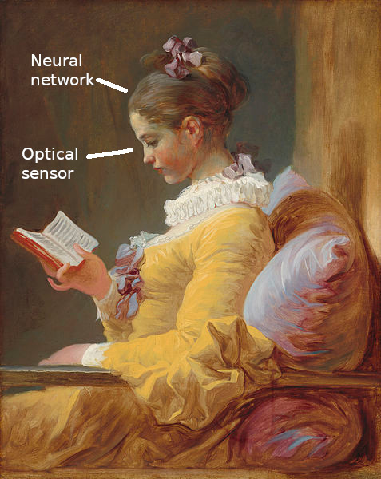

# Introduction

In winter 2016--2017, I decided to update a French Republican programme
written in Pascal several decades ago. This is not a talk about Pascal
programming, this is a talk about how I initialised a Git repository
with commits dating back from 1983--1984.

# Background

In 2012, I found three listings back from my student years. Instead of
the laser-printed  A4 pages we  are now used to  since the end  of the
1980's,  these  were  accordion-folded  sheets,  with  Caroll  strips,
printed from a dot-matrix printer.

At the beginning of each one of these three listings, I had written a
comment giving the date. This precise comment was the starting point
to my project of recovering the sources files _verbatim_ and committing
them to Git with this commit date.


Actually, later on, I found a fourth listing, with the date of 12 december 1983.
But it had several pencil annotations and its contents was a mix of the
8 December and the 10 January listings. So I decided to forsake the
scan and OCR steps on this fourth listing and go on directly to the edit step by copy-pasting
parts of the 8 December and 10 January files. This fourth listing will
play no part in the rest of this text.

## First Method

The first method would be hand-typing everything. The problem (it is a problem in this case)
is that I refined my programming style in the intervening years. Between 1984
and 1990, I adopted a better indent style. Here is how I would set-up my code
in 1984:


And here is the same excerpt, with the indent style I has adopted since at least 1990:

```
    case date.mois of
       1: gregnum := date.jour;
       2: gregnum := date.jour +  31;
       3: gregnum := date.jour +  59 + bissex(date.an);
       4: gregnum := date.jour +  90 + bissex(date.an);
       5: gregnum := date.jour + 120 + bissex(date.an);
       6: gregnum := date.jour + 151 + bissex(date.an);
       7: gregnum := date.jour + 181 + bissex(date.an);
       8: gregnum := date.jour + 212 + bissex(date.an);
       9: gregnum := date.jour + 243 + bissex(date.an);
      10: gregnum := date.jour + 273 + bissex(date.an);
      11: gregnum := date.jour + 304 + bissex(date.an);
      12: gregnum := date.jour + 334 + bissex(date.an);
    end;
```

As you can see, I have added spaces around operators such as « `:=` » and « `+` »
to improve readability and similar elements on successive lines are aligned
vertically. This alignment in a right alignment for numeric elements.
What you do not see in this example is that in 1984 I would use tab chars,
while now I prefer using spaces (except for _makefile_'s).

By retyping everything, I would not have been able to restrict myself
to use the vintage absence of style. So I did not even try this method.

## Second Method

The second method would be scanning the listing and submitting them to
an OCR programme. I have scanned  the first listing and I submitted it
to  a  few  OCR  programmes.  As  I  was  expecting,  the  result  was
catastrophic.

## Automatic Character Recognition Software

Before presenting the third method, here is a sample of character recognition programmes.

The character recognition programmes installed on my computer
are command-line-interface programmes. These are:

- gocr ([http://jocr.sourceforge.net/](http://jocr.sourceforge.net/))
- ocrad ([https://www.gnu.org/software/ocrad/](https://www.gnu.org/software/ocrad/))
- tesseract ([https://github.com/tesseract-ocr](https://github.com/tesseract-ocr))
- cuneiform ([https://en.wikipedia.org/wiki/CuneiForm\_(software)](https://en.wikipedia.org/wiki/CuneiForm_\(software\)))

From what I could see in the Ubuntu package repository, other character recognition
programmes are either GUI wrapper around the CLI programmes shown above,
or very specialised programmes for a narrow purpose.

Also, I  discovered that  cuneiform includes a  `--dot-matrix` option,
but in my case this option did not bring any improvements.

### Remark: automatic recognition, not optical recognition

I have  used the phrase  "automatic recognition" instead  of "optical"
for the programmes above, because they do not use optics.

Imagine the following experiment. You create a shell script based on
the diagram below.

```
    .                        ___
    .                       (   )
    .                       (___)_ /dev/random
    .                         |
    .                   ---------------
    .                   | GIMP script | (or GD.pm)
    .                   ---------------
    .                       |   |
    .                  ------   ------
    .                  |             |
    .                 ___           ___
    .                (   )         (   )     example.ppm
    .    example.txt (___)_        (___)_ or example.png
    .                  |             |
    .                  |      ----------------
    .                  |      |    GOCR      | or OCRAD, or Tesseract, or Cuneiform
    .                  |      ----------------
    .                  |             |
    .                  |            ___
    .                  |           (   )
    .                  |           (___)_ example-2.txt
    .                  |             |
    .                  ------   ------
    .                       |   |
    .                   ---------------
    .                   |    diff     |
    .                   ---------------
    .                         |
    .                       -----
    .                       |  _|
    .                       |_/    /dev/stdout and /dev/stderr
```

You install this script on a cloud-service computer, you add it to the
`crontab` so  it will run  at 4 AM and  you close the  connection with
this server.  When the script  runs at 4 AM,  how many light  rays are
deflected  by a  lens  or  reflected by  a  mirror?  How many  photons
activate a photo-sensor  (human retina or CCD)?  Answer: zero. Nothing
in this experiment  has any relations with optics.  The recognition is
automatic, it is not optical.

## The Best Recognition Engine

The best  recognition engine is built  around a neural network  and it
contains  optical  sensors.  It  has  been  perfected  by  a  Lebanese
start-up, or rather a phoenician start-up, around 1200 BC.


_Personal hard-copy of a
[Wikipedia page](https://fr.wikipedia.org/wiki/Alphabet_ph%C3%A9nicien)
licence [Creative Commons Attribution-ShareAlike 3.0 Unported (CC BY-SA 3.0)](https://creativecommons.org/licenses/by-sa/3.0/deed.en)_



_La Liseuse, by Fragonard (1732--1806), public domain, with a few annotations by myself._

This system allows  for several plug-ins, but each time  it requires a
lengthy set-up time.


_Source: En classe, le travail des  petits (at school, the work of the
small kids) by  Henri Jules Geoffroy (1853--1924),  public domain. The
website  where I  have  found this  public-domain  picture includes  a
watermark. Why?_

Despite the lenghty set-up time, or thanks to it, the results are much
better than with the programmes mentionned above.

There are still problems, yet. See the picture below:


_Source [http://www.popscreen.com/p/MTU3MDkzMDU5/Soviet-CCCP-Astronaut-Space-Patch-Russian-Alexei-Leonov](http://www.popscreen.com/p/MTU3MDkzMDU5/Soviet-CCCP-Astronaut-Space-Patch-Russian-Alexei-Leonov)_

Most  systems  would  give  "see-see-see-pea"  (U+0043  U+0043  U+0043
U+0050), while  the answer if "ess-ess-ess-ar"  (UU+0421 U+0421 U+0421
U+0420). But the  programmes mentionned in the  previous chapter would
not give a better answer.

On  an other  hand, the  wetware systems  can detect  characters where
there are none. For example, look at Cassiopea:


_Source : personal hard-copy from [Stellarium](http://www.stellarium.org/)_

Some people will spot a "W", others will spot a "M". Same thing
[while looking in the other direction](https://news.artnet.com/art-world/nasa-photos-alphabet-in-the-sky-400646),
[from space to Earth](https://www.mapbox.com/blog/letter-hunt-from-space/).

Or in this abstract drawing, some people notice full words, in this case Christian names.


## Hybrid Programmes

In 2000 or 2001, on the computer I used at this time, I have installed
an innovative programme, which I cannot find more than a decade later.
This  programme was  Alice-OCR.  Unlike the  CLI programmes  described
above, this was a GUI programme. The left half of the window displayed
the graphical file that would be analysed and the right half displayed
the resulting text. Here is a pseudo-demo.


_Source : Portrait of Lena Söderberg, (c) Playboy, 1972, with tacit permission from Playboy, included in a personal hard-copy_

You would run  a first analysis, which would produce  a candidate text
in the  window right half. In  the left-half, the characters  would be
outlined by pale blue oval shapes.


_Source : Portrait of Lena Söderberg, (c) Playboy, 1972, with tacit permission from Playboy, included in a personal hard-copy_

If there were errors, you could click on a glyph in the graphical pane
and type the proper transcription in a pop-up window. You did not need
to fix all errors, only a significant sample.


_Source : Portrait of Lena Söderberg, (c) Playboy, 1972, with tacit permission from Playboy, included in a personal hard-copy_

Then, you  could run  a new  analysis and the  result would  take into
account the  fixes you had just  given. The associations glyph  → char
could even be  stored into a database so they  would be available when
analysing another file.

Remark: in 2000 or 2001, I did very few experiments, because I quickly
found that  it did  not fit my  then-current needs. I  did not  try to
analyse a graphical file containing both text and picture.

Here, for the pseudo-demo, I used a graphical file with the portrait of
Lena Söderberg for two reasons:

- Because  it  shows  unambiguously  that  the  processed  file  is  a
graphical file and not a text file,
- Because tradition  requires that each basic  programme prints "Hello
World!",  that  each  programming  lesson about  recursivity  uses  as
examples  the computation  of factorials  and Fibonacci  numbers, that
each  syntax   analysis  generator  uses  as   example  a  4-operation
calculator with parentheses, that  each 3-D image generation programme
displays  a teapot  and that  each image-analysis  programme and  each
image-transformation programme uses Lena's portrait as an example.

By the  way, I analysed  the Lena + Hello  World file with  `gocr` and
`cuneiform`. They succeeded.  Which shows that they  are quite correct
when  dealing  with  quality  printing.  And I  think  that  the  real
Alice-OCR  programme would  have  succeeded too.  But for  pedagogical
purposes, I needed to pretend that it would make mistakes.

Please note that  the exclamation point is  incorrectly extracted, the
programme does not  include the dot. In the  real Alice-OCR programme,
that was the case with "i". I do not remember experimenting with files
containing "j", "!", letters with accents, colons, semi-colons or other
split characters.  Just because of  what I  saw with "i",  I concluded
that  the human  must  be in  the  loop as  soon  as extracting  glyph
bounding boxes, not just when  converting glyphs to characters. So, to
make this step easy and fast, we really need a fixed-width font.

### Other Hybrid Programmes

A few  other programmes, or  websites, rely  at least partly  on human
character recognition, while managing their own back-end processing:

- recaptcha
- Distributed Proofreaders ([https://www.pgdp.net](https://www.pgdp.net)) to feed the Gutenberg project
- Openfoodfacts ([https://fr.openfoodfacts.org/](https://fr.openfoodfacts.org/)).

## Third Method

The method  I adopted is  based on  Alice-OCR. The programme  runs the
back-end  processing,  including  the   database,  and  the  character
recognition  is executed  by the  human user.  Contrary to  Alice-OCR,
there is no  initial recognition attempt with an automatic recognition
engine.  Another difference  is that  the  human user  is active  when
splitting the graphical file into cells containing glyphs.

# Let Us Work!

## Used Technologies

For graphical processing, I use
[`GD.pm`](https://metacpan.org/pod/GD).
I tried and failed installing
[the interface with GIMP](https://metacpan.org/pod/Gimp)
so the choice was narrowed to `GD.pm`.

For functions with low interactivity, I use a command-line interface.

For interactive functions, I chose
[Dancer2](http://perldancer.org/)
and [MongoDB](https://www.mongodb.com/what-is-mongodb).
Dancer2 because I have often  heared about this framework from Alexis,
Damien, Sawyer and others. In  addition, the module includes a working
web  server. This  web server  would  not serve  several requests  per
second, but  for a  single user  it is  sufficient. MongoDB  because I
already know  SQL and this project  would not improve my  knowledge of
SQL. So I chose to explore MongoDB's functionalities. I also thought of
[PDL](https://metacpan.org/pod/PDL)
but in the end I did not use it.

Plan B: no plan  B for `GD.pm`, I know it works and  I was confident I
would  manage. If  I could  not use  MongoDB, I  would go back to  SQL
programming with
[SQLite](https://www.sqlite.org/index.html).
And if I could not work with  Dancer2, I would do old-school CGI like
I used to do back in 1998 or 1999.

What  about  Raku?  Good  question.  I received  my  first  Raku  book
(actually  Perl  6, as  it  was  named at  this  time)  just before  I
initialised  my Github  repo and  before I  wrote the  first programme
line. I learnt there is a Raku port of Dancer,
[Bailador](https://modules.raku.org/dist/Bailador:cpan:UFOBAT).
Then, reading the list of modules in
[https://modules.raku.org/](https://modules.raku.org/),
I noticed there was a
[Raku port](https://github.com/raku-community-modules/GD)
of `GD.pm` and a
[MongoDB module](https://modules.raku.org/dist/MongoDB:cpan:MARTIMM).
Unfortunately, I could not use the `newFromPng` methode from GD, which
is a strong prerequisite for my programmes.

Post-scriptum in 2022. For
[another project](https://github.com/jforget/raku-Hamilton2/blob/master/doc/Hamilton.en.md),
I used Perl's `GD.pm` module with Raku, thanks to Raku's
[Inline::Perl5](https://modules.raku.org/dist/Inline::Perl5:cpan:NINE).
Maybe I could have done the same in 2017?

# Listing Scanning

As  you  can see  when  taking  a look  at  the  reproductions of  the
listings, several elements hinder the scanning of the listings.

First, the paper width.

Actually, no. Although the width of  the listing sheets exceeds the A4
format, only  a very  small number  of code lines  are long  enough to
extend past the scanner's width:  half-a-dozen, including the lines in
which only the final semi-colon is stripped. So I can deal manually with
this very low number of exceptions.

Then the Caroll strips, especially the left one. If I set up the paper
on the scanner's glasspane correctly, the Caroll strip is avoided. And
even if it still shows, a  simple operation under the Gimp will remove
it.

The third  problem is  more serious.  In the  second listing,  the ink
ribbon was  nearly spent. I  could scan  the first and  third listings
with a  B&W target format,  the printed characters would  be correctly
scanned and  the background  lines would be  eliminated. But  this was
impossible with the second listing. Depending on the scanner settings,
on one hand the lines would be eliminated but some characters would be
mutilated, or on the other hand  the characters would be complete, but
some parts of the pre-printed lines would still appear.

The solution  was to use  a colour target  format, so I  could process
each  pixel depending  on  its HSV  characteristics (Hue,  Saturation,
Value).

A first programme gives me the ranges  of the HSV values. I could have
digged into  the documentation, I  prefered writing a  programme which
would give me the answers and which would be the template for the next
programmes. And  in hindsight I  was right, because I  discovered that
the RGB → HSV conversion routine would produce negative numbers, which
is the opposite of what the documentation says. I patched
[`GD::Simple`](https://metacpan.org/pod/GD::Simple)
and I submitted a
[ticket](https://rt.cpan.org/Ticket/Display.html?id=120572).

I modified  this first programme to  compute the mean and  mode values
for each RGB+HSV set of values. I know, the Hue is a cyclic number, so
its mean  is not  significant. But  the mode  is significant.  And for
RGB+SV, both the mean and the mode are significant.

At first, I intended to write a second programme building an histogram
of H and V values (I did  not understand Saturation at this time). But
I found some documentation on HSV and I understood that Saturation was
important. Additionally, with the diagrammes shown at
[https://en.wikipedia.org/wiki/HSL\_and\_HSV#HSV](https://en.wikipedia.org/wiki/HSL_and_HSV#HSV),
I no longer needed histograms.

A  third programme  (which  turned  out to  be  the second  programme)
examines all pixels.  For each one, if it is  brighter than some given
threshold,  it is  converted  to  white. If  it  is  darker than  this
threshold,  it is  converted  to black.  The main  point  is that  the
threshold  varies with  the Hue  value.  With blue,  the threshold  is
rather light and with orange it is rather dark. So a medium-blue pixel
will be converted to black and a medium-orange pixel will be converted
to white.


_Personal hard-copy of a  Wikipedia picture, with minor modifications.
As stated by  Wikipedia, Text is available under  the Creative Commons
Attribution-ShareAlike License; additional terms may apply._

In  this diagram,  I  have drawn  the  border between  colour-to-white
conversion and colour-to-black conversion.

When writing this  programme, I had to fight a  cultural problem. Born
in the 1960's, I learned to draw  with paper and crayons, not with the
Gimp  or  similar. So  in  my  mind,  "nothing"  is a  whitesheet  and
"colourful" is nearing black. Yet  this is the contrary with graphical
software when dealing with RGB values or  with the V value of HSV: the
lower values are nearly black, the higher values are nearly white.

A last problem, the most important one, glyph irregularities

The  printer produced  10 CPI  and 6  LPI. My  scanner has  a 300  DPI
resolution. This  means that each glyph  is included in a  30×50 pixel
bounding box. This gives way to  a huge variability within the various
bitmap  pictures  of  a  given  character. See  the  examples  in  the
hard-copies.


You  may skip  the following  paragraphes, because  they do  not bring
interesting facts to the documentation.

In an unsuccessful attempt to reduce the glyph irregularities, I wrote
another  programme.  This  programme  looks  at  every  pixel  in  the
graphical files. If  the majority of this pixel's  neighbours have the
opposite colour, the pixel switches  to this colour.  This reduces the
bulges  and dents  on the  borders between  black and  white and  this
eliminates ash pixels (isolated black pixels).

The  programme  may run  a  single  iteration or  several  iterations,
according to  a command  line parameter.   Also, depending  on another
command line parameter, the programme may consider that each pixel has
either 4 or  8 neighbours.  The programme builds  two output graphical
files.  The first one has only black and white pixels and contains the
smoothed glyphs.  The other one  uses two other colours,  to highlight
pixels turning  from white to black  and pixels turning from  black to
white.


With  some thought,  we can  find that  the 8-neighbour  variant would
blunt right angles.

    ..***      ..***
    ..***      ..***
    ..***  →   ...**
    .....      .....
    .....      .....

Real-life example, the same "p" as above, processed with the 8-neighbour option.


As you can  see, several corners have turned to  white. The upper-left
corner remained black  because of the neighbouring  bulge.  This bulge
turned to white, which is right, but  it also worked as a fourth black
neighbour for the upper-left corner pixel.

On the  other hand, you can  notice that the 1-pixel  wide gap between
the upper-left part and the isolated  ink blot in the upper-right part
has been bridged. In my opinion, this positive result is not enough to
compensate for the corner blunting.

So  I  took  the  4-neighbour  variant.  And  a  single  iteration  is
sufficient to clean-up the graphical file.

You may  think that  this programme implements  Conway's Game  of Life
(John's, not Damian's), with different transition rules.

The glyph variability has been reduced, but it still exists.

## Partial Conclusion

In  retrospect, I  must  admit that  glyph smoothing  was  a waste  of
time. As you can see in the  two examples above, the number of altered
pixels is  very low:  4 in  the 4-neighbour variant,  about 20  in the
8-neighbour variant. And as we  will see below, the difference between
two variants of the same character can involve a hundred pixels or so.

Or I could have used this programme to only remove snow and ash (white
pixels  with  8  black  neighbours   or  black  pixels  with  8  white
neighbours). I did not think of it until very late. Too bad!

# Character Recognition Proper

Although  I use  a  no-SQL  database, in  this  text  I still  mention
_tables_ and _records_  and I describe the _database  schema_. This is
more   self-discipline  than   technical  requirements.   As  to   the
vocabulary, I  could use  _collection_ instead of  _table_, but  it is
more  confusing to  use _document_  instead of  _record_, because  one
collection (or table) is named `Document`.

Another  point. When  I  wrote this  project, I  had  no intention  of
documenting it  in English.  Therefore, many  variable names  and many
field names are in French.

But first, let us create the database and let us define the
authorisations on it.

## Database Creation

The database creation is executed directly in the Mongo shell:

    $ mongo
    [ welcome message ]
    > use exemple
    switched to db exemple

Then I create a generic user for the database, with the same name
as the database:

    > db.createUser( { 'user': 'exemple', 'pwd': 's3kr3t', 'roles': [ 'readWrite' ] })

To   activate    authentication,   modify    the   `/etc/mongodb.conf`
configuration file. Change the following lines:

    # Turn on/off security.  Off is currently the default
    #noauth = true
    #auth = true

to

    # Turn on/off security.  Off is currently the default
    #noauth = true
    auth = true

and restart the MongoDB server.

Now, when  connecting to the database  in the Mongo shell,  we need to
type:

    $ mongo
    [ welcome message ]
    > use exemple
    switched to db exemple
    > db.auth('exemple', 's3kr3t')
    1

You  can  define  several  different databases  for  several  sets  of
graphical  files: a  database  for listings  printed  by a  dot-matrix
printer, another  database for  listings printed  by a  HP-41 printer,
another database  for cash  tickets from your  local grocery  store (I
doubt doing this, but some other people might be interested). The name
of the database is typed in the connexion webpage. This name is called
"appli".  Maybe "project"  would  have  been better.  But  we will  be
content with "appli".

## Database Model

The  basic database  schema, enriched  later, is  as follow  (with the
English translation on the right):

```
Document             Caractère        Document            Char
  (1,n)               (0,n)             (1,n)             (0,n)
    |                   |                 |                 |
    |                   |                 |                 |
  (1,1)               (1,1)             (1,1)             (1,1)
 Cellule (1,n)---(0,n)Glyphe            Cell (1,n)---(0,n)Glyph
```

A Document is split into several Cells.

A Char is drawn  as several possible Glyphs (but a  Char may be absent
from all the Documents, and it will not be associated with any Glyph).

A Cell may be linked to one or several Glyphs.

A Glyph may be  linked to several Cells, or sometimes  a single one or
even none.

The first table  is `Document`. Each record stores a  scanned file and
its next evolutions.  A listing has been scanned as  8 PNG files, more
or less, so a listing will be stored in the database as 8 Documents.

The second table is `Cellule` (Cell).  It stores the the various cells
when splitting the graphical files. The  data stored in this table are
the coordinates of the Cell,  both the line+column coordinates and the
pixel coordinates. A Cell record  stores also the bitmap picture, with
a MIME/base64 encoding.

The third table  is `Caractère` (Char). It contains  about 96 records,
one for each ASCII character from  space to `}`. Remember that at this
time, I used 7-bit  ASCII only. Yet, since there are  no data to store
besides the character, maybe this table will not be implemented.

The fourth table  is `Glyphe` (Glyph). Each record stores  a 2-D array
of bits, for the drawing of the glyphs as B&W pixels. A Char is linked
to 0-to-n Glyphs, a Glyph is linked to a single Char.

The fifth table is somewhat unexpected for, a "Request" table. At first,
I thought I would do requests on the run: enter criteria, click on a button
and read the result. Then I realised it would better be a permanent
data structure. But since the concept of request means a temporary set
of data, rather than "something that can be stored in the database for
some time", I adopted another name, `Coloriage` (Colouring Scheme),
because the result of the request includes a graphical file where all
selected Cells appear with a coloured background.

```
                   Document             Caractère                          Document             Char
              (1,n)  (1,n)                (0,n)                       (1,n)  (1,n)              (0,n)
             /         |                    |                        /         |                  |
            /          |                    |                       /          |                  |
        (1,1)          |                    |                   (1,1)          |                  |
Coloriage              |                    |           Colour Scheme          |                  |
  (1,n)                |                    |             (1,n)                |                  |
    |                  |                    |               |                  |                  |
  (1,1)                |                    |             (1,1)                |                  |
 Critère               |                    |            Criterion             |                  |
        (0,n)          |                    |                   (0,n)          |                  |
            \          |                    |                       \          |                  |
             \         |                    |                        \         |                  |
              (0,n)  (1,1)                (1,1)                       (0,n)  (1,1)              (1,1)
                    Cellule (1,n)---(0,n) Glyphe                             Cell (1,n)---(0,n) Glyph
```

The user enters the Criteria and saves them with the  Colouring Scheme
into the database.  Then he clicks on a  "Search" (_Recherche_) button
and the programme  applies the criteria to all Cells  in the Document.
When a Criterion  applies, the programme adds the Cell  to the list of
selected Cells  and adds this Cell  with a coloured background  to the
graphical  file associated  to the  Colour Scheme.  Then the  user can
display the result  in his browser, any number of  times. Thanks to an
`imagemap`, the user  can link to the webpage describing  this of that
selected Cell.

A Criterion  (`Critère`) is a  distinct entity from the  Colour Scheme
(`Coloriage`) but in  the physical database, it is stored  in an array
within the `Coloriage` record.

As  the user  creates new  Glyphs, the  result of  a Colouring  Scheme
becomes less and less relevant,  because some selected Cells no longer
verify the  Criteria and  some unselected  Cells verify  Criteria. The
`imagemap` of  the Colouring Scheme  still allows linking to  the Cell
webpage. The  user can  click a  second time on  the search  button to
refresh the  list of selected Cells.  The user has to  decide when the
long refresh of the Colouring Scheme  is necessary and when he can use
a slightly obsolete Colouring Scheme.

## Cell Grid

Before defining the physical data model, we have to examine two processes,
extracting Cells from a Document and linking Cells to Glyphs.

To define the grid, we just have to enter the pixel coordinates of the
Cell (or  the space)  at line  0, column 0.  Additionally, we  have to
enter the  size of  a Cell:  height and width.  Values with  a decimal
point are allowed. Thus, if we give  a width value of 40.34, the pixel
x-coordinates of  successive Cells will be  0, 40, 80, 121,  161, 201,
242 and  so on. The  width of  each Cell is  rounded up to  41 pixels,
which means that  a Cell can overlap  its neighbour. Or may  be I will
round  down  to 40  pixels,  which  will  introduce gaps  between  two
neighbours Cells.

There  is a  problem  I have  not  talked about.  When  I scanned  the
listings, the  paper was  not always properly  aligned on  the scanner
glasspane. Even  if I stack  a big heavy book  on top of  the listing,
when I  lower the scanner cover,  the listing sheets rotates  a little
and I must take care of this when splitting the Document into Cells.

Since the rotation angle is a small one, I can replace the rotation by
the  combination of  an horizontal  shear  and a  vertical shear.  The
horizontal shear can be specified by:

Every _N_ pixels (vertically), shift one pixel leftward / rightward

or by:

Every _N_ lines, shift one pixel leftward / rightward.

I have  opted to use  "Every _N_ lines".  Same thing for  the vertical
shear, I use "Every _N_ characters".

As with  the Cell dimensions,  we admit  values with a  decimal point.
Additionnaly, since  the shears simulate a  rotation, their parameters
are linked. Thus,  if the horizontal shear is  rightward, the vertical
shear has to be upward. And the _N_ values must be the same (if "Every
_N_ pixels") or proportional (if "Every _N_ lines / characters"). This
consistency  is  not enforced  in  the  programme,  it is  the  user's
responsibility.

The shear operation  applies only to the upper-left corner  of a Cell.
The sides of the Cell are still vertical lines or horizontal lines.

Here is an  example of horizontal shear, greatly  exaggerated. You can
notice that the vertical sides of the Cells are vertical, even if each
Cell is not aligned with the Cell above and the Cell below.


And here is an exaggerated example of vertical shear.


The combination of a leftward shear and a downward shear gives a rotation.


And here is a real (not exaggerated) example, zoomed in: left-shift by
one  pixel every  three lines,  down-shift  by one  pixel every  three
chars. On  the first line, you  can notice a slight  shift between the
"o" Cell and the "g" Cell and between the "a" Cell and the "m" Cell.


### Bad Surprise

The project  relies on the hypothesis  that the font is  a fixed-width
font, which allows  a simple computation of  pixel-coordinates for all
Cells,  knowing   their  line-column   coordinates.  Yet,   there  are
irregularities  in the  printing. Here  is an  example where  the Cell
splitting  is fine  until the  ampersand, but  is wrong  for the  word
"gregorien".


The idea is to  add a new concept: the Grid. A  Document is split into
several Grids  and each  Grid is  split into  several Cells.  The data
model is now:


```
                   Document             Caractère                          Document             Char
              (1,n)  (1,n)                (0,n)                       (1,n)  (1,n)              (0,n)
             /         |                    |                        /         |                  |
            /          |                    |                       /          |                  |
        (1,1)          |                    |                   (1,1)          |                  |
Coloriage            (1,1)                  |           Colour Scheme        (1,1)                |
  (1,n)             Grille                  |             (1,n)              Grid                 |
    |                (1,n)                  |               |                (1,n)                |
  (1,1)                |                    |             (1,1)                |                  |
 Critère               |                    |            Criterion             |                  |
        (0,n)          |                    |                   (0,n)          |                  |
            \          |                    |                       \          |                  |
             \         |                    |                        \         |                  |
              (0,n)  (1,1)                (1,1)                       (0,n)  (1,1)              (1,1)
                    Cellule (1,n)---(0,n) Glyphe                             Cell (1,n)---(0,n) Glyph
```

### Splitting Into Several Grids

A Document is split into several  Grids. For each Grid, the attributes
are   the   attributes  specified   above   to   extract  all   Cells:
pixel-coordinates of the top-left corner  of the top-left Cell, heigth
and width  of the Cells, shear.  In addition, we have  the line-column
coordinates of the  top-left Cell, since this is no  longer line 0 and
column 0. And there is a priority number to deal with the case where a
given Cell could  belong to more than one Grid.  The graphical file of
the Document will  emphasize the limits between Grids  by drawing blue
borders instead of green.

Special case: the  Grid containing the top-left Cell  `l=0, c=0`. This
Grid always have the lowest priority. It is automatically created with
the Document  and the user  cannot delete it.  On the other  hand, the
user can update the Grid parameters (pixel-coordinates, cell width and
heigth, shear).

For  the  other  Grids,  creation  is done  by  entering  the  `l,  c`
coordinates and  the priority in an  HTML form. Then, either  the user
enters  all other  parameters,  or  he chooses  to  let the  programme
compute  them  automatically.  With  the  automatic  computation,  the
parameters  are computed  from the  underlying Grid.  Of course,  that
means that the new grid is useless at first, since its parameters are the same
as the  underlying Grid. But in  a second step, the  user tweaks these
parameters  until   he  finds   the  correct  values.   The  automatic
computation  allows  the user  to  find  faster the  correct  values,
without much tinkering.

Let us  use the  example in  the hard-copy  above, without  shears for
simplicity's sake.  At first, with  much tinkering and  without paying
attention to  the word  "gregorien", the user  finds that  the default
Grid is defined with:

    l   c  prio    x    y  lg  ht action
    0   0    0    42   27  30  49

The user decides  to create a Grid for the  word "gregorien". The line
is definitely 3,  but what is the column number?  Without noticing the
darker green vertical line, the user tries:

    l   c  prio    x    y  lg  ht action
    0   0    0    42   27  30  49
    3  58    1                    automatic computation

The programme redisplays

    l   c  prio    x    y  lg  ht action
    0   0    0    42   27  30  49
    3  58    1  1827  194  30  49

But the  graphical file shows  that column 58 contains  the ampersand.
The user deletes the  Grid and creates a new one  with the proper `lc`
coordinates:

    l   c  prio    x    y  lg  ht action
    0   0    0    42   27  30  49
    3  58    1  1827  194  30  49 delete
    3  60    1                    automatic computation

The programme redisplays the HTML form:

    l   c  prio    x    y  lg  ht action
    0   0    0    42   27  30  49
    3  60    1  1889  195  30  49 manual typing

The  user  notices  that  there  is  no  problems  with  the  vertical
splitting,  but the  horizontal  splitting must  be  shifted 4  pixels
leftward, while reducing  the Cell size. He replaces  `1889` by `1885`
and `30` by `29`, which gives:

    l   c  prio    x    y  lg  ht action
    0   0    0    42   27  30  49
    3  60    1  1885  195  29  49 manual typing

He can refine  his tweaks, or create  a third Grid, and  then a fourth
Grid, and so on. Actually, in this case I needed only three Grids. The
final result is:


The red pixels show the places where  a Grid limit contains a ink dot,
which should  not happen. In this  case, the red pixels  are generated
because of  the vertical  line of  the `l=3, c=59`  Cell from  Grid 0,
while the "g" is completely inside the `l=3, c=60` Cell from Grid 1.

## Relation Between Cells and Glyphs

Because of the presence of ink spots here and there, the pixel picture
of a Cell barely  coincidates with a Glyph. We link a  Cell to a Glyph
by  comparing the  respective pixels  and  by lowering  the number  of
differences. This number, `score`, is stored in the Cell record.

There is a problem with this method, because a Cell may be linked with
several Glyphs  having the same  `score`. If these Glyphs  depend from
the same  Character, it does  not matter.  But if these  Glyphs depend
from  different  Characters...   This  will  be  dealt   with  in  the
programmes.

Since there  is always at least  one Glyph in the  database (the Glyph
with no  pixels, linked  with the space  Character U+0020),  each Cell
will always have a  score, as soon as created and  will be linked with
at least  one Glyph. This remark  allows me to simplify  some parts of
the programme.

Once a Cell is  split from a Document, it is  trimmed by computing the
bounding  box of  the pixels.  Let us  take the  example of  two Cells
containing  a  "plus"  sign.  These  signs are  set  up  at  different
positions in their Cells.

```
    ----------------  ----------------
    |              |  |              |
    |        *     |  |              |
    |        *     |  |              |
    |        *     |  |      *       |
    |     *******  |  |      *       |
    |        *     |  |      *       |
    |        *     |  |   *******    |
    |        *     |  |      *       |
    |              |  |      *       |
    |              |  |      *       |
    |              |  |              |
    ----------------  ----------------
```

A basic comparison of the Cells gives many differences. Below, "equal"
signs show the common pixels (only  2 of them), "different" signs show
the differing pixels (22 in each Cell).

```
    ----------------  ----------------
    |              |  |              |
    |        ≠     |  |              |
    |        ≠     |  |              |
    |        ≠     |  |      ≠       |
    |     ≠=≠≠≠≠≠  |  |      =       |
    |        ≠     |  |      ≠       |
    |        =     |  |   ≠≠≠≠≠=≠    |
    |        ≠     |  |      ≠       |
    |              |  |      ≠       |
    |              |  |      ≠       |
    |              |  |              |
    ----------------  ----------------
```

It is very likely that any Glyph  linked to the first Cell will have a
bad score  with the second Cell.  This is why we  compute the bounding
box, which give a more reliable comparison/

```
    Cell 1            Cell 2            Glyph
    ----------------  ----------------  ---------
    |    --------- |  |              |  |   *   |
    |    |   *   | |  |              |  |   *   |
    |    |   *   | |  |  ---------   |  |   *   |
    |    |   *   | |  |  |   *   |   |  |*******|
    |    |*******| |  |  |   *   |   |  |   *   |
    |    |   *   | |  |  |   *   |   |  |   *   |
    |    |   *   | |  |  |*******|   |  |   *   |
    |    |   *   | |  |  |   *   |   |  ---------
    |    --------- |  |  |   *   |   |
    |              |  |  |   *   |   |
    |              |  |  ---------   |
    ----------------  ----------------
```

Here is a real example of a comparison between a Cell and a Glyph. The
Cell is on the left, with a  bounding box drawn in green. The Glyph is
on the right. At the centre, the comparison with orange pixels (erased
from the Glyph to obtain the Cell) and blue pixels (added to the Glyph
to obtain the Cell).


This solution is not foolproof. Let us suppose that the Cells contain:

```
    ----------------  ----------------
    |              |  |              |
    |        *     |  |              |
    |        *     |  |              |
    |        *     |  |      *       |
    |     *******  |  |      *       |
    |        *     |  |      *       |
    |        *     |  |  ********    |
    |        *     |  |      *       |
    |              |  |      *       |
    |              |  |      *       |
    |              |  |              |
    ----------------  ----------------
```

Computing the bounding boxes gives:


```
    Cell 1            Cell 2            Glyph
    ----------------  ----------------  ---------
    |    --------- |  |              |  |   *   |
    |    |   *   | |  |              |  |   *   |
    |    |   *   | |  | ----------   |  |   *   |
    |    |   *   | |  | |    *   |   |  |*******|
    |    |*******| |  | |    *   |   |  |   *   |
    |    |   *   | |  | |    *   |   |  |   *   |
    |    |   *   | |  | |********|   |  |   *   |
    |    |   *   | |  | |    *   |   |  ---------
    |    --------- |  | |    *   |   |
    |              |  | |    *   |   |
    |              |  | ----------   |
    ----------------  ----------------
```

While the  comparison between  the first  Cell and  the Glyph  gives a
perfect zero  score, the  comparison between the  second Cell  and the
Glyph gives a catastrophic score:

```
    Cell 1            Cell 2            Glyph
    ----------------  ----------------  ---------
    |    --------- |  |              |  |   *   |
    |    |   =   | |  |              |  |   *   |
    |    |   =   | |  | ----------   |  |   *   |
    |    |   =   | |  | |    ≠   |   |  |*******|
    |    |=======| |  | |    ≠   |   |  |   *   |
    |    |   =   | |  | |    ≠   |   |  |   *   |
    |    |   =   | |  | |=======≠|   |  |   *   |
    |    |   =   | |  | |    ≠   |   |  ---------
    |    --------- |  | |    ≠   |   |
    |              |  | |    ≠   |   |
    |              |  | ----------   |
    ----------------  ----------------
```

The  bad score  is caused  by  the leftward  extension of  the Cell  2
bounding box, which induces a rightward  move of the vertical bar, and
then a  big number of  modified pixels. Yet,  it would have  been more
right to think  that the vertical bars  in Cell 2 and  the Glyph would
correspond with  each other and not  contribute to the score  and that
the only difference is the leftmost pixel of Cell 2.

This really happened  during my tests. I had created  a few Glyphs for
small-case letter "l"  (for Lima) and for digit "1".  When running the
linking of Cells with Glyphs, a  Cell containing a letter "l" happened
to be linked with a Glyph containing a digit "1".


The score  is 47, including  8 for the vertical  bar, 11 for  the foot
serif  and 28  for  the  top-left ink  spot,  which characterises  the
differences between letters "l" and digits "1".

The comparison between this Cell and some letter "l" Glyphs gives:


What raises  the score in  both cases is  the big number  of different
pixels for  the vertical bar,  overcoming the 28-pixel  difference for
the top-left ink blot in the digit "1" Glyph. For the first letter "l"
Glyph,  it cannot  be  avoided,  because the  Cell's  vertical bar  is
4-pixel wide  while the Glyph's vertical  bar is 5-pixel wide.  But in
the  second case,  both  vertical  bars are  4-pixel  wide,  but at  a
different distance  from the left  border of  the bounding box.  So we
have to  erase a full  1-pixel wide column  and blacken a  nearly full
1-pixel wide column, about sixty pixels  in all. This bad score is not
justified.

The  solution is  to no  longer  rely on  the top-left  corner of  the
bounding box,  but on  the centre  of mass of  the black  pixels. This
nearly  solves the  problem of  the blue  and orange  columns, without
eliminating it completely.

Since  the coordinates  _xg_ and  _yg_  of the  center of  mass G  are
computed by averaging the coordinates _x_ and _y_ of the black pixels,
_xg_ and _yg_ will nearly always have a fractional part. Except when a
Glyph is created from a Cell, the fractional parts will differ between
the Glyph centre  of mass and the  Cell centre of mass. So  how can we
align the Glyph pixels with the Cell pixels?

The solution is to try several comparisons, by rounding up or down the
coordinates. For  abscisses xg\_Cel and  xg\_Gly, first we  round down
both of them, then  we round up xg_Cel and we  round down xg_Gly, then
we  round down  xg_Cel  and we  round  up xg_Gly.  No  need to  trying
rounding up both values, this test would be redundant with the test in
which they were both rounded down.

The same is done with the ordinates. Here is an example to illustrate
the explanations:

```
                Cell              Glyph
                xg_Cel  yg_Cel    xg_Gly  yg_Gly
actual coord   17.76   18.90      7.82   16.11
test 0         17      18         7      16
test 1         17      18         8 *    16
test 2         17      18         7      17 *
test 3         18 *    18         7      16
test 4         18 *    18         8 *    16
test 5         18 *    18         7      17 *
test 6         17      19 *       7      16
test 7         17      19 *       8 *    16
test 8         17      19 *       7      17 *
```

By keeping the lowest score among  the nine computed scores, we reduce
a bit more the problem of the  blue column and the orange column shown
above.

Now, how do we implement the counting of differing pixels?

The first method consists in looping on the "union bounding box" for
the Cell and the Glyph. Each time a pixel differs, we add +1 to the score.

The second method is less straightforward. We initialise the score with the
number of black pixels in the Glyph, plus the number of black pixels in
the Cell. Then, we loop over the pixels and we compute -2 for each
common black pixel. The good point of this method is that we loop over
the intersection of the bounding boxes, which is smaller than the "union
bounding box". It will be clearer with the example below.

```
       Cell            Glyph
       0  3  6  9      0  3  6  9
      ------------    ------------
    0 |         *|    |          |
      |          |    |          |
      |    **    |    |    ***   |
    3 |   ***    |    |    **    |
      |    **    |    |    ***   |
      |          |    |          |
    6 |          |    |*         |
      ------------    ------------
```

The Cell  and the  Glyph have  been aligned so  their centres  of mass
nearly coincidate.  With the first  method, counting is done  with two
embedded loops, one with  _x_ varying from 0 to 9,  the other with _y_
varying from 0 to  6. With the second method, we  notice that the Cell
has no black pixels with _x_ < 3  and no black pixels with _y_ > 4. We
also notice  that the Glyph has  no black pixels  with _x_ > 6  and no
black pixels  with _y_ <  2. So the embedded  loops will use  the 3..6
interval for _x_ instead of 0..9 and the 2..4 interval for _y_ instead
of 0..6.

From the Cell  to the Glyph, there  are 6 common black  pixels, plus 2
black pixels  that will be  erased, plus 3  white pixels that  will be
blackened. With  the first  method, the score  is 2 + 3 = 5.  With the
second method, the  Cell has 8 black  pixels and the Glyph  has 9. The
score is initialised with 17. Then, with the 6 common black pixels, we
compute the final score 17 - 2 × 6 = 5.

The  second  method  allows  for a  quicker  numeric  computation.  In
addition, it automatically discards outlier black pixels such as pixel
(0,9) in the Cell and pixel (0,6)  in the Glyph. On the other hand, if
we generate the  graphical representation of the  comparison, with fat
blue  pixels and  fat orange  pixels, then  we have  to loop  over the
"union bounding box".

Let us reuse the Glyph "l" example above.


For the Cell, we have the following values:

```
    xg  =  7.77
    yg  = 15.91
    lge = 17      (width)
    hte = 30      (height)
```

Translation note:  `lge` means  _largeur enveloppe_, or  "bounding box
width", `hte` means _hauteur enveloppe_ or "bounding box height".

For the Glyph, the values are:

```
    xg  =  7.02
    yg  = 16.11
    lge = 16
    hte = 30
```

I will show only 4 rounding attempts out of 9, so the table will still be readable.

```
    Centre of mass Cell              7  15              7  16            8  15             8  16
    Centre of mass Glyph             7  16              7  16            7  16             7  16

    x-range and y-range Cell   ( 0..16,  0..29)  ( 0..16,  0..29)  ( 0..16,  0..29)  ( 0..16,  0..29)
    relative to centre of mass (-7.. 9,-15..14)  (-7.. 9,-16..13)  (-8.. 8,-15..14)  (-8.. 8,-16..13)
    x-range and y-range Glyph  ( 0..15,  0..29)  ( 0..15,  0..29)  ( 0..15,  0..29)  ( 0..15,  0..29)
    relative to centre of mass (-7.. 8,-16..13)  (-7.. 8,-16..13)  (-7.. 8,-16..13)  (-7.. 8,-16..13)

    Method 1
    combined range relative    (-7.. 9,-16..14)  (-7.. 9,-16..13)  (-8.. 8,-16..14)  (-8.. 8,-16..13)
    to centre of mass
    Combined range Cell        ( 0..16, -1..29)  ( 0..16,  0..29)  ( 0..16, -1..29)  ( 0..16,  0..29)
    Combined range Glyph       ( 0..16,  0..30)  ( 0..16,  0..29)  (-1..15,  0..30)  (-1..15,  0..29)

    Method 2
    combind range relative     (-7.. 8,-15..13)  (-7.. 8,-16..13)  (-7.. 8,-15..13)  (-7.. 8,-16..13)
    to centre of mass
    Combined range Cell        ( 0..15,  0..28)  ( 0..15,  0..29)  ( 1..16,  0..28)  ( 1..16,  0..29)
    Combined range Glyph       ( 0..15,  1..29)  ( 0..15,  0..29)  ( 0..15,  1..29)  ( 0..15,  0..29)
```

Exception: when comparing  a Cell with the empty Glyph  (linked to the
space  Character),  the  nine  ways   to  round  the  centre  of  mass
coordinates  will always  give the  same result:  the number  of black
pixels in the  Cell. There is no  need to examine the  various ways of
rounding.

## Colouring Scheme

As I have  already explained, the Colouring Scheme is  used to display
the results of  the links between Cells and Glyphs,  by specifying and
running requests on the current Document Cells.

There are three types of Colouring Schemes:

1. The Colouring Schemes which show which Cells are linked to 2 Glyphs
or more.

2. The Colouring Schemes which show which Cells have a bad score.

3.  The  Colouring  Schemes  which help  separating  Cells  containing
similar looking Characters;  the first example which comes  to mind is
Cells containing lower-case "l" (for Lima), upper-case "I" (for India)
and digits "1".

Actually, the first  type is next to useless, because  the case when a
Cell is linked to several Glyphs is very rare. So we do not care about
this type.

For scoring Colouring Schemes, we specify the Criteria by decreasing
numeric value and by using color shading.


Here is the result:


You can  notice that one "e"  has been the  model for a Glyph  and has
therefore a  score equal to zero.  You can also notice  that two Cells
containing a space have a  score, because they contain "thermal noise"
pixels  (or ash).  The other  spaces, on  the other  hand, contain  no
pixels, therefore they were not stored as Cells in the database.

For Colouring Schemes aiming at separating similar-looking Characters,
you must  use contrasting colours.  Here is an example  for lower-case
"l" (for Lima), upper-case "I" (for India) and digits "1".


And here is the result:


## Physical Data Model

Remember that the logical data model is as follow:


```
                   Document             Caractère                          Document             Char
              (1,n)  (1,n)                (0,n)                       (1,n)  (1,n)              (0,n)
             /         |                    |                        /         |                  |
            /          |                    |                       /          |                  |
        (1,1)          |                    |                   (1,1)          |                  |
Coloriage            (1,1)                  |           Colour Scheme        (1,1)                |
  (1,n)             Grille                  |             (1,n)              Grid                 |
    |                (1,n)                  |               |                (1,n)                |
  (1,1)                |                    |             (1,1)                |                  |
 Critère               |                    |            Criterion             |                  |
        (0,n)          |                    |                   (0,n)          |                  |
            \          |                    |                       \          |                  |
             \         |                    |                        \         |                  |
              (0,n)  (1,1)                (1,1)                       (0,n)  (1,1)              (1,1)
                    Cellule (1,n)---(0,n) Glyphe                             Cell (1,n)---(0,n) Glyph
```

No hierarchical relation (those with  `(1,1)` on one side) holds data,
so they  are implemented  either by  building the  child key  with the
parent  key plus  a sequential  number, or  by including  the children
MongoDB documents in an array in the parent MongoDB document.

For example, the  key of a Colouring  Scheme is the key  of the parent
Document  plus a  sequential number.  And the  MongoDB document  for a
Colouring  Scheme  contains  an  array  with  all  Criteria  for  this
Colouring Scheme.

The relation between Criteria and  Cells is implemented by storing the
list   of   keys   in   another  array   in   the   Colouring   Scheme
record. Similarly,  the Cell-Glyph relation is  implemented by storing
the list of Glyph keys, plus some  other data, in an array in the Cell
record.

The Character  entity has  no data  besides its key.   It will  not be
implemented.

### Document

Example of Document:

    {
          "_id" : ObjectId("59cb36537a7f4608a2293a61"),
          "ind_blanc" : 0,
          "ind_noir" : 1,
          "taille_x" : 2328,
          "dh_cre" : "2017-09-27 05:25:39",
          "dx" : "30",
          "taille_y" : 1071,
          "fic" : "ex1.png",
          "doc" : "ex1",
          "nb_noirs" : 53089,
          "grille" : [
                  {
                          "cish" : 3,
                          "dy" : 49.5,
                          "dirv" : "bas",
                          "l" : 0,
                          "prio" : 0,
                          "c" : 0,
                          "cisv" : 3,
                          "dirh" : "gauche",
                          "x0" : 42,
                          "dx" : 30.85,
                          "y0" : 27,
                          "action" : "rien"
                  },
                  {
                          "x0" : 1884,
                          "dx" : 28.5,
                          "y0" : 195,
                          "action" : "rien",
                          "cisv" : 3,
                          "dirh" : "gauche",
                          "dirv" : "bas",
                          "dy" : 49.5,
                          "c" : 60,
                          "prio" : 1,
                          "l" : 3,
                          "cish" : 3
                  },
                  {
                          "x0" : 2086,
                          "dx" : 28.5,
                          "y0" : 197,
                          "action" : "saisie",
                          "cisv" : 3,
                          "dirh" : "gauche",
                          "dirv" : "bas",
                          "dy" : 49.5,
                          "l" : 3,
                          "prio" : 2,
                          "c" : 67,
                          "cish" : 3
                  }
          ],
          "etat" : 3,
          "dy" : "50",
          "fic_grille" : "ex1-grille.png",
          "dh_grille" : "2017-09-27 05:27:49",
          "num_gr" : 2,
          "dh_valid" : "2017-09-27 05:29:03"
    }

Detailed description of the fields

Document key

        "doc" : "ex1",

`_id` field, automatically added by MongoDB

        "_id" : ObjectId("59cb36537a7f4608a2293a61"),

Various data such as the name of the gridless graphical file, the name
of the gridded graphical file, the  pixel size of the Document and the
number of black pixels.


        "fic" : "ex1.png",
        "fic_grille" : "ex1-grille.png",
        "taille_x" : 2328,
        "taille_y" : 1071,
        "nb_noirs" : 53089,

How  we must  interpret the  values returned  by `GD:getPixel`:  which
value is associated with white  pixels, which value is associated with
black pixels.

        "ind_blanc" : 0,
        "ind_noir" : 1,

Where we  are in  the global  processing of the  Document and  when we
reached the different steps.

        "etat" : 3,
        "dh_cre" : "2017-09-27 05:25:39",
        "dh_grille" : "2017-09-27 05:27:49",
        "dh_valid" : "2017-09-27 05:29:03"

The different steps are:

1. The Document is created (timestamp `dh_cre`).

2. The grid informations are entered and the gridded graphical file is
generated (timestamp `dh_grille`).

3.  The grid  is valid  and the  Cells are  generated in  the database
(timestamp `dh_valid`).

4.  The  Cell-to-Glyph link  procedure  has  run.  This step  has  two
timestamps, `dh_debut`  and `dh_assoc` (not appearing  above). Thus we
can compute the duration of the link procedure.

5. The final text file is generated.

Approximate pixel-size of the Cells

        "dx" : "30",
        "dy" : "50",

List of Grids and last number

        "num_gr" : 2,
        "grille" : [
            { ... },
            { ... },
            { ... },
        ],

The Grids  are numbered  from 0.  In the  example above,  the Document
contains 3 Grids numbered 0, 1 and 2.

### Grid

The Grids are stored within the Document record. Their fields are:

Priority, which acts as a sequential key within the Document

        "prio" : 0,

We could think  that this field is redundant with  the location of the
Grid MongoDB  sub-document within the  `grille` array.  This  is true,
because when updating a Document  record, Grids are sorted by priority
value and then  renumbered with 0..n-1 values, so  the priority-0 Grid
is always at  position 0, the priority-1 Grid is  always at position 1
and so  on. But I  use the  field `prio` as  a criterion in  a MongoDB
search.  So I keep it within the Grid MongoDB sub-document.

Line-column coordinates of the top-left Cell

        "l" : 0,
        "c" : 0,

Pixel coordinates of the top-left Cell

        "x0" : 42,
        "y0" : 27,

Shift between each Cell and its  neighbour.  The integer part of these
values give the width and height of the Cells in the current Grid.

        "dx" : 30.85,
        "dy" : 49.5,

Values  defining  the horizontal  and  vertical  shears.  `gauche`  is
"leftward", `droite` is "rightward", `bas` is "downward" and `haut` is
"upward". The numerical values are the  number of pixels for each line
/ column.

        "dirh" : "gauche",
        "cish" : 3,
        "dirv" : "bas",
        "cisv" : 3,

Useless field remaining from the  creation form.  It should be removed
from the database.

        "action" : "rien"

### Glyph

Example of Glyph

    {
          "_id" : ObjectId("5978f3c37a7f460b407e2066"),
          "lge" : 23,
          "dh_cre" : "2017-07-26 19:55:47",
          "xg" : 8.201086956521738,
          "ind_blanc" : 0,
          "data" : "iVBORw0KGgoAAAANSUhEUgAAABcAAAAWAQMAAAARuJVGAAAABlBMVEX///8AAABVwtN+AAAACXBI\nWXMAAA7EAAAOxAGVKw4bAAAAN0lEQVQImWNgYGNgqH/fgMANDAw1DHJAbMdQAcQWDDYMMgw/GOTq\nH8BxDQMDGP8B4h9YcAEDAwAWcBYVXE6mZQAAAABJRU5ErkJggg==\n",
          "num" : 1,
          "nb_noir" : 184,
          "car1" : "p",
          "hte" : 22,
          "yg" : 8.793478260869566,
          "car" : "p",
          "ind_noir" : 1
    }


Detailed description of the fields

Glyph key

        "car" : "p",
        "num" : 1,

Alternate  key.  Most  of the  time, `car1`  holds the  same value  as
`car`. The  exceptions are spaces,  dots, quotes and  dollars.  `car1`
contains `"SP"`  instead of a space  because it is more  readable when
printed in a HTML file. For  the three other characters, the raw value
may be rejected  by MongoDB, so we  use a mnemonic such  as `"DL"` for
`"$"`,  `"PT"` for  `"."` (_point_  in  French) and  `"AP"` for  `"'"`
(_apostrophe_ in French). Of course, the full alternate key is `car1 +
num`, but there is no need for an alternate `num`.

        "car1" : "p",

`_id` field, automatically added by MongoDB

        "_id" : ObjectId("5978f3c37a7f460b407e2066"),

The graphical glyph, a bitmap, formatted  as PNG and then encoded with
MIME::Base64.

        "data" : "iVBORw0KGgoAAAANSUhEUgAAABcAAAAWAQMAAAARuJVGAAAABlBMVEX///8AAABVwtN+AAAACXBI\nWXMAAA7EAAAOxAGVKw4bAAAAN0lEQVQImWNgYGNgqH/fgMANDAw1DHJAbMdQAcQWDDYMMgw/GOTq\nH8BxDQMDGP8B4h9YcAEDAwAWcBYVXE6mZQAAAABJRU5ErkJggg==\n",

How  we must  interpret the  values returned  by `GD:getPixel`:  which
value is associated with white  pixels, which value is associated with
black pixels.

        "ind_noir" : 1
        "ind_blanc" : 0,

Width and height of the drawing,  plus the number of black pixels. "e"
means _enveloppe_ or  "bounding box", because Glyphs are  created by a
trimmed version of a Cell.

        "lge" : 23,
        "hte" : 22,
        "nb_noir" : 184,

Pixel coordinates of  the centre of mass of black  pixels.  Of course,
15 digits after the decimal point is overkill, but this is the default
provided by Perl. So why bother?

        "xg" : 8.201086956521738,
        "yg" : 8.793478260869566,

Creation timestamp. UTC timezone to be free from DST problems.

        "dh_cre" : "2017-07-26 19:55:47",

In  the   Glyph  collection,   the  very   first  record   is  created
automatically.  This is the empty Glyph, associated with the Character
"SP" (for space).  When the user  enters the `appli` parameter and the
password, the programme  checks the existence of the  empty Glyph and,
if necessary, creates it.

The next Glyphs are created by copying Cells.

### Cell

    {
          "_id" : ObjectId("599f186e7a7f4608c805e3e1"),
          "ind_blanc" : 0,
          "ye" : 10,
          "dh_assoc" : "2017-09-07 20:11:27",
          "xc" : 42,
          "glyphes" : [
                  {
                          "xg_Gly" : 8,
                          "xg_Cel" : 8,
                          "num" : 1,
                          "car" : "p",
                          "yg_Cel" : 8,
                          "yg_Gly" : 8
                  }
          ],
          "c" : 0,
          "dh_cre" : "2017-08-24 18:18:18",
          "nb_noir" : 184,
          "nb_car" : 1,
          "lge" : 23,
          "yc" : 27,
          "doc" : "ex1",
          "l" : 0,
          "yg" : 8.793478260869566,
          "score" : 0,
          "hte" : 22,
          "voisin" : "iVBORw0KGgoAAAANSUhEUgAAAJoAAAD3AQMAAADfW9/QAAAABlBMVEX///8AAABVwtN+AAAACXBI\nWXMAAA7EAAAOxAGVKw4bAAACDElEQVRYhe3XwWrbMAAG4F8IrEuwrj2E6BUCu3hg7FfpI3g3D8zq\n2y4jfYGRvopO7bGP0EAPO85jFw/GNKmOJUdSkzWUQcE/iNhfkBXHkiwBc+bMsVlETD0AV99bKAV6\n7yHRyDyEh7pcJZf08QbcYo8cJTreMslbhw0E0UjlyrbeDShAdw4r1BDwMCMd9JlBYTFXckT28HLs\ndRlQ0k0EbTvEIts57I6jDJDdcnmx9pDq/7NQ8hCJ+uMQ5vJLXdTXCc55s1lHbFlHMI9iFcHfEXzq\ntX7o7qWYApc+UtWjjmHvI4viJnPVyWf59CmStcNxLioAV52qI2imis5e8zqCtvVtFsGbk0j2t5kW\nIZoRH0F+Hg6H9EuJ6s7q0BnotgH51h7HasAa5M7inLefixjm/4z/I1QP7YMw3cfZfQ+en41Cj47E\nx0IjTiLXuNRf+SgDZDEkO67P+bmI/lME9VQfYt4h+PEozZpHhCg2BRbNFIXG6x5pI6e31IJpXPlI\nDeY+6geXZlOcM+eVksBbn5AWFW/2r7xxX6JX3PWIP5XDPoadyD7IEPfL9h9yUn1E+4Zlz2DHA2yn\nKB2O1at30lUfUajjSCyWMbQje4rdCUSItF2HiLSO4KrpzKwYYLI/dLjI7KN0OGfOK4e2mdl6TEP0\nNr1G+l46Mp2WbZ/Djx7yRQn+y0Pz2j3YABnMB/wLn3MdnyG5fxsAAAAASUVORK5CYII=\n",
          "xe" : 5,
          "xg" : 8.201086956521738,
          "cpt_car" : {
                  "p" : 1
          },
          "ind_noir" : 1,
          "data" : "iVBORw0KGgoAAAANSUhEUgAAABcAAAAWAQMAAAARuJVGAAAABlBMVEX///8AAABVwtN+AAAACXBI\nWXMAAA7EAAAOxAGVKw4bAAAAN0lEQVQImWNgYGNgqH/fgMANDAw1DHJAbMdQAcQWDDYMMgw/GOTq\nH8BxDQMDGP8B4h9YcAEDAwAWcBYVXE6mZQAAAABJRU5ErkJggg==\n"
    }

Detailed description of the fields

MongoDB internal key

        "_id" : ObjectId("599f186e7a7f4608c805e3e1"),

Cell logical key: the Document id plus line and column numbers

        "doc" : "ex1",
        "l" : 0,
        "c" : 0,

Pixel coordinates

        "xc" : 42,
        "yc" : 27,

Bounding  box:  pixel  coordinates  (relative  to  the  Cell  top-left
corner), width and height, content  (bitmap, formatted as PNG and then
encoded with MIME::Base64)  and number of black pixels.  Letter `e` is
for the French word _enveloppe_, meaning "bounding box".

        "xe" : 5,
        "ye" : 10,
        "lge" : 23,
        "hte" : 22,
        "data" : "iVBORw0KGgoAAAANSUhEUgAAABcAAAAWAQMAAAARuJVGAAAABlBMVEX///8AAABVwtN+AAAACXBI\nWXMAAA7EAAAOxAGVKw4bAAAAN0lEQVQImWNgYGNgqH/fgMANDAw1DHJAbMdQAcQWDDYMMgw/GOTq\nH8BxDQMDGP8B4h9YcAEDAwAWcBYVXE6mZQAAAABJRU5ErkJggg==\n",
        "nb_noir" : 184,

How  we must  interpret the  values returned  by `GD:getPixel`:  which
value is associated with white  pixels, which value is associated with
black pixels.

        "ind_noir" : 1,
        "ind_blanc" : 0,

Pixel coordinates of  the centre of mass of black  pixels.  Of course,
15 digits after the decimal point is overkill, but this is the default
provided by Perl. So why bother?

        "xg" : 8.201086956521738,
        "yg" : 8.793478260869566,

The drawing  of the Cell,  plus its  neighbours, because it  gives the
user  the context  of the  Cell. As  usual, a  PNG image  encoded with
MIME::Base64.

        "voisin" : "iVBORw0KGgoAAAANSUhEUgAAAJoAAAD3AQMAAADfW9/QAAAABlBMVEX///8AAABVwtN+AAAACXBI\nWXMAAA7EAAAOxAGVKw4bAAACDElEQVRYhe3XwWrbMAAG4F8IrEuwrj2E6BUCu3hg7FfpI3g3D8zq\n2y4jfYGRvopO7bGP0EAPO85jFw/GNKmOJUdSkzWUQcE/iNhfkBXHkiwBc+bMsVlETD0AV99bKAV6\n7yHRyDyEh7pcJZf08QbcYo8cJTreMslbhw0E0UjlyrbeDShAdw4r1BDwMCMd9JlBYTFXckT28HLs\ndRlQ0k0EbTvEIts57I6jDJDdcnmx9pDq/7NQ8hCJ+uMQ5vJLXdTXCc55s1lHbFlHMI9iFcHfEXzq\ntX7o7qWYApc+UtWjjmHvI4viJnPVyWf59CmStcNxLioAV52qI2imis5e8zqCtvVtFsGbk0j2t5kW\nIZoRH0F+Hg6H9EuJ6s7q0BnotgH51h7HasAa5M7inLefixjm/4z/I1QP7YMw3cfZfQ+en41Cj47E\nx0IjTiLXuNRf+SgDZDEkO67P+bmI/lME9VQfYt4h+PEozZpHhCg2BRbNFIXG6x5pI6e31IJpXPlI\nDeY+6geXZlOcM+eVksBbn5AWFW/2r7xxX6JX3PWIP5XDPoadyD7IEPfL9h9yUn1E+4Zlz2DHA2yn\nKB2O1at30lUfUajjSCyWMbQje4rdCUSItF2HiLSO4KrpzKwYYLI/dLjI7KN0OGfOK4e2mdl6TEP0\nNr1G+l46Mp2WbZ/Djx7yRQn+y0Pz2j3YABnMB/wLn3MdnyG5fxsAAAAASUVORK5CYII=\n",

Timestamp of the creation and of the link computation.

        "dh_cre" : "2017-08-24 18:18:18",
        "dh_assoc" : "2017-09-07 20:11:27",

Summary of coordinates


        "xc" : 42,
        "yc" : 27,
        "xe" : 5,
        "ye" : 10,
        "lge" : 23,
        "hte" : 22,
        "xg" : 8.201086956521738,
        "yg" : 8.793478260869566,

The coordinates  `xg` and `yg` of  the centre of mass  are relative to
the bounding  box top-left corner,  not the Cell top-left  corner. The
loops on the pixels use the ranges `0`  to `lge - 1` and `0` to `hte - 1`.

### Cell-to-Glyph Relation

In the following  example, the Cell is linked to  a single Glyph.  But
you  can  guess how  it  looks  when the  Cell  is  linked to  several
Glyphs. The  `glyphes` array  contains the keys of the  Glyph records,
plus the values used to align the  centers of mass of the Glyph and of
the Cell.  The `cpt_car` field contains the histogram of the number of
Glyphs for each  Character and the `nb_car` field  contains the number
of pairs stored in the `glyphes` array.

        "nb_car" : 1,
        "cpt_car" : {
                "p" : 1
        }
        "glyphes" : [
                {
                        "car" : "p",
                        "num" : 1
                        "xg_Gly" : 8,
                        "yg_Gly" : 8,
                        "xg_Cel" : 8,
                        "yg_Cel" : 8,
                }
        ]
        "score" : 0,

And here  is the relation between  a Cell and three  Glyphs (two "r"'s
and one space). You may notice  that while the `glyphes` array use the
plain Character key,  the `cpt_car` histogram uses  the printable key:
`"SP"` instead of a space.

        "nb_car" : 2,
        "score" : 221,
        "glyphes" : [
                {
                        "car" : " ",
                        "num" : 1,
                        "xg_Gly" : 8,
                        "yg_Gly" : 9,
                        "xg_Cel" : 8,
                        "yg_Cel" : 8,
                },
                {
                        "car" : "r"
                        "num" : 1,
                        "xg_Gly" : 8,
                        "yg_Gly" : 8,
                        "xg_Cel" : 7,
                        "yg_Cel" : 8,
                },
                {
                        "car" : "r"
                        "num" : 3,
                        "xg_Gly" : 8,
                        "yg_Gly" : 8,
                        "xg_Cel" : 7,
                        "yg_Cel" : 7,
                }
        ],
        "cpt_car" : {
                "r" : 2,
                "SP" : 1
        },


### Colouring Scheme

For the example,  I have created a very "narrow"  Colouring Scheme, to
keep the description short. Here is its complete content.

    {
          "_id" : ObjectId("59ef77347a7f46082142bdc1"),
          "dh_cre" : "2017-10-24 17:24:04",
          "desc" : "Coloriage&#32;minimal",
          "doc" : "ex1bis",
          "criteres" : [
                  {
                          "couleur" : "violet",
                          "seuil" : 0,
                          "select" : "multiple",
                          "selspace" : "",
                          "caract" : ""
                  },
                  {
                          "caract" : "",
                          "selspace" : "",
                          "couleur" : "rose",
                          "seuil" : 93,
                          "select" : "score"
                  },
                  {
                          "couleur" : "orange",
                          "seuil" : 0,
                          "select" : "carac",
                          "selspace" : "",
                          "caract" : "{}"
                  },
                  {
                          "caract" : "",
                          "selspace" : "on",
                          "couleur" : "jaune",
                          "seuil" : 0,
                          "select" : "carac"
                  },
                  {
                          "couleur" : "vert",
                          "seuil" : 0,
                          "select" : "",
                          "caract" : "",
                          "selspace" : ""
                  },
                  {
                          "caract" : "",
                          "selspace" : "",
                          "select" : "",
                          "seuil" : 0,
                          "couleur" : "cyan"
                  }
          ],
          "n" : 3,
          "dh_maj" : "2017-10-24 17:25:57",
          "dh_val" : "2017-10-24 17:26:03",
          "fic" : "ex1bis-col3.png",
          "cellules" : [
                  {
                          "couleur" : "orange",
                          "select" : "carac",
                          "crit" : 2,
                          "xc" : 873,
                          "lge" : 24,
                          "c" : 27,
                          "yc" : 234,
                          "hte" : 31,
                          "l" : 4
                  },
                  {
                          "l" : 15,
                          "hte" : 22,
                          "yc" : 775,
                          "lge" : 23,
                          "crit" : 1,
                          "xc" : 561,
                          "c" : 17,
                          "select" : "score",
                          "couleur" : "rose"
                  },
                  {
                          "c" : 51,
                          "lge" : 2,
                          "crit" : 3,
                          "xc" : 1609,
                          "select" : "carac",
                          "couleur" : "jaune",
                          "l" : 19,
                          "hte" : 2,
                          "yc" : 984
                  },
                  {
                          "l" : 19,
                          "yc" : 987,
                          "hte" : 4,
                          "crit" : 3,
                          "xc" : 1935,
                          "lge" : 9,
                          "c" : 62,
                          "couleur" : "jaune",
                          "select" : "carac"
                  },
                  {
                          "hte" : 30,
                          "yc" : 76,
                          "l" : 1,
                          "select" : "carac",
                          "couleur" : "orange",
                          "c" : 0,
                          "lge" : 23,
                          "crit" : 2,
                          "xc" : 41
                  },
                  {
                          "yc" : 188,
                          "hte" : 30,
                          "l" : 3,
                          "couleur" : "rose",
                          "select" : "score",
                          "c" : 38,
                          "crit" : 1,
                          "xc" : 1213,
                          "lge" : 23
                  },
                  {
                          "xc" : 1861,
                          "crit" : 3,
                          "lge" : 6,
                          "c" : 59,
                          "couleur" : "jaune",
                          "select" : "carac",
                          "l" : 3,
                          "yc" : 195,
                          "hte" : 22
                  }
          ]
    }

As always, the internal MongoDB key

        "_id" : ObjectId("59ef77347a7f46082142bdc1"),

The record key.

        "doc" : "ex1bis",
        "n" : 3,

Various data: a plain language description,  the name of the file that
will contain the colourised document  and the timestamps for creation,
last update and validation.

        "desc" : "Coloriage&#32;minimal",
        "fic" : "ex1bis-col3.png",
        "dh_cre" : "2017-10-24 17:24:04",
        "dh_maj" : "2017-10-24 17:25:57",
        "dh_val" : "2017-10-24 17:26:03",

List of Colour Criteria, embedded in the Colouring Scheme record. Even
if only 4  criteria are defined, the array contains  6 items, the last
two criteria being empty

        "criteres" : [
                {
                        "couleur" : "violet",
                        "seuil" : 0,
                        "select" : "multiple",
                        "selspace" : "",
                        "caract" : ""
                },
                {
                        "caract" : "",
                        "selspace" : "",
                        "couleur" : "rose",
                        "seuil" : 93,
                        "select" : "score"
                },
                {
                        "couleur" : "orange",
                        "seuil" : 0,
                        "select" : "carac",
                        "selspace" : "",
                        "caract" : "{}"
                },
                {
                        "caract" : "",
                        "selspace" : "on",
                        "couleur" : "jaune",
                        "seuil" : 0,
                        "select" : "carac"
                },
                {
                        "couleur" : "vert",
                        "seuil" : 0,
                        "select" : "",
                        "caract" : "",
                        "selspace" : ""
                },
                {
                        "caract" : "",
                        "selspace" : "",
                        "select" : "",
                        "seuil" : 0,
                        "couleur" : "cyan"
                }
        ],

The possible values for `select` are:

- multiple

  A Cell  is selected if it  is linked to several  Glyphs belonging to
  differents Characters.

- score

  A Cell is  selected if its `score`  is greater than or  equal to the
  `seuil` value (seuil = threshold).

  By specifying several Criteria with decreasing values of `score`, we
  classify the Cells.

- carac

  A Cell  is selected  if the  linked Glyph  belongs to  the Character
  stored  in  the  `carac`  field.  If `selspace`  has  a  true  value
  (according to  Perl's syntax),  the Cell is  selected if  the linked
  Glyph belongs to the space Character.

  In the exceptional case when a Cell is linked to two Glyphs or more,
  the selection  algorithm considers the  first Glyph and  ignores the
  others. Anyhow,  usually, the  Cell has already  been selected  by a
  `multiple` Criterion.

Relation between Glyphs and Criteria. This relation is embedded in the
Colouring  Scheme   MongoDB  document,   but  not  in   the  Criterion
sub-document.  Therefore,  we store  the  Criterion  number `crit`  to
rebuild the full Criterion key.

        "cellules" : [
                {
                        "couleur" : "orange",
                        "select" : "carac",
                        "crit" : 2,
                        "xc" : 873,
                        "lge" : 24,
                        "c" : 27,
                        "yc" : 234,
                        "hte" : 31,
                        "l" : 4
                },
                {
                        "l" : 15,
                        "hte" : 22,
                        "yc" : 775,
                        "lge" : 23,
                        "crit" : 1,
                        "xc" : 561,
                        "c" : 17,
                        "select" : "score",
                        "couleur" : "rose"
                },
                {
                        "c" : 51,
                        "lge" : 2,
                        "crit" : 3,
                        "xc" : 1609,
                        "select" : "carac",
                        "couleur" : "jaune",
                        "l" : 19,
                        "hte" : 2,
                        "yc" : 984
                },
                {
                        "l" : 19,
                        "yc" : 987,
                        "hte" : 4,
                        "crit" : 3,
                        "xc" : 1935,
                        "lge" : 9,
                        "c" : 62,
                        "couleur" : "jaune",
                        "select" : "carac"
                },
                {
                        "hte" : 30,
                        "yc" : 76,
                        "l" : 1,
                        "select" : "carac",
                        "couleur" : "orange",
                        "c" : 0,
                        "lge" : 23,
                        "crit" : 2,
                        "xc" : 41
                },
                {
                        "yc" : 188,
                        "hte" : 30,
                        "l" : 3,
                        "couleur" : "rose",
                        "select" : "score",
                        "c" : 38,
                        "crit" : 1,
                        "xc" : 1213,
                        "lge" : 23
                },
                {
                        "xc" : 1861,
                        "crit" : 3,
                        "lge" : 6,
                        "c" : 59,
                        "couleur" : "jaune",
                        "select" : "carac",
                        "l" : 3,
                        "yc" : 195,
                        "hte" : 22
                }
        ]

## Functions Organisation

The functions  appear as  webpages, which display  the content  of the
database. On  each webpage,  there is  one or  more HTML  forms, which
allows the user  to update the database. Some  webpages have variants,
which  display the  database in  a slightly  different way,  but which
contain the same HTML forms.

Here  is the  list  of webpages,  in  a order  rather  similar to  the
chronological order when processing a Document.

### Webpage: List of Documents

The first function displays the  list of Documents. From this webpage,
you can access the webpage displaying a single Document.

Address: [http://localhost:3000/listedoc](http://localhost:3000/listedoc).

#### Form: Adding a Document

The list of  Documents contains a form used to  create a new Document.
The only data entered are the name of the Document and the path of the
PNG file.

### Webpage: Document

This webpage displays  the data from a Document record,  plus the list
of Colouring  Schemes for this  Document. This list includes  an extra
item `nouveau` (new), which allows you to display the Colouring Scheme
webpage  to create  a  new  Colouring Scheme  instead  of updating  an
existing one.

Address for a Document `exemple1`: [http://localhost:3000/doc/exemple1](http://localhost:3000/doc/exemple1).

#### Variant: Grid

The  basic  webpage displays  the  PNG  file  used to  initialise  the
Document. The "Grid"  variant displays another PNG image  in which the
edges of the Cells are drawn.

Adress for a Document `exemple1`: [http://localhost:3000/grille/exemple1](http://localhost:3000/grille/exemple1).

The  word `grille`  is  singular,  because I  had  already chosen  the
address scheme  before I  realised that  I needed  to remove  the Grid
characteristics from the Document table and to create a Grid table.

#### Form: Grid

This webform allows the user to specify the parameters used to extract
Cells from a Document. This form creates a graphical file showing the
Cell edges, but does not create the Cell records.


How  it works:  the form  has  _n -  1_  lines for  the existing  Grid
records, plus a last line to allow the creation of a new Grid record.

The line  / column coordinates  can be typed  only for the  Grid being
created. The `priorité` (priority) field  is always zero for the first
Grid, it  can be typed  for all other Grids.  All other fields  can be
typed or modified for all Grid lines.

The `Action` field can take the following values:

- `rien` (nothing)

  For an existing  Grid, the programme will ignore  all values entered
  on the line  (except the priority) and the line  will be redisplayed
  with the  values read  from the  database. For  the last  line, that
  means there will be no Grid creation.

- `saisie` (enter)

  This action means that the Grid is updated with the entered values.

- `calcul` (computation)

  The  values entered  in  the  line are  ignored.  The  line will  be
  redisplayed  with  values computed  from  the  underlying Grid.  The
  values  of `dx`,  `dy` and  the shears  (`cisaillement`) are  simply
  copied from  the underlying Grid.  The values  of `x0` and  `y0` are
  computed from the underlying Grid by adding _n_ times the `dx` value
  and adding _n'_ times the `dy` value.

- `suppr` (delete)

  Removing the Grid. This option is  not available for the basic Grid,
  which must  always exist for  the Document. Neither is  it available
  for the last  line, because this line applies to  a not yet existing
  Grid, so  there is nothing  yet to  delete. I used  the abbreviation
  `suppr` instead  of the full  French word `suppression`  because the
  text width  of this option would  have been very different  from the
  width of the other options.

A common  mistake is entering numeric  values in a form  line and keep
the `Action`  field with a `rien`  (nothing) value. In this  case, the
values entered by  the user are ignored and the  user (me) wonders why
they were ignored.

A last  point: even  if the  `Action` field  is `rien`  (nothing), the
value of `priorité` (priority) is taken into account.

#### Form: Grid Validation

This second form has only an action button. It validates the Grid list
and creates the Cells records. There is no need to enter values in the
first form, they will be ignored if you click on `Validation`.

#### Form: Relation between Cells and Glyphs

This third  form contains only an  action button. It runs  the process
analysing Cells and linking them to Glyphs.

#### Pseudo-Form: List of Colouring Schemes

The  list  of  Colouring  Schemes  is nothing  more  than  a  list  of
hyperlinks to the webpage displaying  and updating a Colouring Scheme.
There is  an additional line  which allows  to create a  new Colouring
Scheme.  Clicking  on  this  link  does  not  immediately  create  the
Colouring Scheme  record, the  creation will be  done by  clicking the
proper action button on the Colouring Scheme webpage.

#### Form: Text Generation

This last  form contains a single  action button. It creates  the text
file according to the Cells and to the Glyphs they are linked to.

### Webpage: Colouring Scheme

The  parameter  for this  page  is  either  a  number or  the  keyword
`nouveau`. In the first case, this is to work on an existing Colouring
Scheme  and in  the latter  case  this is  to create  a new  Colouring
Scheme.

If  the  Colouring  Scheme  is validated,  the  webpage  displays  the
imagemap for  the Colouring Scheme.  This imagemap allows the  user to
select a Cell associated by a Criterion and to link to its webpage.

Address: [http://localhost:3000/coloriage/exemple1/2](http://localhost:3000/coloriage/exemple1/2) for the second
Colouring Scheme of Document `exemple1`, or [http://localhost:3000/coloriage/exemple1/nouveau](http://localhost:3000/coloriage/exemple1/nouveau)
to create a new Colouring Scheme for the same Document.

#### Form: Deletion

A  lone action  button to  delete  the current  Colouring Scheme.  The
programme redisplays the "Document Grid" webpage.

#### Form: Copy

This  form allows  copying  the current  Colouring  Scheme to  another
Document or even to the same Document. The new Colouring Scheme is not
validated, even if the copied one is.

The programme  displays the new  Colouring Scheme. You can  update the
Criteria or you can validate the new Colouring Scheme as is.

Why  would we  copy a  Colouring Scheme  from a  Document to  the same
Document? Because  you might  want to create  a Colouring  Scheme with
similar but different Criteria.

#### Form: Criteria

This form allows creating or modifying a Colouring Scheme, by entering
values for  the six Criteria. In  addition, you can enter  a title for
the Colouring Scheme,  because referring to the  Colouring Scheme with
only its number is not user-friendly.

Updating the Colouring Scheme only  updates the title and the Criteria
data. It does not examine all Cells  in the Document to link them with
the updated Criteria.

This form is much simpler than  the Grid form in the Document webpage.
Whatever happens,  there are  always six  Criteria for  each Colouring
Scheme. No creation, no deletion.  The entered values are always taken
into  account, there  is  no  automatic computation  and  there is  no
dropdown list to ignore the entered values on this or that line.

Why six  Criteria? Because  at first,  the user  could not  choose the
colours. Each Criterion  had a fixed colour, depending  on its number.
Since I had a palette with six colours, that meant there could be only
six Criteria. Later,  I decided to give the user  the option to choose
the colour on each  line. The user can even choose  the same colour on
two different lines.  There is no longer a reason  to limit the number
of Criteria to 6, but this limit is still in effect. That's the way it
is.

#### Form: Validation

This  form provides  a single  action button.  It launches  the search
within the database, to link each Cell to a Criterion.

### Page: Cell

The Cell webpage displays the Cell with fat pixels, plus the
linked Glyph (or Glyphs) also in fat pixels.

Address: [http://localhost:3000/cellule/exemple1/0/3](http://localhost:3000/cellule/exemple1/0/3) for the Cell at line
0 and column 3 in Document `exemple1`.

#### Variant: Top 10

This page has a variant "Top  10" variant, which reexecutes the search
for the best Glyph, but without  stopping at the first. It fetches the
10 best Glyphs and displays them.

Address: [http://localhost:3000/top10/exemple1/0/3](http://localhost:3000/top10/exemple1/0/3)

#### Form: Glyph Creation

This form is displayed  if the Cell's score is not  zero. The Glyph is
created by copying most of the  Cell's data. The only missing field is
the Character linked to the Glyph.

#### Form: Linking to Glyphs

Launches the search for the best  Glyph, just a form "Relation between
Cells and Glyphs" in the webpage  "Document", but only for the current
Cell.

# After the Conversion

Once all  Documents are  processed and converted  to text  files, what
remains to be done is:

1.  Rebuild the  three source  files,  by merging  the generated  text
files. Remember that a listing has been split into 8 Documents.

2. Rebuild the fourth source file, which was not scanned and OCR'ed.

3. For each one of the four  files, run the `tabify` Emacs command, to
replace strings of spaces with tabs,  because in 1983 and 1984, I used
the easy way of using tabs for indenting.

4. Initialise the Git repo for  the Pascal programme. Copy each source
file in turn  to the repo, overriding the previous  version and commit
it with the 1983  or 1984 date. In the commit  message, write that the
programme is retroactively licensed under the GPL + Artistic license.

5.  Add the  `LICENSE`, `README`  and `LISEZMOI`  files, plus  add the
comments required by the GPL in the programme source file. Then commit
with the current date.

6. Take in account the  hand-written notes from the 1984-01-19 listing
and fix other  errors which prevent the programme  from being compiled
and run.

7. Run  the `untabify` Emacs command,  because in this century  I have
turned wiser and I no longer use tabs, except in makefiles. Also,
[it is more lucrative](https://arstechnica.com/information-technology/2017/06/according-to-statistics-programming-with-spaces-instead-of-tabs-makes-you-rich/).

8. In  the Git repo,  create a  subdirectory with the  graphical files
from the scan step.

# As a Conclusion

## What I Did Not Do

### Concurrent Updates

I did not pay attention about concurrency.  I am the only user of this
programme on this computer, so I can  do with a unique session. But if
it is  very easy to  implement simultaneous sessions under  Dancer2, I
will manage to avoid concurrent updates from my various sessions.

### Security

The  security  model is  very  simple.  The programmer,  the  database
administrator, the user and the  final beneficiary are the same person
(me). In other words, the potential wrongdoer and the potential victim
are the same person.

A well-known  example: some forms rely  on a `hidden` field  to keep a
few values,  without letting the  user modify  them. If you  program a
shop website  and if you use  hidden fields to store  the item prices,
this is  a big mistake!  Any sufficiently  aware user can  display the
HTML source file,  modify the hidden prices and send  back the updated
file to the shop  web server. But here, on the server  side and on the
client side,  this is the  same person, me. I  have no reason  to scam
myself. So I adopted the simple  and fast solution, rather than a more
technical solution that would require more development time.

The pendulum  swings back: I  have still activated  authentication for
the MongoDB database. Also, I may have been influenced by
[xkcd](https://xkcd.com/327/) and
[Bobby Tables](http://bobby-tables.com/),
and I have coded strong checks  on the values entered for the Document
names and the  graphical file names. This is  rather a cross-scripting
problem  than a  SQL injection  problem (or  rather, in  this case,  a
no-SQL injection problem).

Third swing  of the  pendulum: although I  use regular  expressions to
check Document names and filenames, I  did not try to run my programme
with  taint  mode.  I  am  sure   it  would  break.  As  with  MongoDB
authentication, it would  prevent me from accessing  the database even
when I entered the right password, so I deactivated it.

Fourth  swing of  the  pendulum:  I understood  how  I could  activate
authentication  in the  MongoDB shell  and  in Perl  programmes, so  I
activated it on my database and in my application.

Lastly, I  added another security  measure, I  worked in air  gap. The
computer where I developped the character recognition programme is not
my main computer,  with all my mail, my documents  and my archives. It
is a  secondary computer. One  day, when I switched  it on, I  did not
care  about connecting  to Internet.  Then I  worked in  this fashion,
isolated from  the cyber world.  From time  to time, I  would transfer
text files using a USB key,  nothing more. I had some modifications to
the programmes, but my local Git  repo was not sync'ed with the Github
repo for about two months.

### Fashionable Programming Methods

ORM? First,  it is  aimed at  SQL databases, where  the SQL  schema is
stored in  the database and  it is accessible  through an API.  Do not
think of this on a schema-less database such as MongoDB (although some
might  try). Second,  from  what I  have heard,  after  the first  app
generation step,  it is very  difficult and very cumbersome  to change
the database schema and forward  adaptations to the application. Last,
hiding SQL or MongoDB access statements does not interest me.

MVC? I did not  try it. Maybe using Dancer2 requires  at least a small
amount of  MVC, but except for  this, I did  not try to do  proper MVC
programming. It still tried to  separate functions which generate HTML
from functions which  access the database, but the reason  had more to
do with  a possible plan B  replacing MongoDB with SQLite  and because
the very first  versions would give hard-coded data  values instead of
values from  the database.  This  is not a  deliberate use of  the MVC
architecture.

AJAX? First  I would need  to learn Javascript.  Then I would  need to
learn and understand AJAX. Not in a forseeable future.

In the same  line, HTML5? In the early Paris.PM  meetings, someone had
quoted  a post  by  [Jamie Zawinski](https://www.jwz.org/)  explaining
that his  Netscape 2 browser  could not display websites  crammed with
HTML gadgets, but that he did  not care, because these webpages had no
interest for him. He would use the Internet to learn things and facts,
not to  be impressed  by visual  special effects. In  the same  way, I
adopted a minimalist HTML style for the webpages in my application, so
I  would not  need to  learn a  templating system.  Also, I  wrote the
documentation  in  POD  (and  then  in  Markdown),  because  they  are
automatically converted to HTML by a simple enough converter.

So I used HTML 1 or HTML 2.  Well, nearly so, because I have been told
that the way I inserted graphical  data in the HTML source (see below)
has been introduced in a later HTML version.

#### Post-Scriptum about MVC and Templating

In a few
[later](https://github.com/jforget/Perl6-Alpha-As-des-As-Zero/blob/master/Description/description-en.md)
[projects](https://github.com/jforget/raku-Hamilton2/blob/master/doc/Hamilton.en.md#displaying-the-results),
I decided  to no  longer write a  single monolithic  programme dealing
with everything about the database and the webpages, based on
[Dancer2](https://metacpan.org/dist/Dancer2/view/script/dancer2)
or its Raku equivalent
[Bailador](https://modules.raku.org/dist/Bailador:cpan:UFOBAT),
I wrote several programmes split according to a loose simili-MVC idea.

When dealing with 
[these](https://github.com/jforget/Perl6-Alpha-As-des-As-Zero/blob/master/Description/description-en.md#templateanti)
[projects](https://github.com/jforget/raku-Hamilton2/blob/master/doc/Hamilton.en.md#displaying-the-results),
I decided to write a bilingual English + French website, which required the use of a
[templating module](https://github.com/jforget/raku-Hamilton2/blob/master/doc/Hamilton.en.md#displaying-the-results).
Since the Raku module I chose is based on ideas already found in
[Perl 5](https://metacpan.org/pod/Template::Semantic)
[modules](https://metacpan.org/pod/HTML::Zoom),
I could have done the same in this OCR project. Some day, maybe...

## Bad Surprises

I had a few bad surprises when  I tried to use the various modules. It
may be bugs, it may be PEBKAC problems.  I will find out when I have a
bit more leeway in my timetable.

### Graphical Formats

I made  several attempts to  scan my  listings. The first  problem was
that I  did not pay attention  to the scanner's setup.  One evening, I
scanned  a listing  at 300  dpi, the  next evening  I scanned  another
listing at 96 dpi. Of course, the  two groups of files did not go well
together.

Another time, I thought I was scanning  in black and white, but for an
unknown reason, the  files were stored as 1-bit  grayscale.  And 1-bit
grayscale pixmaps must  not be mixed with B&W  bitmaps.  My `appli.pl`
programme wants  black (RGB =  000000) and  white (RGB =  FFFFFF), not
dark grey and light grey.   Fortunately, my other programme `conv-nb`,
originally used to  convert blue pixels to black and  orange pixels to
white, was  able to convert dark  grey pixels to black  and light grey
pixels to white.

A  slight paradox  with `conv-nb`.  For  the 10th  January listing,  I
created coulour PNG files at 300  dpi. The output of `conv-nb` was B&W
PNG files, at _72 dpi_! Actually, this was not a problem, becauses all
pixels were there.  While the input file `b001-coul.png` was  a 2550 ×
3509 pixel file representing a 21 cm  × 29.7 cm sheet, the output file
`b001-nb.png` was file  representing a 900 mm × 1238  mm virtual paper
sheet (more  than 1  meter high),  which translates as  a 2550  × 3509
pixel size.

### GD

As I have already mentioned, the  RGB → HSV conversion would sometimes
give negative values for the Hue. I submitted a
[RT ticket](https://rt.cpan.org/Ticket/Display.html?id=120572)
and the  module was fixed. Later,  I found other problems  with either
RGB → HSV or HSV → RGB. When I  get a few round tuits, I will submit a
new ticket.

## Dancer2

I tried to display a graphical file with:

    

It  triggered  a route  processing  and  the  graphical file  was  not
displayed. Fortunately, with the HTML tag

    

the picture is  properly displayed. The HTML file is  much bigger, but
at least I can see the picture. I had intended to use this system with
pictures like  Cells and Glyphs, because  they are small enough  to be
stored  in the  database,  but for  big pictures  like  a Document,  I
thought I would use files. Since I did not succeed with files, I tried
with embedded pictures and, despite the size, it succeeded.

On the other hand, had I RTFM'ed until the end, I would have found the
[paragraph](https://metacpan.org/pod/distribution/Dancer2/lib/Dancer2/Tutorial.pod#Serving-static-files)
about serving static files with Dancer2. When I read this paragraph, I
had already written much code, so I  did not think worth to rewrite my
graphical processing in a more straightforward way.

### MongoDB

In  the O'Reilly  book  about  MongDB, I  read  that  the Mongo  shell
provides  a  `find`  method  providing a  list  of  MongoDB  documents
matching the  criteria parameters and  a `findOne` method  providing a
single matching MongoDB document.  When I read the
[Perl module](https://metacpan.org/pod/MongoDB)
I  read that  there  is  a `find_one`  which  gives  a single  MongoDB
document. It  stands to  reason there  is also  a `find`  method which
gives a  list of MongoDB  documents, isn't  it? No luck.  When reading
_another_ documentation text, the
[tutorial](https://metacpan.org/pod/distribution/MongoDB/lib/MongoDB/Tutorial.pod),
the
[Cursors](https://metacpan.org/pod/distribution/MongoDB/lib/MongoDB/Tutorial.pod#Cursors)
paragraph explains that the `find`  method gives an iterator that must
be iteratively accessed with `next`. When I wrote my first attempts to
access MongoDB, I needed much  debugging (with `say` and `YAML::Dump`)
to understand I needed to use `next` or rather `all`.

Another point could have slowed  me big time: MongoDB consider numbers
and numerical strings  as different values. This is written  on page 8
of the O'Reilly book. For example, the two MongoDB documents below are
different:

    { "foo" : 3 }
    { "foo" : "3" }

My first attempts  at writing a function which accesses  a Cell record
matching a line and column numbers failed, because the line and column
numbers were  filled with substrings  from the Dancer2  URL, therefore
these were strings.  In other words, the MongoDB criteria contained

    { "doc" : "ex1", "l" : "0", "c" : "0" }

while the record contained (among other fields):

    { "doc" : "ex1", "l" : 0, "c" : 0 }

Fortunately,  I happened  to open  the book  at the  right page  and I
remembered a similar topic during a
[Paris.PM meeting](http://paris.mongueurs.net/meetings/2013/0515.html#t).

Another bad  surprise, an unexpected  one, is that not  all characters
are allowed within  hash keys which are stored within  MongoDB.  In my
case,  it  happened  within  the   `cpt_car`  histogram  in  the  Cell
collection. I attempted to store a hash key containing a single period
and it  failed. MongoDB prevents  this. At  another time, it  tried to
store  a   hash  key  consisting  in   a  single  quote  and   it  was
rejected. Maybe it was possible, but the way my programme was written,
it was forbidden.  I extended  the digram-encoding `SP` for "space" to
the digrams `PT` (_point_ = "period") and `AP` (_apostrophe_ = "single
quate") and,  preventively `DL` for  "dollar", even if  this character
never appears in my Pascal programmes.

### The Programme Itself

The  bad surprise  in  the programme  is the  processing  time of  the
function linking Cells  with Glyphs.  After the end of  the project, I
modified the programme to display the  start time and the stop time of
the function, when run on a  full Document. At this time, the database
contained 179  Glyphs.  The  smallest Document had  261 Cells  and was
processed in 4 min  22 s. The biggest Document had  1866 Cells and was
processed in 16 min and 19 s.

On the other hand, before writing  the programmes, I had envisioned an
even slower process.  For example, I would have worked  one evening on
building a  grid for  a Document,  then just before  going to  sleep I
would  start the  process of  linking the  Cells of  this Document  to
Glyphs and the next  morning I would have a look at  the result. I did
not get  to this  point, fortunately. I  have been able  to work  on 4
Documents per evening, with 4  validation processes. I must admit that
it was bearable  because these validation processes were  running on a
secondary computer and meanwhile I would read my mail or read the news
on my main computer.

## Good Surprises

There  were   good  surprises,   yet.  For  example   the  coordinates
orientation in `GD`. In this  module, the x-coordinates grow from left
to right, as is usual, and  the y-coordinates grow from top to bottom,
which is the  opposite of the usual case. But  this reflects the usual
variation  of line  numbers and  column  numbers in  texts printed  in
constant-width  fonts.  This  gave  a  simple  L,C  →  X,Y  conversion
function, simpler than if I had to introduce negative factors.

Another  good   surprise  lies  wihh   Github.  I  wrote   the  French
documentation in  POD, because it  is the simplest markup  language to
write documentation, and because we  can find many converters to HTML,
L<sup>A</sup>T<sub>E</sub>X and  the like. I  had planned to  write my
own  converter,  using   CPAN  modules,  but  it  turned   out  to  be
unnecessary.  When  a POD  file is  pushed to Github,  any time  a web
browser asks  for this file,  Github converts it  to HTML and  the web
browser renders the HTML. The conversion is not perfect.  For example,
it ignores `S<>` POD tags and does not generate non-breaking spaces. I
found another problem when working on my
[Ace of Aces](https://github.com/jforget/Perl6-Alpha-As-des-As-Zero/blob/master/Description/description-en.pod)
project.   Several   times   I  added   pictures   side-by-side   with
`width="45%"`   attributes  to   ensure   they   would  be   displayed
side-by-side. It  did not work. I  had to take every  pair of pictures
and generate a single graphical file containing both pictures.

Then  in spring  2022, there  was a  problem.  The  Github POD  → HTML
converter failed and it was no longer possible to display POD files in
a web  browser. In  summer 2022,  the converter  worked again,  but it
still had problems with codepoints  beyond 255, such as "œ" (`U+0153`,
LATIN SMALL  LIGATURE OE) or  "→" (`U+2192`, RIGHTWARDS ARROW).   So I
switched to Markdown.

A good surprise with my Pascal coding habits. When writing a character
recognition  programme,  you must  pay  special  attention to  similar
characters such as "l" (lower-case  "L"), "I" (upper-case "i") and "1"
(one  digit). The  functions  in  my programme  deal  with that.   But
because of the  extraction of the bounding-box,  these functions would
be powerless to  sort out dashes and underscores.  But fortunately, in
1983--1984, I did not use underscores. The problem is voided. For now.

A good  surprise I was  not aware  of for a  long time. You  can store
full-fledged data structures  within a MongoDB document.   On the side
of   anal-retentive   traditional   SQL   databases,   obsessed   with
normalisation, you cannot even store an array in a database record. If
you need to store an array in  a table, you have to create a secondary
table, whose key has the same definition as the main table's key, plus
the array index.   Then you store each value of  the array in separate
records of  the secondary table with  its index value. In  more recent
and  more relaxed  SQL  databases,  you can  encode  your array,  your
hash-table or  whatever in JSON  and store  the resulting string  in a
`Text` column. Then,  in later `select` statements, you  can deal with
individual values by  calling a `JSON_decode` function in  the list of
selected columns,  or in  the `where`  clauses, or  maybe even  in the
`order by` and `group by` clauses.

## A Few Advices about Using The Programmes

The Colouring Schemes have mainly two  roles and the choice of colours
reflects this.  First there  are performance Colouring  Schemes, which
show how  closely each Cell fits  its Glyph. This Colouring  Scheme is
based on the  `score` field and possibly the `nb_car`  field for Cells
linked to more than one Glyph.  For this type of Colouring Scheme, you
should choose  smoothly varying colours,  like a rainbow.  Second, you
have disambiguation  Colouring Schemes,  dealing with  "l" (lower-case
"L"), "I" (upper-case "i") and digits "1".  For this type of Colouring
Scheme, you should use well-separated colours. For example, you should
avoid using both orange and pink in the same Colouring Scheme.

When working on a new Document, copying Colouring Schemes from another
Document can be very convenient.  Thus, the colours will be consistent
from one Document  to the other. You should display  the old Document,
scroll until  the list of  Colouring Schemes  and click on  several of
them by selecting "open in a new  tab" each time.  Then you can do the
copy on each Colouring Scheme tab.

Webpage displaying a Cell: if the  Cell is linked to a Glyph depending
on a wrong Character, you should create a new Glyph from this Cell and
associate  it  with   the  proper  Character.  This   is  the  theory.
Practically, you  display several Cells in  a row. So if  you create a
Glyph for an  early Cell, it can  void the Cell →  Glyph relations for
later Cells. So  each time you display another Cell,  you should first
click on  the "association"  button, the  update of  the Cell  → Glyph
relation can benefit of a recently created Glyph.

Each listing is  split into several Documents. A  good method consists
in converting the Documents in order. Each Document is processed fully
before dealing  with the  next.  You even  generate the  Pascal source
file, you append it to the previous generated source files and you run
the Pascal compiler.  Of course you  will have a compile error because
the source file is incomplete and the final `end.` is missing. But you
may have  other compiler errors because  some Cells are linked  to the
wrong Glyphs.  For example, I had  once an error because  the compiler
stumbled on a `hegin` at a place where it was expecting a `begin`. So,
back to the OCR  programme, I fixed the Cell by  creating a "b" Glyph,
and I also created a  disambiguation Colouring Scheme highlighting all
"b"'s and all "h"'s.

It  does  not  solve  all  problems. For  example,  there  is  a  high
probability  that the  OCR programme  will mix  upper-case "J"'s  with
lower-case  "j"'s.   Pascal is  a  case-insensitive  language, so  the
compiler will not mind if a data is named `date.jour` at one point and
`date.Jour` at another point.

On  the  listings,  from  place   to  place,  there  are  hand-written
annotations overlaying the Pascal source lines. In such a case, I have
created  a Glyph  from  the Cell,  even  if the  pixel  layout has  no
similitarities with the properly printed Character.  I think that this
did  not generate  distorsions with  other Cells  linked to  the wrong
Glyph. To  be certain, we would  need a two-tier display,  listing all
Glyphs linked to a given Character and then all Cels linked to a given
Glyph.

Or there are hand-written annotations after  the end of line.  In this
situation,  I did  not bother  at all  about these  superfluous Cells,
until after the text generation. When I merged the partial source with
the sources  from the previous  Documents, I cleaned up  the annotated
lines with a basic `d$` (for vi and Emacs-viper) or a basic `C-k` (for
vanilla Emacs).

## The Bottom Line

My three listings are about 500-line long each, 1500 together.  My OCR
programme is 1900-line long, to which we add a hundred lines or so for
the  blue →  black and  orange  → white  conversion programme.   These
programmes   cannot  be   understood   and   maintained  without   the
documentation you  are currently reading  and which contain  more than
2500-line, even omitting the annexes.  Was it worthwhile to write 4500
lines of Perl + POD/Markdown to avoid typing 1500 Pascal lines?

Yes it was worthwhile. With this  project, I have a basic knowledge of
Dancer2, I have learnt how to  manipulate data from a MongoDB database
and  I  have  refreshed  my  knowledge of  HTML  forms  and  of  pixel
processing through
[GD](https://metacpan.org/pod/GD).
I cannot pretend that I  know everything about the Dancer2 tool-suite,
but at  least what little  I know is  better than an  abstract opinion
based on no practical experience.

# Annexes

## Graphical File Smoothing

The algorithm for  file smoothing is similar to John  Conway's Game of
Life, But there are behavioural differences. For example, the bounding
box of  black pixels can  only shrink or stay  the same, it  can never
expand. It  is easy  to see why.  Let us consider  a white  pixel just
outside  the  bounding  box,  for   example  just  above  it.  In  the
8-neighbour variant, this pixel has at  most 3 black neighbours, the 3
pixels just below. In the 4-neighbour variant, the pixel may have only
one black  neighbour, the  pixel below.   Therefore, the  pixel cannot
switch to black.  On the  other hand, with Conway's traditional rules,
you have gliders, spaceships, glider guns, etc.

What about the  iterative process? Since we cannot  expand outside the
initial bounding  box, the total  number of configurations  is finite,
lower than or equal  to 2\*\*N, where N is the  number of pixels (both
black and  white) in the  initial bounding  box. After some  number of
iterations, we will reach a  periodical situation. The transition time
and the  period are both  lower than or equal  to 2\*\*N. But  in real
life, I think that  these values will be much lower,  low enough to be
grasped  by mere  human  beings.  More precisely,  I  think the  final
situation will be a static  situation, that is, a periodical situation
with period 1.  No period-2 blinkers as in Conway's  Life. But that is
only my guess.

If we allow 2-D infinite extensions,  we have blinkers. One of the two
patterns below is a blinker for  the 8-neighbour variant, the other is
a blinker for the 4-neighbour variant.

    .x.x.x.x.x   .x.x.x.x.x
    x.x.x.x.x.   .x.x.x.x.x
    .x.x.x.x.x   .x.x.x.x.x
    x.x.x.x.x.   .x.x.x.x.x
    .x.x.x.x.x   .x.x.x.x.x
    x.x.x.x.x.   .x.x.x.x.x

But in  the present  case, each  pattern is  enclosed in  white lines,
above, below  on the  left and  on the  right. Therefore,  the paterns
below:

    ............   ...........
    ..x.x.x.x.x.   .x.x.x.x.x.
    .x.x.x.x.x..   .x.x.x.x.x.
    ..x.x.x.x.x.   .x.x.x.x.x.
    .x.x.x.x.x..   .x.x.x.x.x.
    ..x.x.x.x.x.   .x.x.x.x.x.
    .x.x.x.x.x..   .x.x.x.x.x.
    ............   ...........

slowly dissolve into nothingness:

    ............   ...........
    ...x.x.x.x..   ...........
    ..x.x.x.x.x.   ..x.x.x.x..
    .x.x.x.x.x..   ..x.x.x.x..
    ..x.x.x.x.x.   ..x.x.x.x..
    .x.x.x.x.x..   ..x.x.x.x..
    ..x.x.x.x...   ...........
    ............   ...........

    ............   ...........
    ....x.x.x...   ...........
    ...x.x.x.x..   ...........
    ..x.x.x.x.x.   ...x.x.x...
    .x.x.x.x.x..   ...x.x.x...
    ..x.x.x.x...   ...........
    ...x.x.x....   ...........
    ............   ...........

    ............   ...........
    .....x.x....   ...........
    ....x.x.x...   ...........
    ...x.x.x.x..   ...........
    ..x.x.x.x...   ...........
    ...x.x.x....   ...........
    ....x.x.....   ...........
    ............   ...........

And so on.

## Rotating And Shearing

Warning: I am  not used at writing math formulas  in English.  While I
have many  English books about  computer programming, I have  very few
English books about mathematics. So,  in the following, I have written
formulas in the way French teachers and students write them, which may
be different from the way English-speaking teachers and students write
them.

In the HTML  form defining the Grids, shearing is  defined as "1 pixel
every _n_  lines" (or chars).  Here I prefer  defining it as  "1 pixel
every _n_ pixels"

When using  an orthonormal referential,  a rotation use  the following
formula:

    (x')   (cos a -sin a) (x)
    (  ) = (            ) ( )
    (y')   (sin a  cos a) (y)

If angle _a_ (in radians) is small enough, we can write:

    sin a ≅ a
    cos a ≅ 1

which gives:

    (x')   (1 -a) (x)
    (  ) = (    ) ( )
    (y')   (a  1) (y)

The equation of an horizontal shear is:

    (x')   (1 -a) (x)
    (  ) = (    ) ( )
    (y')   (0  1) (y)

where _a_ is the reciprocal of _n_ in "1 pixel every _n_ pixels".  The
minus sign  may be replaced  by plus if the  shear is in  the opposite
direction.

Likewise, the equation of a vertical shear is:

    (x')   (1  0) (x)
    (  ) = (    ) ( )
    (y')   (a  1) (y)

Executing these  two shears  one after  the other  gives one  of these
equations, depending on which shear is executed first:

    (x')   (1    -a) (x)          (x')   (1-a² -a) (x)
    (  ) = (       ) ( )          (  ) = (       ) ( )
    (y')   (a  1-a²) (y)          (y')   (a     1) (y)

Since _a_ has a small value, we can omit its square in the equations
above, which gives the equation for a rotation.

## My Development Environment

Here are the  various tools I use on my  Linux computer.  They reflect
my  preferences  about ergonomy,  which  may  be different  from  your
preferences.

### xterm

When I  work on this project,  I begin with opening  an `xterm` window
and running these two commands:

    cd Documents/prog/Perl-fixed-width-char-human-recognition/
    emacs &

Then I leave this  window alone, except from time to  time, when I run
some of the following:

    git status
    git diff --no-color
    git add appli/appli.pl
    git add description/description.md
    git commit
    git push -u --tags origin master

When I execute a `commit`, Git opens a vi session (not Vim) and I type
the commit  message in  this window. I  do not need  the Vim  or Emacs
advanced features when doing Git stuff.

### Emacs

I  use  Emacs  in  `viper`  mode. If  you  prefer  vanilla-Emacs,  the
following description still applies.

Within Emacs,  I open a  first buffer, showing  the list of  files and
subdirectories in `dired` mode. This is  an habit of mine, rather than
a specific requirement for this specific project.

I also open a file  modification buffer for programme `appli/appli.pl`
and another for documentation file `description/description.pod`.

I open a shell buffer with `M-x  shell`. In this buffer, I run Dancer2
with:

    cd fichiers
    perl ../appli/appli.pl

Remember that for  security purposes, I only  accept filenames without
slashes, so Dancer2  must run from the directory where  the data files
are stored.

I  open another  shell  buffer with  `C-u  M-x shell`  and  I name  it
`Mongo`. Because of  the way `C-u` works in viper  mode, Emacs must be
in vi-insert  mode rather than  vi-command mode  when I type  `C-u M-x
shell`.  This does not apply to  those who use vanilla-Emacs.  In this
buffer, I type:

    mongo
    use exemple
    db.auth('exemple','s3kr3t')

In this  way, I  can access  the MongoDB  database directly  through a
Mongo   shell    and   I    can   copy-paste   query    results   into
`description/description.md`.

### Firefox

As usual with Dancer2, the address is
[http://localhost:3000](http://localhost:3000).

This displays  the connection page where  I type the project  name and
the password.  Then it displays  the list  of Documents. From  this, I
select a Document  by right-clicking and choosing "open in  a new tab"
for reasons that will be explained below.

### Programme Modification

Each time I fix or enhance the website programme, here are the actions
to check the update.

1. In the `*shell*` buffer, I type `C-c C-c` (control-c twice) to stop
the Dancer2 server.

  Note:  doubling  control-c is  required  because  of the  way  Emacs
  interacts with  its embedded  shell interpreter. If  you use  a more
  mundane shell such as `xterm`, you need to type control-c only once.

2. In the same buffer, I look for a line

        perl ../appli/appli.pl

  and I execute it again.

3. In  Firefox, I display the  first tab and I  press `back` (alt-left
arrow) to redisplay the connection page.

4. I  type once  more the project  code and the  password to  create a
session in the new server instance.

5. In  the other Firefox  tabs, I press `<F5>`  (refresh) and I  go on
with whatever I was doing in these tabs.

### Debugging

As you  can see  if you  read the source  of `appli.pl`,  my favourite
debugging technique is inserting lines such as

    say YAML::Dump($my_variable);

Since the Dancer2 programme runs in an Emacs buffer, finding the debug
messages is rather easy.

Maybe I should use the `perldb`  Emacs tool... On the other hand, when
reading the `perldb`  documentation, I see that  the current directory
is,  at first,  the directory  where the  programme being  debugged is
stored. That means  that I would have to code  the change of directory
in the Perl programme instead of the command line.

# License

This  text is  licensed  under  the terms  of  Creative Commons,  with
attribution,  preventing  commercial  usage and  with  no  derivatives
(CC-BY-NC-ND).

Some pictures have a different license. It is mentionned just after the picture.
