# Introduction

Pendant l'hiver 2014-2015, j'ai décidé de
prendre un programme e-Lisp de
calendrier républicain dont les
racines remontent à plusieurs décennies
et de l'améliorer. Je ne vais pas
vous faire un exposé sur les
développements en e-Lisp,
je vais vous expliquer comment
j'ai initialisé un dépôt Git
avec des commits remontant à
1989.

# Ooops !

Ooops, c'est l'exposé de l'année précédente pour les Journées Perl Francophones
de 2016. Permettez-moi de faire quelques adaptations.

    s/2014-2015/2016-2017/g;
    s/e-Lisp/Pascal/g;
    s/1989/1983-1984/g;

# La véritable introduction

Pendant l'hiver **2016-2017**, j'ai décidé de
prendre un programme **Pascal** de
calendrier républicain dont les
racines remontent à plusieurs décennies
et de l'améliorer. Je ne vais pas
vous faire un exposé sur les
développements en **Pascal**,
je vais vous expliquer comment
j'ai initialisé un dépôt Git
avec des commits remontant à
**1983-1984**.

# Circonstances

En 2012, j'ai retrouvé trois listings
de mes années étudiantes. Au lieu
des feuilles A4 imprimés au laser
que nous utilisons tous depuis
la fin des années 1980, c'était
des listings continus avec entraînement
par bande Caroll et sortant d'une
imprimante à aiguilles.

Au début de chacun de ces trois listings,
j'ai écrit un commentaire pour donner la date.
Cette précision a été
le point de départ de mon projet,
récupérer les fichiers sources
_à l'identique_ et les soumettre à
Git avec cette date de commit.

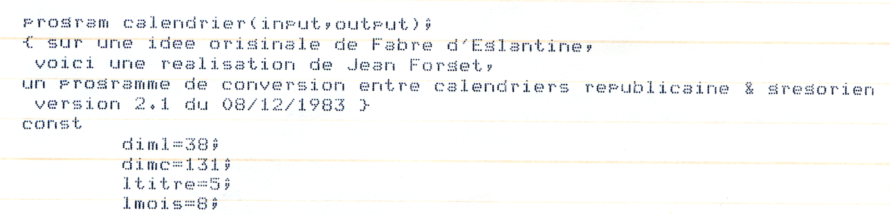

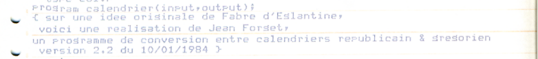

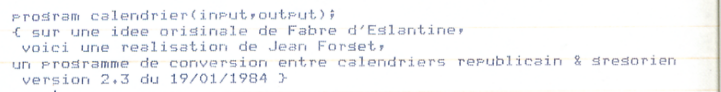

Remarque : ultérieurement, j'ai retrouvé un quatrième listing, daté du 12 décembre 1983.
Mais en raison du fait qu'il était abondamment raturé et que son contenu était un mélange
du contenu du 8 décembre et du contenu du 10 janvier, j'ai décidé de ne pas le scanner
mais de le reconstituer par copier-coller une fois les fichiers sources du 8 décembre et
du 10 janvier reconstruits. Ce quatrième listing ne jouera donc aucun rôle dans la suite.

## Première méthode

Première méthode, tout recopier
à la main. Le problème, c'est qu'entre
1984 et 1990, j'ai affiné mon style
de programmation. Voici par exemple comment je codais en 1984 :

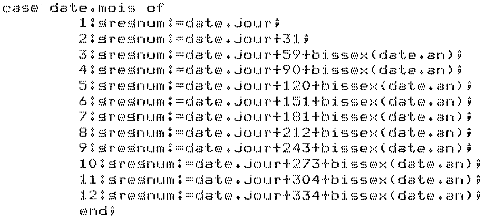

Et voici le même extrait, mis en forme ainsi que je le fais depuis 1990 (au moins)

    case date.mois of
       1: gregnum := date.jour;
       2: gregnum := date.jour +  31;
       3: gregnum := date.jour +  59 + bissex(date.an);
       4: gregnum := date.jour +  90 + bissex(date.an);
       5: gregnum := date.jour + 120 + bissex(date.an);
       6: gregnum := date.jour + 151 + bissex(date.an);
       7: gregnum := date.jour + 181 + bissex(date.an);
       8: gregnum := date.jour + 212 + bissex(date.an);
       9: gregnum := date.jour + 243 + bissex(date.an);
      10: gregnum := date.jour + 273 + bissex(date.an);
      11: gregnum := date.jour + 304 + bissex(date.an);
      12: gregnum := date.jour + 334 + bissex(date.an);
    end;

Comme vous pouvez le voir, j'encadre les opérateurs tels que « `:=` » et « `+` »
de blancs pour améliorer la lisibilité et j'aligne verticalement les éléments semblables
dans les lignes successives, l'alignement se faisant sur la droite si les éléments alignés
sont numériques.
Ce qui ne se voit pas dans cet exemple, c'est qu'en 1984 j'utilisais des
tabulations et que maintenant, je préfère des espaces (sauf pour les _makefiles_).

Et je ne pourrais pas
m'empêcher de rectifier le
programme pendant que je le recopie.
Donc j'ai laissé tomber cette méthode
_a priori_.

## Deuxième méthode

Deuxième méthode, scanner les listings
puis les passer dans un
programme de reconnaisance automatisée
de caractères. J'ai scanné le premier
listing puis je l'ai soumis à quelques
programmes OCR. Comme je m'y attendais,
le résultat a été catastrophique.

## Programmes de reconnaissance automatisée de caractères

Avant de présenter la troisième méthode,
voici un aperçu des programmes de
reconnaissance de caractères.

Les programmes de reconnaissance de
caractères installés sur ma machine
fonctionnent en ligne de commande.
Il s'agit de :

- gocr ([http://jocr.sourceforge.net/](http://jocr.sourceforge.net/))
- ocrad ([https://www.gnu.org/software/ocrad/](https://www.gnu.org/software/ocrad/))
- tesseract ([https://github.com/tesseract-ocr](https://github.com/tesseract-ocr))
- cuneiform ([https://en.wikipedia.org/wiki/CuneiForm\_(software)](https://en.wikipedia.org/wiki/CuneiForm_\(software\)))

De ce que j'ai pu voir dans la logithèque
Ubuntu, les autres programmes disponibles
sont des habillages graphiques
de ces programmes, ou bien des
programmes très spécialisés.

Notons également que cuneiform propose
une option `--dot-matrix` mais dans
mon cas, cela n'a rien donné de mieux
que la tentative sans cette option.

### Remarque : reconnaissance automatisée, non pas optique

J'ai utilisé l'expression « reconnaissance automatisée » et non
pas « optique » pour les programmes ci-dessus. Parce qu'ils ne font
pas de traitement optique.

Imaginez que vous fassiez l'expérience suivante. Vous créez un script
shell basé sur le schéma ci-dessous :

    .                        ___
    .                       (   )
    .                       (___)_ /dev/random
    .                         |
    .                   ---------------
    .                   | script GIMP | (ou GD.pm)
    .                   ---------------
    .                       |   |
    .                  ------   ------
    .                  |             |
    .                 ___           ___
    .                (   )         (   )     exemple.ppm
    .    exemple.txt (___)_        (___)_ ou exemple.png
    .                  |             |
    .                  |      ----------------
    .                  |      |    GOCR      | ou OCRAD, ou Tesseract, ou Cuneiform
    .                  |      ----------------
    .                  |             |
    .                  |            ___
    .                  |           (   )
    .                  |           (___)_ exemple-2.txt
    .                  |             |
    .                  ------   ------
    .                       |   |
    .                   ---------------
    .                   |    diff     |
    .                   ---------------
    .                         |
    .                       -----
    .                       |  _|
    .                       |_/    /dev/stdout et /dev/stderr

Vous le transférez sur un serveur du « claoude », vous l'ajoutez à la
liste des tâches `cron` de ce serveur pour qu'il s'exécute à 4h du
matin et vous coupez la communication avec ce serveur. Lorsque le
script s'exécute à 4h du matin, combien de rayons lumineux sont déviés
par une lentille ou réfléchis par un miroir ? Combien de photons
activent une surface photo-sensible (rétine, barrette CCD) ? Réponse :
zéro. Il n'y a rien d'optique dans ce traitement.

## Le meilleur moteur de reconnaissance

Le meilleur moteur de reconnaissance de caractères
est basé sur des réseaux neuronaux et il nécessite
réellement des capteurs optiques.
Il a été publié pour la première fois
par une start-up libanaise ou, plus précisément,
phénicienne aux alentours de 1200 ans avant J-C.

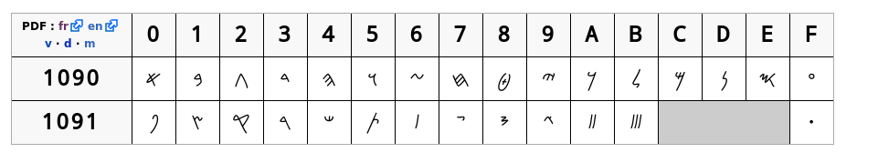

_Copie d'écran personnelle d'une page
[Wikipedia](https://fr.wikipedia.org/wiki/Alphabet_ph%C3%A9nicien)
licence [Creative Commons attribution, partage dans les mêmes conditions](http://creativecommons.org/licenses/by-sa/3.0/deed.fr)_

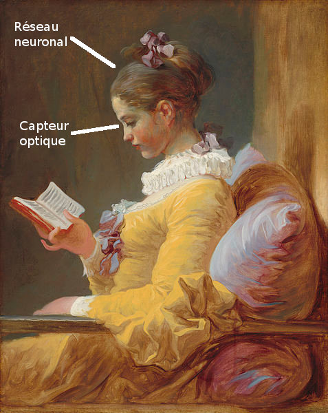

_La Liseuse, par Fragonard (1732--1806), œuvre dans le domaine public, avec quelques adaptations personnelles mineures._

Ce système admet plusieurs plug-ins, mais
à chaque fois, cela nécessite un temps
de paramétrage assez long.

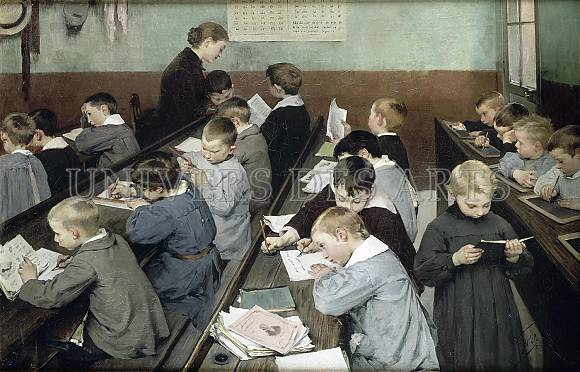

_Source : En classe, le travail des petits, par Henri Jules Geoffroy (1853--1924), œuvre dans le domaine public. Avec un marquage par le site web où j'ai trouvé cette reproduction (pourquoi marquer une œuvre dans le domaine public ?)_

En revanche, les résultats sont
largement meilleurs que pour les
programmes ci-dessus.

Il y a des problèmes toutefois. Par exemple, avec cette image :

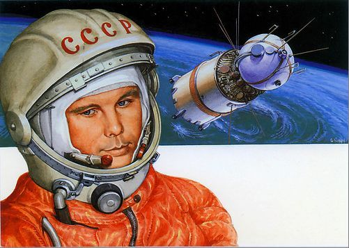

_Source [http://www.popscreen.com/p/MTU3MDkzMDU5/Soviet-CCCP-Astronaut-Space-Patch-Russian-Alexei-Leonov](http://www.popscreen.com/p/MTU3MDkzMDU5/Soviet-CCCP-Astronaut-Space-Patch-Russian-Alexei-Leonov)_

la plupart des systèmes donnent comme résultat « cécécépé » (U+0043 U+0043 U+0043 U+0050),
alors qu'il faut lire en fait « essessessère » (U+0421 U+0421 U+0421 U+0420).
Mais reconnaissons que les programmes mentionnés dans le chapitre précédent ne feraient pas mieux.

D'un autre côté, les systèmes de ce type peuvent détecter des caractères là où il
n'y en a pas. Par exemple, vous les pointez vers Cassiopée :

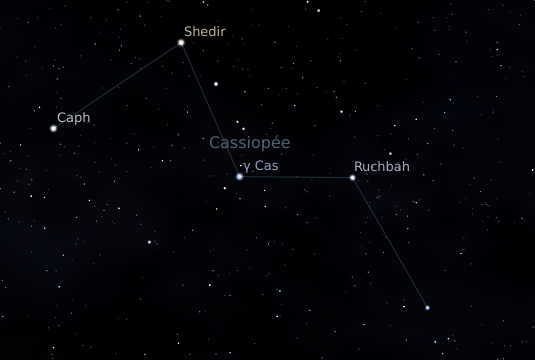

_Source : copie d'écran personnelle du logiciel [Stellarium](http://www.stellarium.org/)_

certains détecterons un « W », d'autres un « M ». Idem
[en regardant dans l'autre sens](https://news.artnet.com/art-world/nasa-photos-alphabet-in-the-sky-400646),
[de l'espace vers la Terre](https://www.mapbox.com/blog/letter-hunt-from-space/).

Ou bien dans ce dessin abstrait, certains y voient des mots entiers, en l'occurrence des prénoms :

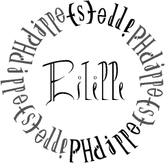

## Programmes hybrides

En  2000 ou  2001,  j'avais installé  sur ma  machine  de l'époque  un
programme original dont je ne trouve plus aucune trace quinze ans plus
tard : Alice-OCR. Pour changer, c'était une application graphique, pas
un utilitaire  en ligne de  commande. La  moitié gauche de  la fenêtre
affichait le  fichier graphique à  analyser et la moitié  droite était
prévue pour afficher le texte résultat.

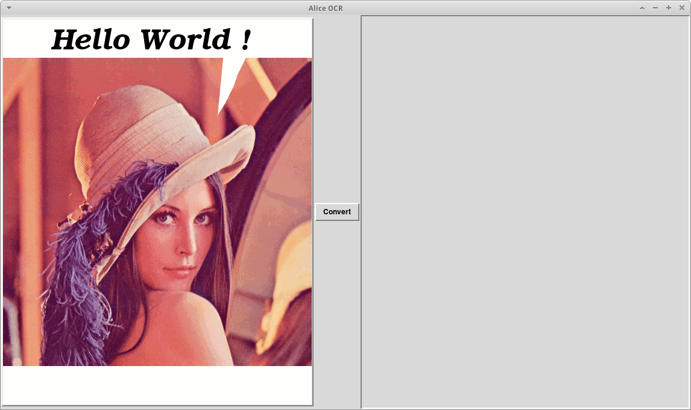

_Source : Portrait de Lena Söderberg, (c) Playboy, 1972, utilisé avec la permission tacite de Playboy, incorporé dans une copie d'écran personnelle_

Vous lanciez une analyse et un premier résultat s'affichait dans la partie droite, avec
dans la partie gauche les caractères mis en relief par des ovales de couleur pâle.

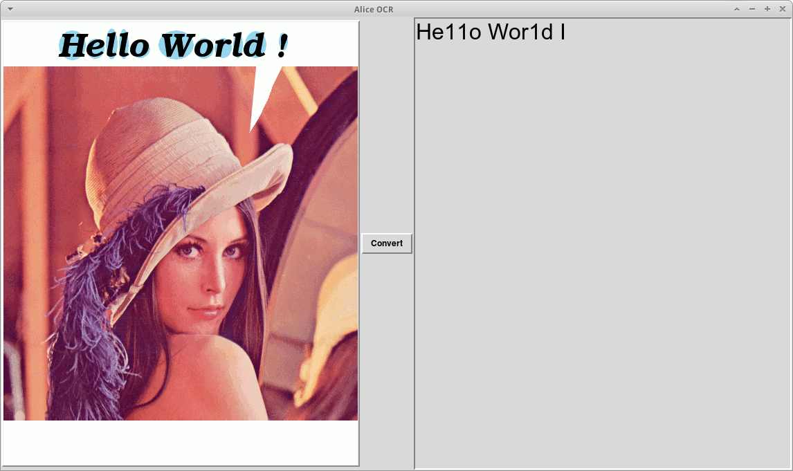

_Source : Portrait de Lena Söderberg, (c) Playboy, 1972, utilisé avec la permission tacite de Playboy, incorporé dans une copie d'écran personnelle_

S'il y avait des erreurs, vous pouviez
cliquer sur un glyphe de la partie graphique
puis indiquer la véritable transcription dans une fenêtre.
Ce n'était pas la peine de pointer
toutes les erreurs, mais seulement
un échantillon représentatif.

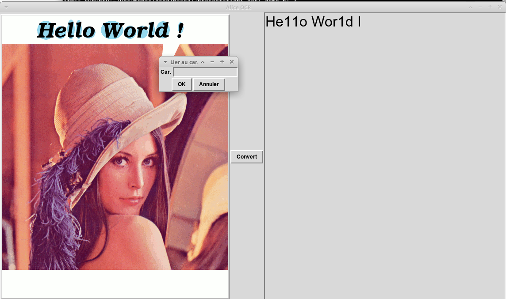

_Source : Portrait de Lena Söderberg, (c) Playboy, 1972, utilisé avec la permission tacite de Playboy, incorporé dans une copie d'écran personnelle_

Ensuite, vous relanciez une analyse
et le résultat tenait compte
des corrections que vous aviez données.
Les associations glyphe → caractère
pouvaient même être stockées dans
une base de données pour l'analyse
d'un autre fichier.

Remarques : en 2000 ou 2001, j'ai fait très peu d'essais, car j'ai rapidement conclu
que cela ne correspondait pas à mes besoins du moment. Notamment, je n'ai pas essayé
avec un fichier graphique contenant à la fois du texte et une photo.

Ici, pour la pseudo-démo, j'ai utilisé un fichier graphique contenant la photo de Lena Söderberg
pour deux raisons :

- Parce que cela montre sans ambiguïté qu'il s'agit d'un fichier graphique et non
d'un fichier texte,
- Parce que la tradition veut que tout programme élémentaire affiche « Hello World ! », que toute leçon de programmation présentant la récursivité prenne pour exemples la factorielle
et la suite de Fibonacci, que tout générateur d'analyse syntaxique comme yacc
prenne pour exemple une calculatrice à quatre opérations, que tout programme de modélisation 3D affiche une
théière et que tout programme d'analyse ou de transformation de dessin affiche le
portrait de Lena.

J'ai essayé de soumettre le portrait de Lena (avec la bulle « Hello World ! ») à `gocr`
et à `cuneiform`. Ils s'en sont tirés correctement. Comme quoi, ce sont quand même de bons programmes
lorsqu'ils sont confrontés à une impression de qualité. Et je pense que le vrai programme
Alice-OCR aurait obtenu un résultat correct également. Mais c'est plus pédagogique en simulant
une erreur.

Remarquez que la délimitation du point d'exclamation ne fonctionne pas, elle oublie le
point. Dans le vrai Alice-OCR, c'était le cas avec les « i », je ne me souviens pas
avoir testé avec des fichiers graphiques contenant des « ! », des  « j », des lettres
accentuées, des deux-points ou d'autres caractères en plusieurs morceaux.
J'en ai tiré la leçon qu'il faut mettre l'humain dans la boucle au moment de la délimitation
des caractères et pas seulement lors de la reconnaissance à proprement parler.
Du coup, pour réduire le nombre de paramètres à renseigner par l'humain, il est essentiel
que les listings soient dans une police à espacement fixe.

### Autres programmes hybrides

Il existe d'autres systèmes informatiques
reposant au moins en partie  sur la reconnaissance humaine
des caractères et qui gèrent leur
infrastructure :

- recaptcha
- Distributed Proofreaders ([https://www.pgdp.net](https://www.pgdp.net)) en amont du projet Gutenberg
- Openfoodfacts ([https://fr.openfoodfacts.org/](https://fr.openfoodfacts.org/)).

## Troisième méthode

La méthode que j'ai adoptée en fin de compte
est inspirée d'Alice-OCR. Le programme assure
l'aspect logistique de la conversion
en gérant notamment une base de données
et la reconnaissance à proprement parler
est assurée par l'utilisateur humain.
À l'inverse de Alice-OCR, il n'y a pas
de première tentative avec un moteur de reconnaissance
informatique. Une autre différence est que
l'utilisateur a son mot à dire lors du
découpage du fichier graphique en cellules contenant un glyphe.

Note : dans ce qui suit, je décris
les programmes au présent ou au passé,
mais j'ai écrit la première description
du système
_avant_ d'écrire la première ligne
de code. Bien sûr, si je dois changer mon
fusil d'épaule sur certains points,
je mettrai à jour la présente description.

# Au travail

## Technologies utilisées

Pour les fonctions graphiques, j'utilise `GD.pm`. Je n'ai pas réussi
à installer l'interface entre Perl et the Gimp sur ma machine, donc je n'ai
pas eu à choisir, j'ai pris `GD.pm`.

Pour les fonctions peu interactives, j'ai utilisé bien entendu une interface
en ligne de commande.

Pour les fonctions interactives, j'ai décidé d'utiliser [Dancer2](http://perldancer.org/)
et [MongoDB](https://www.mongodb.com/what-is-mongodb).
Dancer2 parce que cela fait longtemps
que j'en entends parler par Alexis,
Damien, Sawyer et d'autres. En plus, le module inclut
un serveur web. Certes, ce serveur ne supporterait
pas une charge de  plusieurs requêtes à la seconde,
mais comme mon appli est prévue pour un
seul utilisateur à la fois, c'est largement suffisant.
MongoDB, parce que je connais déjà SQL et
cette application ne m'aurait pas donné l'occasion
d'apprendre des techniques avancées de SQL.
Alors j'ai chaisi de faire mes premiers pas en MongoDB.
Et peut-être PDL si cela permet des comparaisons faciles
de matrices de booléens.

Plan B : pas de plan B pour `GD.pm`, je sais que cela fonctionne et que je saurai
me débrouiller avec. Si je n'étais pas arrivé à m'en sortir avec MongoDB, tant pis, j'aurais
fait du SQL avec SQLite. Et pour Dancer2, j'aurais fait du CGI à l'ancienne, comme lorsque
j'ai commencé à utiliser Perl il y a 19 ans.

Et bien sûr, j'utilise Perl. Perl 5 ou Perl 6 ? Bonne question.
Comme j'ai reçu mon premier livre sur Perl 6 juste avant d'initialiser
mon dépôt Git et d'écrire la première ligne de code exécutable,
j'ai eu le temps de constater qu'il existait une variante de Dancer
pour Perl 6, Bailador. Ensuite, en consultant la liste des modules Perl 6
sur [http://modules.perl6.org/](http://modules.perl6.org/), j'ai vu qu'il existait aussi un
module GD et un module MongoDB. Hélas, je n'ai pas pu utiliser la méthode
`newFromPng` du module GD, la méthode cruciale qui me permet d'utiliser les
listings numérisés. Donc, Perl 6, ce sera pour une autre fois.

Post-scriptum de 2022. Pour
[un autre projet](https://github.com/jforget/raku-Hamilton2/blob/master/doc/Hamilton.fr.md),
j'ai utilisé le module GD.pm de Perl 5 avec Raku et avec le module
[Inline::Perl5](https://modules.raku.org/dist/Inline::Perl5:cpan:NINE) de Raku.
Peut-être aurais-je pu faire de même en 2017 ?

# Numérisation des listings

Comme vous pouvez le constater sur les
reproductions des listings, il y a plusieurs
éléments perturbateurs pour numériser les
fichiers.

Tout d'abord, la largeur.

En fait non, en pratique le problème
est minime. Sur les trois listings,
il y a un nombre très faible de lignes trop
longues pour le format A4, une demi-douzaine en comptant celles où
le dernier point-virgule ou la dernière accolade manque. Donc, je peux me
permettre une reprise manuelle de ces
lignes une fois le processus terminé.

Les bandes Caroll ensuite, ou plus précisément
la bande gauche. En plaçant correctement
le papier au moment de la numérisation,
la bande Caroll est éliminée sans coup férir.
Et si elle apparaît quand même, une intervention
élémentaire sous the Gimp la fait disparaître.

Le troisième écueil, plus gênant,
est que pour le deuxième listing, le ruban
encreur était plutôt fatigué.
Alors que j'ai pu numériser le premier listing
en noir et blanc, en conservant les
caractères et en éliminant les lignes
pré-imprimées, cela n'a pas été
possible avec le deuxième. Selon le
réglage du scanner, soit les lignes étaient
éliminées mais les caractères étaient
mutilés, soit les caractères étaient complets,
mais des morceaux de ligne persistaient.

La solution a consisté à scanner ce listing
en couleurs, de manière à pouvoir ensuite
traiter chaque pixel en fonction de
ses caractéristiques HSV (en anglais
_hue, saturation, value_
et en français
teinte, saturation, valeur).

Un premier programme me permet de savoir quelle est la plage de valeurs
des caractéristiques HSV. J'aurais pu fouiller la documentation, j'ai préféré
écrire un programme qui a l'autre avantage de me servir de modèle pour les suivants.
Et à la réflexion, j'ai bien fait, car j'ai découvert que la fonction de conversion
de RGB vers HSV produisait des nombres négatifs, ce qui est contraire à la documentation.
J'ai donc patché `GD::Simple` et j'ai soumis un ticket
[https://rt.cpan.org/Ticket/Display.html?id=120572](https://rt.cpan.org/Ticket/Display.html?id=120572).

J'ai complété ce premier programme pour calculer également la moyenne et le mode
(la valeur qui apparaît le plus souvent) de chacune des caractéristiques RGB et HSV.
Certes, comme la teinte H est de nature cyclique, le calcul de la moyenne n'a pas
de signification réelle. Mais le mode, si. Et pour les cinq autres caractéristiques,
la moyenne et le mode ont une signification réelle.

À l'origine, j'avais l'intention d'écrire
un deuxième programme pour construire un histogramme
des données H et V (je ne saisissais pas très
bien ce que représente la saturation,
donc j'ai l'intention de faire l'impasse). Mais je me suis renseigné sur
les valeurs HSV et j'ai compris que la saturation avait
son importance. D'autre part, avec les schémas en
[https://en.wikipedia.org/wiki/HSL\_and\_HSV#HSV](https://en.wikipedia.org/wiki/HSL_and_HSV#HSV),
je n'avais plus besoin d'un histogramme.

Un troisième programme (devenu second programme) passe en revue
tous les pixels des fichiers graphiques.
Pour chacun, s'il est plus clair qu'un
certain seuil, le programme le remplace par un
pixel blanc, s'il est plus foncé que
ce seuil il le remplace par
un pixel noir. Le point essentiel est
que ce seuil dépend de la teinte H.
Pour le bleu, ce seuil est plutôt clair,
tandis que pour l'orange il est
plutôt foncé. De la sorte, un
pixel bleu moyen deviendra noir
alors qu'un pixel orange moyen
deviendra blanc.

Dans ce diagramme, j'ai représenté la frontière entre la
zone de conversion vers le blanc et la zone de conversion vers le noir.

_Copie d'écran personnelle d'une page Wikipedia avec des modifications mineures. Comme indiqué dans la page Wikipedia,
Text is available under the Creative Commons Attribution-ShareAlike License; additional terms may apply._

À noter un problème culturel.
Né dans les années 1960, j'ai appris
le dessin avec des crayons de couleurs,
et du papier,
pas avec the Gimp ou assimilé. Donc, pour
moi, « rien », c'est une feuille blanche,
et « plein de couleurs », cela tend à donner
du noir. Or c'est l'inverse dans les
logiciels graphiques avec les valeurs RGB
ou avec le V des valeurs HSV :
plus c'est faible, plus c'est noir
et de l'autre côté, plus c'est
élevé, plus cela se rapproche du blanc.

Un dernier écueil, le plus important, les irrégularités des glyphes.

L'imprimante faisait du 10 CPI et du 6 LPI. Mon scanner
fait du 300 DPI. Cela veut dire que chaque glyphe
correspond à un rectangle de 30x50 pixels.
Cela laisse le champ libre à une énorme variabilité
dans les dessins bitmaps d'un caractère donné.
Voir les exemples dans les copies d'écran.

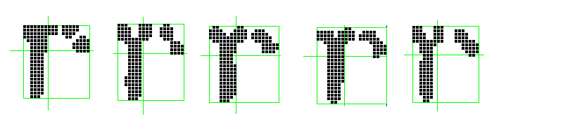

D'où un traitement pour réduire cette variabilité.
Je passe en revue tous les pixels d'un fichier graphique.
Si un pixel est entouré d'une majorité de voisins de la couleur opposée,
alors il change de couleur. Cela permet d'enlever les
verrues et les gerçures sur les frontières entre
le blanc et le noir et cela permet d'enlever la poussière
(pixels noirs isolés).

Le programme de lissage et de nettoyage permet de faire au choix une seule
ou plusieurs itérations en fonction d'un paramètre au lancement.
Un autre paramètre permet de prendre en compte les
diagonales (8 voisins par pixel) ou pas (4 voisins).
Finalement, le programme génère deux fichiers
graphiques : le premier avec des pixels noirs et blancs
pour la suite du projet, le deuxième avec des pixels de
couleurs pour visualiser ceux qui ont été touchés
par le nettoyage et les distinguer de ceux qui n'ont pas
changé de couleur. Cela me permet de mieux apprécier
le fonctionnement de l'algorithme de lissage et
de nettoyage.

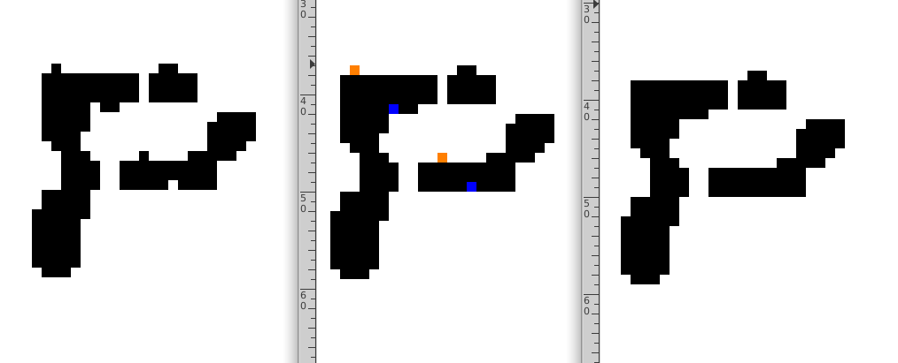

En réfléchissant un peu, je me suis aperçu que la variante
avec 8 voisins aurait émoussé les coins à angle droit :

    ..***      ..***
    ..***      ..***
    ..***  →   ...**
    .....      .....
    .....      .....

Exemple tiré du réel, le même caractère « p » que ci-dessus, traité par un
lissage à 8 voisins.

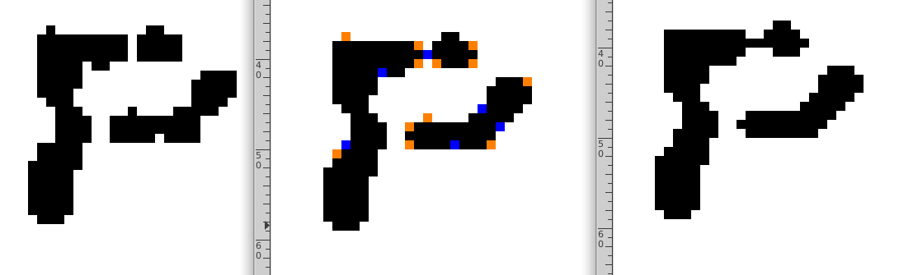

Comme vous pouvez le voir, plusieurs coins ont été effacés, car ils n'avaient
que trois voisins. Le coin en haut à gauche a survécu, parce que la verrue juste à côté (effacée
à juste titre) constituait un quatrième voisin pour ce pixel de coin.

En revanche, vous pouvez constater que le fossé d'un pixel de large entre la partie en haut à gauche
et la goutte d'encre isolée en haut à droite a été comblé, Cet avantage ne compense pas, à mon avis,
l'inconvénient de voir les coins s'effacer.

J'ai donc pris la variante à 4 voisins. Et il suffit d'une génération
pour avoir un bon nettoyage.

On peut considérer que c'est une variante
du Jeu de la Vie de Conway (John, pas Damian),
avec des règles de transition différentes.

La variabilité des glyphes est réduite, mais elle existe encore.

## Conclusion partielle

Après coup, je me rends compte que le lissage des glyphes ne sert à rien. Comme vous pouvez le voir
sur l'exemple ci-dessus, cela permet de changer un nombre très réduit de pixels : 4 dans l'exemple
ci-dessus à 4 voisins, une vingtaine dans l'exemple du lissage à 8 voisins. Alors que comme on le
verra ci-dessous, le nombre de pixels différents entre deux variantes du même caractère peut
atteindre la centaine. Donc, _a posteriori_, le jeu n'en valait pas la chandelle.

# Reconnaissance à proprement parler

Bien que j'utilise une base no-SQL, je continue, dans le cadre
de ce texte descriptif, à définir un schéma de base de
données et à parler de tables et d'enregistrements. Mais c'est plus une auto-discipline
qu'une contrainte imposée par la base de données.
Quant au vocabulaire, j'aurais pu utiliser « collection » au lieu de « table »,
mais ç'aurait été plus difficile d'utiliser « document » au lieu d'« enregistrement »
car l'une des tables (ou collections si vous préférez) s'appelle « Document ».

Mais tout d'abord, définir la base de données utilisée et les autorisations
d'accès.

## Création de la base de données

La création se fait tout simplement dans le shell `mongo`.

    $ mongo
    [ message d'accueil ]
    > use exemple
    switched to db exemple

Puis la création d'un utilisateur générique pour la base de données, portant
le même nom que la base de données :

    > db.createUser( { 'user': 'exemple', 'pwd': 's3kr3t', 'roles': [ 'readWrite' ] })

Et pour activer l'authentification, éditer `/etc/mongodb.conf` et changer les lignes :

    # Turn on/off security.  Off is currently the default
    #noauth = true
    #auth = true

en

    # Turn on/off security.  Off is currently the default
    #noauth = true
    auth = true

et redémarrer le serveur MongoDB.

Maintenant, pour se connecter à la base de données sous le shell `mongo`, il faudra faire

    $ mongo
    [ message d'accueil ]
    > use exemple
    switched to db exemple
    > db.auth('exemple', 's3kr3t')
    1

Il est possible d'utiliser plusieurs bases de données séparées pour plusieurs séries
de fichiers graphiques : une base de données pour les listings sortant d'une
imprimante à aiguilles, une autre base de données pour les listings produits
par une imprimante HP-41, une base de données pour les tickets de supermarché (ça
m'étonnerait que je le fasse, mais je n'exclus pas que d'autres puissent trouver
cela intéressant), etc. Le nom de la base de données est saisi dans l'écran de connexion.
J'ai utilisé le terme « appli ». J'aurais peut-être dû appeler cela « projet »
ou utiliser un autre nom. C'est  « appli », c'est comme ça.

## Le modèle logique des données

Le schéma de base basique, qui sera complété ultérieurement, est :

    .    Document             Caractère
    .      (1,n)                (0,n)
    .        |                    |
    .        |                    |
    .      (1,1)                (1,1)
    .     Cellule (1,n)---(0,n) Glyphe

Un Document se découpe en plusieurs Cellules,

Un Caractère se décline en plusieurs Glyphes (mais un caractère peut ne pas apparaître
dans les Documents de la base de données et ne donner lieu à aucun Glyphe).

Une Cellule peut être associée à un ou parfois plusieurs Glyphes.

Un Glyphe peut être associé à plusieurs Cellules, mais parfois une seule, voire aucune.

La première table est la table « Document ».
Cela correspond à un fichier numérisé et à ses
avatars successifs. Chaque listing a été scanné en huit fichiers graphiques
environ, donc donnera lieu à huit Documents.

La deuxième table est la table « Cellule ».
Elle représente les Cellules obtenues en découpant le Document. Les informations de cette table
sont, entre autres, les coordonnées de la Cellule
dans le Document, aussi bien exprimées en
ligne-colonne qu'en coordonnées pixel.
La table contient également le dessin en pixels encodé
en MIME/base64.

La troisième table est la table « Caractère ».
Elle comporte environ 96 enregistrements,
pour les caractères espace à « } ». Je rappelle
que j'ai utilisé de l'ASCII 7 bits.
Comme il n'y a pas d'information à stocker, peut-être que
cette table ne sera pas implémentée.

La quatrième table est la table « Glyphe ».
Chaque enregistrement correspond à un tableau à deux dimensions
de bits, représentant le dessin du caractère en pixels noirs et blancs.
Un Caractère est associé à 1 à n Glyphes,
un Glyphe est associé à un caractère et un seul.

Et une cinquième table un peu inattendue, la table « Requête ».
Au début, je pensais faire des requêtes « au fil de l'eau » :
saisir les critères, cliquer sur un bouton et lire le résultat.
Je pense qu'il est préférable d'en faire une entité permanente.
Mais comme la notion de requête est plus associée à la notion de processus éphémère
qu'à la notion de « quelque-chose qui peut se stocker dans une base de
données », j'ai préféré adopter un autre nom pour cette table. Le
nom adopté est « Coloriage », parce que le résultat de la requête comporte un fichier
graphique où toutes les Cellules sélectionnées sont représentées sur
un fond coloré.

    .                        Document             Caractère
    .                   (1,n)  (1,n)                (0,n)
    .                  /         |                    |
    .                 /          |                    |
    .             (1,1)          |                    |
    .     Coloriage              |                    |
    .       (1,n)                |                    |
    .         |                  |                    |
    .       (1,1)                |                    |
    .      Critère               |                    |
    .             (0,n)          |                    |
    .                 \          |                    |
    .                  \         |                    |
    .                   (0,n)  (1,1)                (1,1)
    .                         Cellule (1,n)---(0,n) Glyphe

L'utilisateur saisit les critères et on les sauvegarde en base de données.
Puis il clique sur un bouton « Recherche » et le programme applique les critères
sur les Cellules et constitue la liste des Cellules extraites, plus un fichier
graphique où les Cellules extraites sont mises en valeur par un fond coloré.
Par la suite, l'utilisateur peut consulter à plusieurs reprises le résultat de
ce Coloriage (le fichier graphique déjà constitué) et enchaîner vers les
Cellules sélectionnées grâce à une _imagemap_.

Un Critère est une entité logique distincte du Coloriage, mais dans le schéma
physique, tous les Critères dépendant d'un Coloriage seront stockés dans un
tableau de l'enregistrement Coloriage.

Certes, avec la création de nouveaux Glyphes, le résultat du Coloriage devient
de plus en plus obsolète, car certaines Cellules ne vérifient plus les Critères et
d'autres se mettent à les vérifier. Il reste encore utilisable pour consulter les Cellules.
Et l'utilisateur peut de nouveau cliquer sur le bouton « Recherche » pour rafraîchir
le résultat de la requête du Coloriage. C'est à l'utilisateur de décider quand il est souhaitable de déclencher
le (long) rafraîchissement du Coloriage et quand il est préférable de continuer avec un
Coloriage légèrement « rassis ».

## Quadrillage

Avant de définir le modèle physique de données, il faut analyser
deux processus, le découpage d'un Document en Cellules et l'association
entre les Cellules et les Glyphes.

Pour définir le quadrillage, il faut renseigner
les coordonnées pixel de la Cellule (ou de l'espace)
en ligne 0, colonne 0. Il faut également donner
la taille en pixels (largeur et hauteur) pour les
Cellules du quadrillage. Ces dimensions peuvent
avoir une partie décimale. Ainsi, si on attribue
la valeur 40,34 à la largeur, alors
les abscisses-pixel des Cellules successives
seront 0, 40, 80, 121, 161, 201, 242, etc.
La largeur de chaque Cellule sera arrondie
à 41 pixels, tant pis s'il y a un recouvrement
entre deux Cellules voisines.
À moins que j'arrondisse la largeur des Cellules à 40 pixels,
ce qui engendrera d'éventuelles lacunes d'un pixel de large entre
deux Cellules voisines.

Il y a encore un écueil de la numérisation dont je n'ai pas parlé.
Lorsque j'ai scanné les listings, le papier n'était pas
toujours bien aligné sur la vitre du scanner.
J'ai beau caler la feuille avec un gros livre,
lorsque je rabat le couvercle du scanner la feuille subit
une légère rotation qu'il faut compenser dans le
découpage en Cellules.

Comme l'angle de rotation est très faible malgré tout,
je remplace la rotation par la combinaison
d'un cisaillement horizontal et d'un cisaillement
vertical. Le cisaillement horizontal s'exprime au choix ainsi :

Tous les N pixels (en hauteur), décaler d'un pixel vers la gauche / la droite.

Toutes les N lignes, décaler d'un pixel vers la gauche / la droite.

Et de même pour le cisaillement vertical. Dans le cas présent, j'ai
opté pour "toutes les N lignes" et "tous les N caractères".

Comme pour la taille des Cellules, on admet des valeurs
avec partie décimale. D'autre part, comme ces deux cisaillements
simulent une rotation, leurs paramètres sont liés.
Si le cisaillement horizontal se fait vers la droite,
le cisaillement vertical se fera vers le haut.
Et les valeurs des paramètres N devront être identiques
(pour la règle « tous les N pixels ») ou proportionnelles
(« tous les N caractères »). Cette cohérence est
laissée à la charge de l'utilisateur.

Cette opération de cisaillement, comme le calcul des abscisses-pixel et
des ordonnées-pixel, ne concerne que le positionnement du coin
en haut à gauche de la Cellule. Les côtés de la Cellule extraite
sont purement verticaux ou horizontaux.

Voici un exemple volontairement exagéré de cisaillement horizontal. Vous remarquez que les côtés
verticaux des Cellules restent verticaux, même si les Cellules ne sont pas
alignées verticalement entre elles.

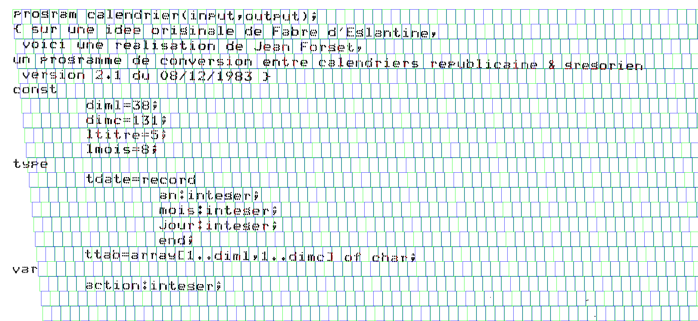

De même voici un cisaillement vertical tout aussi exagéré

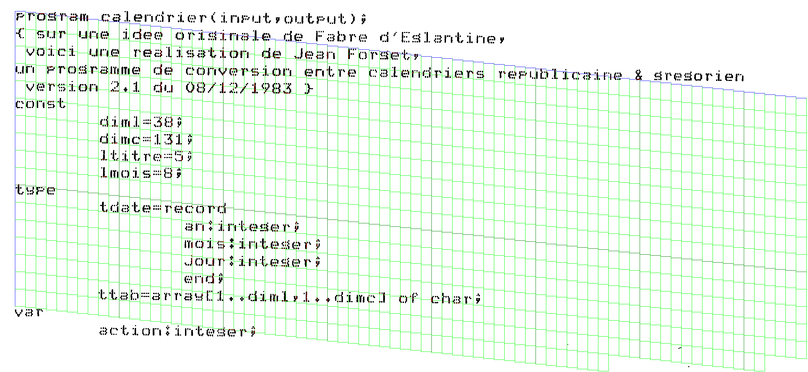

Et la combinaison d'un cisaillement vers la gauche et d'un cisaillement vers le bas
donne une rotation.

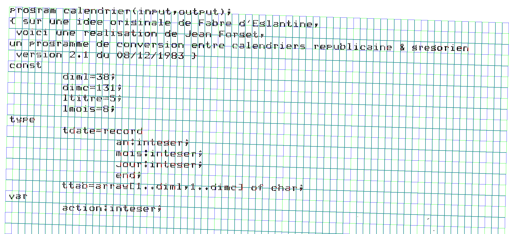

Et voici un exemple réel, en gros plan :  décalage d'un pixel à gauche toutes les trois lignes,
décalage d'un pixel vers le bas tous les trois caractères. Vous pouvez voir le léger décalage
entre la Cellule du « o » et la Cellule du « g », ainsi qu'entre le « a » et le « m ».

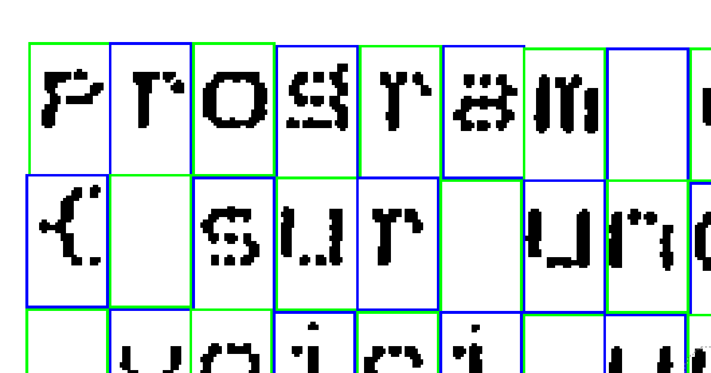

### Mauvaise surprise

Le projet est basé sur l'hypothèse que l'impression se fait avec une police à espacement fixe,
ce qui permet de calculer facilement les coordonnées pixel des Cellules en fonction de leurs
coordonnées ligne-colonne. Or il a des irrégularités dans l'impression. Voici un exemple
où le découpage des Cellules se fait bien jusqu'à l'esperluette, mais où cela débloque
complètement pour le mot « grégorien »

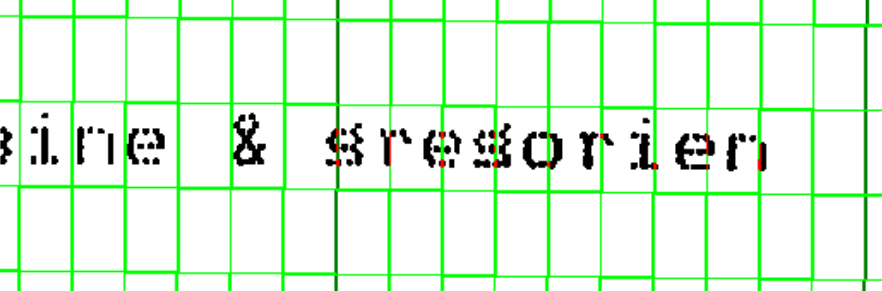

L'idée consiste à introduire une nouvelle notion de Grille et considérer qu'un Document se découpe
en plusieurs Grilles, lesquelles se découpent en Cellules. Le modèle de données devient donc :

    .                                    Document             Caractère
    .                               (1,n)  (1,n)                (0,n)
    .                              /         |                    |
    .                             /          |                    |
    .                         (1,1)          |                    |
    .                 Coloriage            (1,1)                  |
    .                   (1,n)             Grille                  |
    .                     |                (1,n)                  |
    .                   (1,1)                |                    |
    .                  Critère               |                    |
    .                         (0,n)          |                    |
    .                             \          |                    |
    .                              \         |                    |
    .                               (0,n)  (1,1)                (1,1)
    .                                     Cellule (1,n)---(0,n) Glyphe

### Découpage en plusieurs grilles

Un Document est scindé en plusieurs Grilles. Chaque Grille possède comme
attributs les valeurs permettant de découper les Cellules comme dans
la version initiale du schéma de données :
coordonnées pixels du coin en haut à gauche, largeur et hauteur des Cellules
en pixels, cisaillement. En plus, il y a les coordonnées ligne-colonne du coin
en haut à gauche, puisque la Grille ne couvre plus la totalité du Document.
Et il y a un facteur de priorité, pour régler le cas où une Cellule pourrait
être obtenue avec les paramètres de deux Grilles différentes.
Le fichier graphique obtenu par la mise à jour du Document et de ses Grilles
mettra en valeur les coins en haut à gauche de chaque Grille.

Il y a un cas particulier, la Grille avec la Cellule `l = 0, c = 0` en haut à gauche.
Cette Grille a automatiquement le coefficient de priorité le plus faible. Cette Grille
est créée automatiquement avec le Document et il n'y a pas moyen de la supprimer.
Il y a néanmoins la possibilité de modifier ses paramètres (coordonnées pixels,
largeur, hauteur, cisaillement).

Pour les autres Grilles, la création se fait en saisissant les coordonnées `l, c` du
coin en haut à gauche et la priorité. Puis l'utilisateur choisit entre saisir tous les
autres paramètres manuellement, ou laisser le programme les calculer. Avec le calcul automatique,
les paramètres sont recopiés à partir de la Grille de priorité inférieure qui aurait permis
de générer la Cellule en haut à gauche. Évidemment, cela veut dire que la nouvelle Grille ne
sert à rien pour l'instant puisque les paramètres sont les mêmes que pour la Grille de priorité
inférieure. Mais l'utilisateur peut modifier les paramètres manuellement ensuite, jusqu'à obtenir
des valeurs correctes. Le calcul automatique permet d'éviter que l'utilisateur tatonne trop
pour obtenir les valeurs finales.

Reprenons l'exemple de la copie d'écran précédente, en omettant les cisaillements pour simplifier.
Au début, puis par tatonnements successifs, et en faisant l'impasse sur le mot
« gregorien », l'utilisateur a déterminé que la Grille par défaut est :

    l   c  prio    x    y  lg  ht action
    0   0    0    42   27  30  49

L'utilisateur décide de créer une deuxième Grille pour le mot « gregorien ». Le numéro de ligne
est à coup sûr 3, mais combien vaut le numéro de colonne ? Sans faire attention à la ligne verticale
en vert foncé, l'utilisateur essaie au pif :

    l   c  prio    x    y  lg  ht action
    0   0    0    42   27  30  49
    3  58    1                    calcul automatique

Le programme réaffiche

    l   c  prio    x    y  lg  ht action
    0   0    0    42   27  30  49
    3  58    1  1827  194  30  49

Mais le fichier graphique montre qu'en colonne 58, il y a l'esperluette. L'utilisateur corrige alors
en supprimant la Grille qu'il vient de créer et en en créant une nouvelle avec les bonnes
coordonnées :

    l   c  prio    x    y  lg  ht action
    0   0    0    42   27  30  49
    3  58    1  1827  194  30  49 suppression
    3  60    1                    calcul automatique

Le programme réaffiche alors :

    l   c  prio    x    y  lg  ht action
    0   0    0    42   27  30  49
    3  60    1  1889  195  30  49 saisie manuelle

L'utilisateur constate qu'il n'y a pas de problème dans le découpage vertical, mais qu'il faut
décaler le découpage horizontal de quatre pixels vers la gauche, tout en réduisant la largeur
des Cellules. Il saisit donc :

    l   c  prio    x    y  lg  ht action
    0   0    0    42   27  30  49
    3  60    1  1885  195  29  49 saisie manuelle

Et il peut procéder à d'autres ajustements progressifs, voire créer une troisième Grille, puis
une quatrième, et ainsi de suite. En fait, dans ce cas je n'ai eu besoin que de trois Grilles.
Voici ce que cela donne avec :

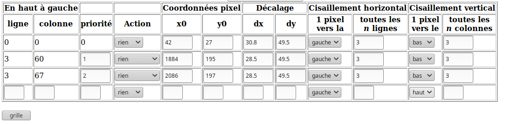

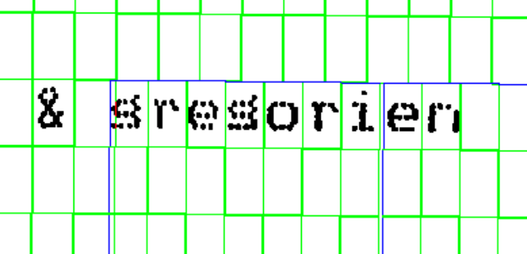

On remarquera qu'il reste des pixels rouges dans « gregorien ». Ce n'est
pas dû à la nouvelle Grille, celle qui chapeaute le caractère « g », mais à l'ancienne
avec le recouvrement entre les deux Grilles sur quelques pixels de large. Donc,
ne pas se formaliser pour ces pixels rouges.

## Relation entre Cellules et Glyphes

Compte tenu des irrégularités des gouttes d'encre, le dessin en pixels
d'une Cellule
ne correspond pas au dessin épuré d'un Glyphe. On associe
une Cellule à un Glyphe en comparant les pixels et en minimisant
le nombre de pixels différents. Ce nombre, le « score »,
est stocké dans l'enregistrement Cellule.

Il y a un problème avec cette méthode, dans la mesure où une Cellule
peut correspondre à plusieurs Glyphes différents. Si ces Glyphes
dépendent du même Caractère, ce n'est pas grave. Mais si ces Glyphes
représentent des Caractères différents... J'en tiendrai compte
pour mes traitements.

En raison de l'existence systématique d'au moins un Glyphe dans la base de
données (le Glyphe Espace), chaque Cellule aura, dès sa création, un score
et sera associée à au moins un Glyphe. Cela permet de simplifier d'autres
portion des traitements du programme.

Une fois le découpage effectué, on rogne la Cellule en calculant
l'« enveloppe » des pixels (_bounding box_ en anglais).
Prenons l'exemple de deux Cellules contenant un signe plus.
Les signes ne sont pas centrés de la même manière dans leur Cellule.

    ----------------  ----------------
    |              |  |              |
    |        *     |  |              |
    |        *     |  |              |
    |        *     |  |      *       |
    |     *******  |  |      *       |
    |        *     |  |      *       |
    |        *     |  |   *******    |
    |        *     |  |      *       |
    |              |  |      *       |
    |              |  |      *       |
    |              |  |              |
    ----------------  ----------------

La comparaison brute de ces deux Cellules donne de nombreuses différences.
Les « `=` » montrent les pixels noirs communs (deux seulement),
les « `≠` » montrent les pixels différents (22).

    ----------------  ----------------
    |              |  |              |
    |        ≠     |  |              |
    |        ≠     |  |              |
    |        ≠     |  |      ≠       |
    |     ≠=≠≠≠≠≠  |  |      =       |
    |        ≠     |  |      ≠       |
    |        =     |  |   ≠≠≠≠≠=≠    |
    |        ≠     |  |      ≠       |
    |              |  |      ≠       |
    |              |  |      ≠       |
    |              |  |              |
    ----------------  ----------------

Il y a fort à parier
que le Glyphe qui sera associé à la première donnera un mauvais score pour la seconde.
C'est pour cela que l'on calcule l'enveloppe rectangulaire englobant les pixels noirs, pour obtenir des comparaisons
plus significatives.

    Cellule 1         Cellule 2         Glyphe
    ----------------  ----------------  ---------
    |    --------- |  |              |  |   *   |
    |    |   *   | |  |              |  |   *   |
    |    |   *   | |  |  ---------   |  |   *   |
    |    |   *   | |  |  |   *   |   |  |*******|
    |    |*******| |  |  |   *   |   |  |   *   |
    |    |   *   | |  |  |   *   |   |  |   *   |
    |    |   *   | |  |  |*******|   |  |   *   |
    |    |   *   | |  |  |   *   |   |  ---------
    |    --------- |  |  |   *   |   |
    |              |  |  |   *   |   |
    |              |  |  ---------   |
    ----------------  ----------------

Exemple réel de comparaison entre une Cellule et un Glyphe. La Cellule est à gauche
et on peut remarquer le rectangle bleu délimitant la Cellule et le rectangle vert délimitant
l'enveloppe des pixels noirs. Le Glyphe est à droite. Et au milieu, comme dans le programme de lissage,
la représentation en orange des pixels effacés et la représentation en cyan des pixels noircis.

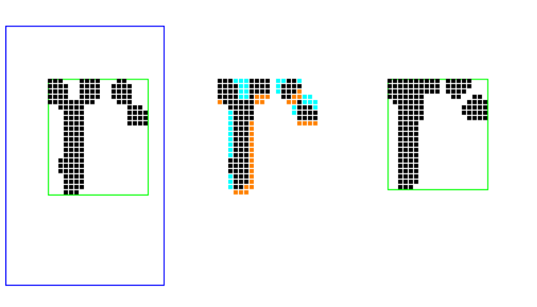

Il y a un problème, toutefois. Imaginons que les Cellules soient

    ----------------  ----------------
    |              |  |              |
    |        *     |  |              |
    |        *     |  |              |
    |        *     |  |      *       |
    |     *******  |  |      *       |
    |        *     |  |      *       |
    |        *     |  |  ********    |
    |        *     |  |      *       |
    |              |  |      *       |
    |              |  |      *       |
    |              |  |              |
    ----------------  ----------------

Le calcul des enveloppes donne alors :

    Cellule 1         Cellule 2         Glyphe
    ----------------  ----------------  ---------
    |    --------- |  |              |  |   *   |
    |    |   *   | |  |              |  |   *   |
    |    |   *   | |  | ----------   |  |   *   |
    |    |   *   | |  | |    *   |   |  |*******|
    |    |*******| |  | |    *   |   |  |   *   |
    |    |   *   | |  | |    *   |   |  |   *   |
    |    |   *   | |  | |********|   |  |   *   |
    |    |   *   | |  | |    *   |   |  ---------
    |    --------- |  | |    *   |   |
    |              |  | |    *   |   |
    |              |  | ----------   |
    ----------------  ----------------

Si la comparaison du Glyphe avec la Cellule 1 donne un résultat parfait de 0 pixel,
la comparaison du Glyphe avec la Cellule 2 donne un résultat catastrophique :

    Cellule 1         Cellule 2         Glyphe
    ----------------  ----------------  ---------
    |    --------- |  |              |  |   *   |
    |    |   =   | |  |              |  |   *   |
    |    |   =   | |  | ----------   |  |   *   |
    |    |   =   | |  | |    ≠   |   |  |*******|
    |    |=======| |  | |    ≠   |   |  |   *   |
    |    |   =   | |  | |    ≠   |   |  |   *   |
    |    |   =   | |  | |=======≠|   |  |   *   |
    |    |   =   | |  | |    ≠   |   |  ---------
    |    --------- |  | |    ≠   |   |
    |              |  | |    ≠   |   |
    |              |  | ----------   |
    ----------------  ----------------

Le mauvais score provient du fait que l'exension vers la gauche de l'enveloppe des pixels
de la Cellule provoque au final un décalage de la barre verticale vers la droite, d'où
un nombre important de pixels modifiés alors qu'il était naturel de considérer qu'ils n'étaient
pas modifiés et qu'ils ne comptaient pas dans le score de la Cellule.

Et cela s'est passé dans mes tests. J'ai créé quelques Glyphes pour la lettre « l »  et le
chiffre « 1 ». En faisant passer l'association entre Cellules et Glyphes, l'une des Cellules
contenant une lettre « l » s'est retrouvée associée à un Glyphe chiffre « 1 ».

Le score est de 47, dont 8 pour la barre verticale, 11 pour le pied et 28 pour la goutte d'encre
en haut à gauche, censée faire la différence entre les lettres « l » et les chiffres « 1 ».

La comparaison avec les Glyphes lettres « l » donne :

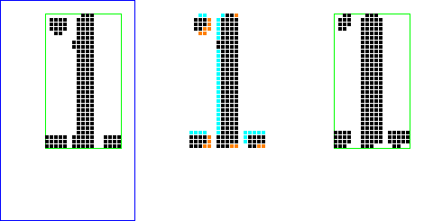

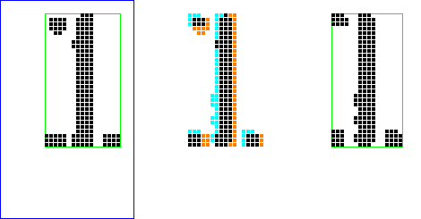

Ce qui augmente le score dans ces deux cas, c'est le fait que la barre verticale comporte un nombre
important de pixels de différence, dépassant la différence de 28 pixels due à la goutte d'encre en haut à gauche
du glyphe « 1 ». Pour le premier Glyphe « l », c'est un peu normal, la barre verticale de la
Cellule est large de 4 pixels alors que la barre verticale du Glyphe fait 5 pixels de large et il
faut donc effacer une trentaine de pixels. Mais pour le second Glyphe « l », la barre
verticale fait 4 pixels de large comme pour la Cellule, donc il n'y a pas de raison d'avoir une
telle différence. Or, comme la barre n'est pas à la même distance du bord de gauche de
l'enveloppe dans la Cellule et le Glyphe, il faut effacer toute une colonne et colorier une
autre, soit une soixantaine de pixels au total.

La solution consiste donc à ne plus caler la comparaison sur le coin en haut à gauche de l'enveloppe
des pixels noirs, mais de se baser sur le centre de gravité des pixels noirs.
Cela permet de réduire notablement ce problème de la colonne bleue et de la colonne orange, sans l'éliminer
tout-à-fait.

Comme le centre de gravité est déterminé par la moyenne des coordonnées x et y
des pixels noirs, les coordonnées xg et yg auront presque toujours une valeur
fractionnaire. Et à part le cas de figure d'un Glyphe créé à partir d'une Cellule,
les parties fractionnaires seront différentes entre les coordonnées du centre
de gravité de la Cellule et celle du Glyphe.
Comment aligner les pixels de la Cellule avec ceux du Glyphe avec un décalage
en nombre entier ? Comment arrondir les coordonnées xg et yg ?

La solution adoptée consiste à faire plusieurs essais, en arrondissant par défaut
puis par excès. Pour les abscises xg\_Cel et xg\_Gly, on fait une série de tests
où les deux sont arrondies par défaut, une deuxième où xg\_Cel est arrondie par
excès tandis que xg\_Gly est arrondie par défaut, puis une troisième où
xg\_Cel est de nouveau arrondie par défaut et xg\_Gly est cette fois-ci arrondie
par excès. Inutile de faire l'essai où les deux abscises sont arrondies par
excès, cet essai serait redondant avec celui où elles sont arrondies par défaut.

Et c'est la même chose pour les ordonnées.
Avec un exemple, c'est plus clair.

    .               Cellule           Glyphe
    .               xg_Cel  yg_Cel    xg_Gly  yg_Gly
    coord réelles   17,76   18,90      7,82   16,11
    essai 0         17      18         7      16
    essai 1         17      18         8 *    16
    essai 2         17      18         7      17 *
    essai 3         18 *    18         7      16
    essai 4         18 *    18         8 *    16
    essai 5         18 *    18         7      17 *
    essai 6         17      19 *       7      16
    essai 7         17      19 *       8 *    16
    essai 8         17      19 *       7      17 *

En gardant le score le plus faible parmi
les neuf scores calculés, on réduit encore un peu plus le problème de la
colonne bleue et de la colonne orange présenté ci-dessus.

Une fois que l'on a choisi une méthode d'arrondi, comment compte-t-on le nombre
de pixels différents entre la Cellule et le Glyphe ?

La première méthode consiste à dérouler toutes les coordonnées de l'enveloppe commune
au Glyphe et à la Cellule. Chaque fois qu'un pixel est blanc dans l'un et noir dans l'autre,
on ajoute +1 au score.

La seconde méthode est moins évidente. On initialise le score avec le nombre de noirs
de la Cellule, plus le nombre de noirs du Glyphe. Puis on déroule tous les pixels et
on compte -2 chaque fois que l'on a un pixel noir à la fois dans la Cellule et dans le Glyphe.
L'avantage de cette seconde méthode est que l'on boucle sur un intervalle plus réduit
de coordonnées. Cela se verra mieux avec l'exemple ci-dessous

    Cellule            Glyphe
       0  3  6  9      0  3  6  9
      ------------    ------------
    0 |         *|    |          |
      |          |    |          |
      |    **    |    |    ***   |
    3 |   ***    |    |    **    |
      |    **    |    |    ***   |
      |          |    |          |
    6 |          |    |*         |
      ------------    ------------

La Cellule et le Glyphe ont été alignés pour faire coïncider (à peu près) leurs centres
de gravité. Avec la première méthode, le calcul du score se fera avec deux boucles
emboîtées, l'une avec les coordonnées x dans l'intervalle 0..9, l'autre avec les coordonnées
y dans l'intervalle 0..6. Avec la seconde méthode, on commence par remarquer que la Cellule
n'a aucun pixel noir avec x < 3 ni avec y > 4.  De même, le Glyphe n'a aucun
pixel noir avec x > 6 ni avec y < 2. Donc, les deux boucles emboîtées
se feront avec x dans l'intervalle 3..6 (au lieu de 0..9) et avec y dans l'intervalle 2..4
(au lieu de 0..6).

Dans les deux dessins, il y a 6 pixels en commun, plus 2 pixels à effacer et 3 à noircir.
Le score est donc 2 + 3 = 5. Avec la seconde méthode, la Cellule a 8 pixels noirs et le Glyphe
en a 9. Le calcul commence donc avec un score de 17. Comme il y a 6 pixels noirs en
commun, on calculera 17 - 2 x 6 = 17 - 12 = 5.

La seconde méthode permet donc un calcul plus rapide. De plus, elle permet de ne pas se
préoccuper du cas où un pixel se trouve en dehors du dessin du Glyphe (pixel 0,9 dans l'exemple
ci-dessus) ou en dehors de l'enveloppe de la Cellule (pixel 6,0). En revanche, s'il faut dessiner
la Cellule et le Glyphe avec des gros pixels bleus et des gros pixels orange pour
mettre en évidence la comparaison entre Cellule et Glyphe, alors la seconde méthode
ne peut pas s'appliquer, il faut réellement passer en revue tous les pixels de l'enveloppe
commune de la Cellule et du Glyphe.

Reprenons la comparaison entre la Cellule en ligne 1, colonne 38 et le Glyphe « l » numéro 1.

Pour la Cellule, on a :

    xg  =  7.77
    yg  = 15.91
    lge = 17
    hte = 30

Pour le Glyphe, on a :

    xg  =  7.02
    yg  = 16.11
    lge = 16
    hte = 30

On va se contenter d'illustrer quatre tentatives pour que le tableau reste lisible.

    Centre de gravité Cellule       7  15              7  16            8  15             8  16
    Centre de gravité Glyphe        7  16              7  16            7  16             7  16

    Plage de valeurs Cellule   ( 0..16,  0..29)  ( 0..16,  0..29)  ( 0..16,  0..29)  ( 0..16,  0..29)
    relative au CDG            (-7.. 9,-15..14)  (-7.. 9,-16..13)  (-8.. 8,-15..14)  (-8.. 8,-16..13)
    Plage de valeurs Glyphe    ( 0..15,  0..29)  ( 0..15,  0..29)  ( 0..15,  0..29)  ( 0..15,  0..29)
    relative au CDG            (-7.. 8,-16..13)  (-7.. 8,-16..13)  (-7.. 8,-16..13)  (-7.. 8,-16..13)

    Méthode 1
    Plage combinée             (-7.. 9,-16..14)  (-7.. 9,-16..13)  (-8.. 8,-16..14)  (-8.. 8,-16..13)
    relative au CDG
    Plage combinée Cellule     ( 0..16, -1..29)  ( 0..16,  0..29)  ( 0..16, -1..29)  ( 0..16,  0..29)
    Plage combinée Glyphe      ( 0..16,  0..30)  ( 0..16,  0..29)  (-1..15,  0..30)  (-1..15,  0..29)

    Méthode 2
    Plage combinée             (-7.. 8,-15..13)  (-7.. 8,-16..13)  (-7.. 8,-15..13)  (-7.. 8,-16..13)
    relative au CDG
    Plage combinée Cellule     ( 0..15,  0..28)  ( 0..15,  0..29)  ( 1..16,  0..28)  ( 1..16,  0..29)
    Plage combinée Glyphe      ( 0..15,  1..29)  ( 0..15,  0..29)  ( 0..15,  1..29)  ( 0..15,  0..29)

Exception : lors que l'on compare une Cellule avec le Glyphe-Espace, qui ne contient aucun
pixel noir, les neuf façons de faire varier les arrondis donneront toutes le même score :
le nombre de pixels noirs de la Cellule. C'est inutile de faire varier les arrondis dans
ce cas.

## Coloriage

Comme je l'ai  déjà indiqué, le Coloriage sert à  afficher le résultat
de  l'association entre  Cellules et  Glyphes, en  spécifiant puis  en
exécutant des requêtes sur les cellules du Document courant.

Il y a trois types de coloriage :

- 1  Les coloriages servant  à détecter  le cas des  Cellules pour
lesquelles l'association hésite entre deux Glyphes, voire plus.
- 2 Les coloriages servant à  mettre en évidence les Cellules avec
un très mauvais score.
- 3 Les  coloriages servant  à faire  le tri  entre les  Cellules
associées  à  des  caractères   similaires  ;  typiquement,  faire  la
distinction entre  les « l  » comme Lima,  les « I  » majuscules
comme India, et les chiffres « 1 ».

En fait,  le premier type n'a  pas d'utilité pratique, les  cas où une
Cellule est associée à deux Glyphes différents sont extrêmement rares.
Inutile de s'y intéresser.

Pour les  coloriages par  score, on spécifie  des critères  par scrore
décroissant et en utilisant des couleurs en dégradé.

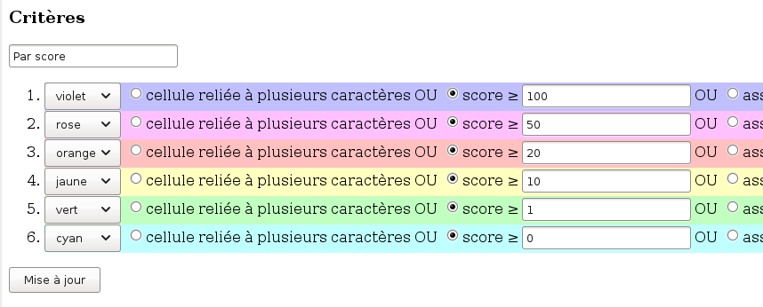

Le résultat ressemble à ceci :

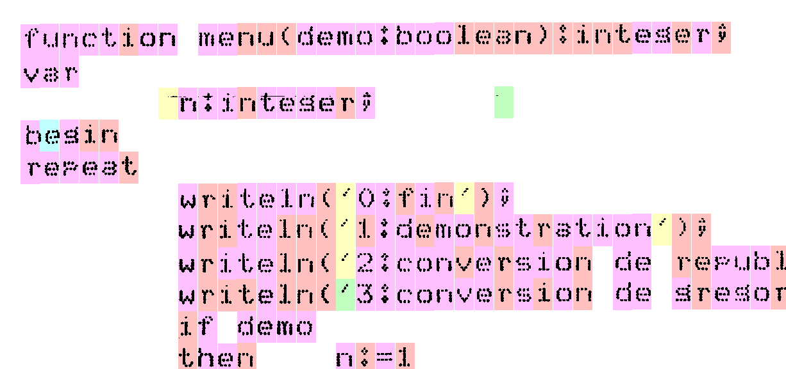

On peut constater dans  cet exemple que le « e » de  « begin » a
servi de modèle pour un Glyphe et que, par conséquent, son score est à
zéro. On  peut constater également  que deux Cellules occupées  par un
espace ont un  score, car elles contiennent des  pixels parasites. Les
autres  espaces, en  revanche, ne  contiennent aucun  pixel, donc  ils
n'ont pas donné lieu à extraction de Cellule.

Pour   les  coloriages   destinés   à   différencier  les   caractères
ressemblant, les  couleurs à utiliser doivent  être contrastées. Voici
un exemple de  coloriage pour faire la distinction entre  les « l »
comme  Lima,  les  « I »  majuscules  comme  India, et les chiffres
« 1 ».

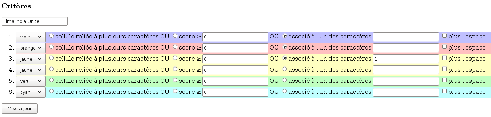

Et voici le résultat

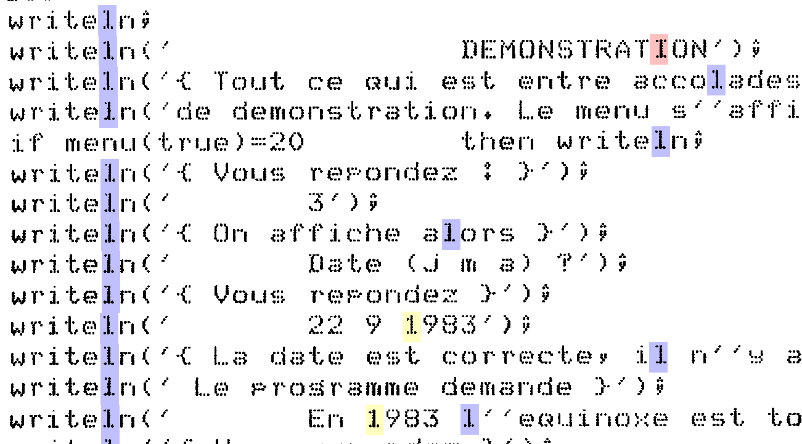

## Modèle physique des données

Rappel : le modèle logique des données est :

    .                       Document             Caractère
    .                  (1,n)  (1,n)                (0,n)
    .                 /         |                    |
    .                /          |                    |
    .            (1,1)          |                    |
    .    Coloriage            (1,1)                  |
    .      (1,n)             Grille                  |
    .        |                (1,n)                  |
    .      (1,1)                |                    |
    .     Critère               |                    |
    .            (0,n)          |                    |
    .                \          |                    |
    .                 \         |                    |
    .                  (0,n)  (1,1)                (1,1)
    .                        Cellule (1,n)---(0,n) Glyphe

Aucune des relations hiérarchiques (c'est-à-dire avec un `(1,1)` d'un côté)
n'est porteuse de données. Elles sont donc matérialisées par le fait que la clé
de l'entité fille contient la clé de l'entité mère, ou par le fait que les documents
implémentant les entités filles sont inclus dans le document implémentant l'entité
mère.

Par exemple, un enregistrement Coloriage est identifié par le code du Document associé,
plus un numéro séquentiel et cet enregistrement Coloriage contient la liste des
Critères définis pour ce Coloriage.

La relation Critère-Cellule est implémentée en incluant la liste des couples
Cellule-Critère (uniquement les clés) dans l'enregistrement Coloriage.
De même, la relation Cellule-Glyphe est implémentée en incluant la liste des
clés de Glyphe, plus quelques autres informations, dans l'enregistrement de la Cellule.

L'entité Caractère n'ayant aucune information à part sa clé, elle ne donne pas lieu
à une collection MongoDB.

### Document

Exemple de Document :

    {
          "_id" : ObjectId("59cb36537a7f4608a2293a61"),
          "ind_blanc" : 0,
          "ind_noir" : 1,
          "taille_x" : 2328,
          "dh_cre" : "2017-09-27 05:25:39",
          "dx" : "30",
          "taille_y" : 1071,
          "fic" : "ex1.png",
          "doc" : "ex1",
          "nb_noirs" : 53089,
          "grille" : [
                  {
                          "cish" : 3,
                          "dy" : 49.5,
                          "dirv" : "bas",
                          "l" : 0,
                          "prio" : 0,
                          "c" : 0,
                          "cisv" : 3,
                          "dirh" : "gauche",
                          "x0" : 42,
                          "dx" : 30.85,
                          "y0" : 27,
                          "action" : "rien"
                  },
                  {
                          "x0" : 1884,
                          "dx" : 28.5,
                          "y0" : 195,
                          "action" : "rien",
                          "cisv" : 3,
                          "dirh" : "gauche",
                          "dirv" : "bas",
                          "dy" : 49.5,
                          "c" : 60,
                          "prio" : 1,
                          "l" : 3,
                          "cish" : 3
                  },
                  {
                          "x0" : 2086,
                          "dx" : 28.5,
                          "y0" : 197,
                          "action" : "saisie",
                          "cisv" : 3,
                          "dirh" : "gauche",
                          "dirv" : "bas",
                          "dy" : 49.5,
                          "l" : 3,
                          "prio" : 2,
                          "c" : 67,
                          "cish" : 3
                  }
          ],
          "etat" : 3,
          "dy" : "50",
          "fic_grille" : "ex1-grille.png",
          "dh_grille" : "2017-09-27 05:27:49",
          "num_gr" : 2,
          "dh_valid" : "2017-09-27 05:29:03"
    }

Détail des champs

Clé du Document

        "doc" : "ex1",

Champ `_id` automatiquement créé par MongoDB

        "_id" : ObjectId("59cb36537a7f4608a2293a61"),

Informations diverses, comme le nom du fichier graphique origine
et celui du fichier où la grille est matérialisée, la taille
en pixels dudit fichier, le nombre de pixels noirs.

        "fic" : "ex1.png",
        "fic_grille" : "ex1-grille.png",
        "taille_x" : 2328,
        "taille_y" : 1071,
        "nb_noirs" : 53089,

Comment interpréter les valeurs renvoyées par `GD:getPixel`

        "ind_blanc" : 0,
        "ind_noir" : 1,

À  quel point du traitement est-on arrivé, ainsi que les dates-heures
où l'on est arrivé aux différents états.

        "etat" : 3,
        "dh_cre" : "2017-09-27 05:25:39",
        "dh_grille" : "2017-09-27 05:27:49",
        "dh_valid" : "2017-09-27 05:29:03"

Les différents états possible sont :

1. Le Document est créé.
2. Les informations de grille sont saisies et le fichier généré.
3. La grille est validée, c'est-à-dire que les Cellules ont été
générées en fonction de cette grille.
4. La procédure d'association a été lancée pour toutes les Cellules
du Document. Pour cet état, il y a deux horodatages, `dh_debut` et `dh_assoc`. Cela
permet de calculer le temps que cette fonction a pris pour le document
complet.
5. Le fichier texte final a été généré.

Taille approximative des Cellules

        "dx" : "30",
        "dy" : "50",

Liste des Grilles et numéro de la dernière

        "num_gr" : 2,
        "grille" : [
            { ... },
            { ... },
            { ... },
        ],

Les Grilles sont numérotées à partir de zéro, donc
dans ce cas il y a trois grilles. Voici l'une d'elles

Priorité, qui tient lieu de clé (numéro séquentiel)

        "prio" : 0,

On pourrait considérer que ce champ est redondant avec la position
de la Grille dans le tableau des Grilles. En effet, comme on renumérote
les priorités après avoir trié les Grilles en fonction de cette priorité,
la Grille de priorité 0 est nécessairement en position 0 du tableau,
la Grille de priorité 1 est nécessairement en position 1 du tableau,
et ainsi de site. Mais j'ai utilisé la valeur de l'attribut `prio`
pour une recherche, donc je conserve cet attribut dans la Grille.

Coordonnées ligne-colonne de la Cellule en haut à gauche de la Grille

        "l" : 0,
        "c" : 0,

Coordonnées pixels de la Cellule en haut à gauche de la Grille

        "x0" : 42,
        "y0" : 27,

Décalage d'une Cellule à sa voisine. La partie entière de ces deux
nombres donne la largeur et la hauteur des Cellules de cette Grille

        "dx" : 30.85,
        "dy" : 49.5,

Valeurs déterminant le cisaillement horizontal et le cisaillement vertical

        "dirh" : "gauche",
        "cish" : 3,
        "dirv" : "bas",
        "cisv" : 3,

Reliquat du formulaire de création, je devrais le supprimer.

        "action" : "rien"

### Glyphe

Exemple de Glyphe :

    {
          "_id" : ObjectId("5978f3c37a7f460b407e2066"),
          "lge" : 23,
          "dh_cre" : "2017-07-26 19:55:47",
          "xg" : 8.201086956521738,
          "ind_blanc" : 0,
          "data" : "iVBORw0KGgoAAAANSUhEUgAAABcAAAAWAQMAAAARuJVGAAAABlBMVEX///8AAABVwtN+AAAACXBI\nWXMAAA7EAAAOxAGVKw4bAAAAN0lEQVQImWNgYGNgqH/fgMANDAw1DHJAbMdQAcQWDDYMMgw/GOTq\nH8BxDQMDGP8B4h9YcAEDAwAWcBYVXE6mZQAAAABJRU5ErkJggg==\n",
          "num" : 1,
          "nb_noir" : 184,
          "car1" : "p",
          "hte" : 22,
          "yg" : 8.793478260869566,
          "car" : "p",
          "ind_noir" : 1
    }

Détail des champs

Clé de l'enregistrement

        "car" : "p",
        "num" : 1,

Clé alternative. Elle coïncide avec la clé `car`, sauf pour les Glyphes associés à certains
caractères spéciaux : espace, point, dollar et apostrophe.
Pour les espaces, on a la valeur `"SP"` dans `car1`, pour une meilleure lisibilité dans
les pages HTML. Quant aux trois autres caractères, c'est parce que la valeur
peut être utilisée comme clé d'un hachage stocké dans MongoDB et la valeur
brute est refusée par MongoDB.
Évidemment, la clé (pour identifier le Glyphe) comporte aussi le champ `num`,
mais c'est la même valeur que pour la clé normale.

        "car1" : "p",

Champ `_id` automatiquement créé par MongoDB

        "_id" : ObjectId("5978f3c37a7f460b407e2066"),

Le contenu du dessin, un bitmap au format PNG, encodé en MIME::Base64.

        "data" : "iVBORw0KGgoAAAANSUhEUgAAABcAAAAWAQMAAAARuJVGAAAABlBMVEX///8AAABVwtN+AAAACXBI\nWXMAAA7EAAAOxAGVKw4bAAAAN0lEQVQImWNgYGNgqH/fgMANDAw1DHJAbMdQAcQWDDYMMgw/GOTq\nH8BxDQMDGP8B4h9YcAEDAwAWcBYVXE6mZQAAAABJRU5ErkJggg==\n",

Comment interpréter les valeurs renvoyées par `GD:getPixel`

        "ind_noir" : 1
        "ind_blanc" : 0,

Caractéristiques du dessin : dimensions et nombre de pixels noirs.

        "lge" : 23,
        "hte" : 22,
        "nb_noir" : 184,

Coordonnées du centre de gravité des pixels noirs. Certes, 15 chiffres après la virgule,
c'est un peu excessif. Mais c'est plus simple de laisser faire Perl et MongoDB.

        "xg" : 8.201086956521738,
        "yg" : 8.793478260869566,

Date-heure de création, pour d'éventuels besoins techniques, on ne sait jamais. Fuseau
horaire UTC pour éviter les problèmes avec l'heure d'été.

        "dh_cre" : "2017-07-26 19:55:47",

Dans la table des Glyphes, le tout premier enregistrement est généré
automatiquement. Il s'agit du Glyphe Espace. Lorsque l'utilisateur
saisit le paramètre `appli` et le mot de passe, le programme vérifie que le
Glyphe Espace existe et, si nécessaire, le crée.

Les autres Glyphes sont créés par copie d'une Cellule.

### Cellule

    {
          "_id" : ObjectId("599f186e7a7f4608c805e3e1"),
          "ind_blanc" : 0,
          "ye" : 10,
          "dh_assoc" : "2017-09-07 20:11:27",
          "xc" : 42,
          "glyphes" : [
                  {
                          "xg_Gly" : 8,
                          "xg_Cel" : 8,
                          "num" : 1,
                          "car" : "p",
                          "yg_Cel" : 8,
                          "yg_Gly" : 8
                  }
          ],
          "c" : 0,
          "dh_cre" : "2017-08-24 18:18:18",
          "nb_noir" : 184,
          "nb_car" : 1,
          "lge" : 23,
          "yc" : 27,
          "doc" : "ex1",
          "l" : 0,
          "yg" : 8.793478260869566,
          "score" : 0,
          "hte" : 22,
          "voisin" : "iVBORw0KGgoAAAANSUhEUgAAAJoAAAD3AQMAAADfW9/QAAAABlBMVEX///8AAABVwtN+AAAACXBI\nWXMAAA7EAAAOxAGVKw4bAAACDElEQVRYhe3XwWrbMAAG4F8IrEuwrj2E6BUCu3hg7FfpI3g3D8zq\n2y4jfYGRvopO7bGP0EAPO85jFw/GNKmOJUdSkzWUQcE/iNhfkBXHkiwBc+bMsVlETD0AV99bKAV6\n7yHRyDyEh7pcJZf08QbcYo8cJTreMslbhw0E0UjlyrbeDShAdw4r1BDwMCMd9JlBYTFXckT28HLs\ndRlQ0k0EbTvEIts57I6jDJDdcnmx9pDq/7NQ8hCJ+uMQ5vJLXdTXCc55s1lHbFlHMI9iFcHfEXzq\ntX7o7qWYApc+UtWjjmHvI4viJnPVyWf59CmStcNxLioAV52qI2imis5e8zqCtvVtFsGbk0j2t5kW\nIZoRH0F+Hg6H9EuJ6s7q0BnotgH51h7HasAa5M7inLefixjm/4z/I1QP7YMw3cfZfQ+en41Cj47E\nx0IjTiLXuNRf+SgDZDEkO67P+bmI/lME9VQfYt4h+PEozZpHhCg2BRbNFIXG6x5pI6e31IJpXPlI\nDeY+6geXZlOcM+eVksBbn5AWFW/2r7xxX6JX3PWIP5XDPoadyD7IEPfL9h9yUn1E+4Zlz2DHA2yn\nKB2O1at30lUfUajjSCyWMbQje4rdCUSItF2HiLSO4KrpzKwYYLI/dLjI7KN0OGfOK4e2mdl6TEP0\nNr1G+l46Mp2WbZ/Djx7yRQn+y0Pz2j3YABnMB/wLn3MdnyG5fxsAAAAASUVORK5CYII=\n",
          "xe" : 5,
          "xg" : 8.201086956521738,
          "cpt_car" : {
                  "p" : 1
          },
          "ind_noir" : 1,
          "data" : "iVBORw0KGgoAAAANSUhEUgAAABcAAAAWAQMAAAARuJVGAAAABlBMVEX///8AAABVwtN+AAAACXBI\nWXMAAA7EAAAOxAGVKw4bAAAAN0lEQVQImWNgYGNgqH/fgMANDAw1DHJAbMdQAcQWDDYMMgw/GOTq\nH8BxDQMDGP8B4h9YcAEDAwAWcBYVXE6mZQAAAABJRU5ErkJggg==\n"
    }

Détail des champs

Clé interne de MongoDB

        "_id" : ObjectId("599f186e7a7f4608c805e3e1"),

Clé logique : le Document et les coordonnées ligne-colonne.

        "doc" : "ex1",
        "l" : 0,
        "c" : 0,

Coordonnées pixel de la Cellule

        "xc" : 42,
        "yc" : 27,

Caractéristiques de l'enveloppe des pixels noirs. Le champ `data`
contient le graphique, un bitmap au format PNG, encodé en MIME::Base64.

        "xe" : 5,
        "ye" : 10,
        "lge" : 23,
        "hte" : 22,
        "data" : "iVBORw0KGgoAAAANSUhEUgAAABcAAAAWAQMAAAARuJVGAAAABlBMVEX///8AAABVwtN+AAAACXBI\nWXMAAA7EAAAOxAGVKw4bAAAAN0lEQVQImWNgYGNgqH/fgMANDAw1DHJAbMdQAcQWDDYMMgw/GOTq\nH8BxDQMDGP8B4h9YcAEDAwAWcBYVXE6mZQAAAABJRU5ErkJggg==\n",
        "nb_noir" : 184,

Comment interpréter les valeurs renvoyées par `GD:getPixel`

        "ind_noir" : 1,
        "ind_blanc" : 0,

Coordonnées du centre de gravité des pixels noirs. Certes, 15 chiffres après la virgule,
c'est un peu excessif. Mais c'est plus simple de laisser faire Perl et MongoDB.

        "xg" : 8.201086956521738,
        "yg" : 8.793478260869566,

Purement esthétique : la Cellule et ses voisines. Juste pour
améliorer l'affichage et afficher la Cellule dans son contexte.
Encore une fois, c'est du PNG encodé par MIME::Base64.

        "voisin" : "iVBORw0KGgoAAAANSUhEUgAAAJoAAAD3AQMAAADfW9/QAAAABlBMVEX///8AAABVwtN+AAAACXBI\nWXMAAA7EAAAOxAGVKw4bAAACDElEQVRYhe3XwWrbMAAG4F8IrEuwrj2E6BUCu3hg7FfpI3g3D8zq\n2y4jfYGRvopO7bGP0EAPO85jFw/GNKmOJUdSkzWUQcE/iNhfkBXHkiwBc+bMsVlETD0AV99bKAV6\n7yHRyDyEh7pcJZf08QbcYo8cJTreMslbhw0E0UjlyrbeDShAdw4r1BDwMCMd9JlBYTFXckT28HLs\ndRlQ0k0EbTvEIts57I6jDJDdcnmx9pDq/7NQ8hCJ+uMQ5vJLXdTXCc55s1lHbFlHMI9iFcHfEXzq\ntX7o7qWYApc+UtWjjmHvI4viJnPVyWf59CmStcNxLioAV52qI2imis5e8zqCtvVtFsGbk0j2t5kW\nIZoRH0F+Hg6H9EuJ6s7q0BnotgH51h7HasAa5M7inLefixjm/4z/I1QP7YMw3cfZfQ+en41Cj47E\nx0IjTiLXuNRf+SgDZDEkO67P+bmI/lME9VQfYt4h+PEozZpHhCg2BRbNFIXG6x5pI6e31IJpXPlI\nDeY+6geXZlOcM+eVksBbn5AWFW/2r7xxX6JX3PWIP5XDPoadyD7IEPfL9h9yUn1E+4Zlz2DHA2yn\nKB2O1at30lUfUajjSCyWMbQje4rdCUSItF2HiLSO4KrpzKwYYLI/dLjI7KN0OGfOK4e2mdl6TEP0\nNr1G+l46Mp2WbZ/Djx7yRQn+y0Pz2j3YABnMB/wLn3MdnyG5fxsAAAAASUVORK5CYII=\n",

Les dates-heures de création et de calcul des associations. On utilise l'heure
UTC, ce qui évite les problèmes de changement d'heure.

        "dh_cre" : "2017-08-24 18:18:18",
        "dh_assoc" : "2017-09-07 20:11:27",

Récapitulatif sur les coordonnées :

        "xc" : 42,
        "yc" : 27,
        "xe" : 5,
        "ye" : 10,
        "lge" : 23,
        "hte" : 22,
        "xg" : 8.201086956521738,
        "yg" : 8.793478260869566,

Les coordonnées du centre de gravité sont relatives au coin en haut à
gauche de l'enveloppe, pas à celui de la Cellule. Et les boucles sur
les pixels se font de `0` à `lge - 1` et de `0` à `hte - 1`.

Relation Cellule-Glyphe. Ici, la Cellule est reliée à un seul Glyphe.
Mais on devine ce qui se passe lorsque la Cellule est associée à plusieurs
Glyphes. Le champ `glyphes` contient les clés pour tous les Glyphes
sélectionnés, ainsi que les valeurs utilisées pour faire coïncider les centres de gravité.
Le champ `cpt_car` contient l'histogramme par caractère
de `glyphes` et le champ `cpt_car` contient le nombre de paires stockées
dans le champ `glyphes`.

        "nb_car" : 1,
        "cpt_car" : {
                "p" : 1
        }
        "glyphes" : [
                {
                        "car" : "p",
                        "num" : 1
                        "xg_Gly" : 8,
                        "yg_Gly" : 8,
                        "xg_Cel" : 8,
                        "yg_Cel" : 8,
                }
        ]
        "score" : 0,

Voici la relation Cellule-Glyphe pour une Cellule associée
à trois Glyphes correspondant à deux Caractères différents,
un « r » et un espace. Vous pouvez constater que dans le
tableau `glyphes` on utilise la clé normale de l'espace,
tandis que dans le hachage `cpt_car` on prend la clé
affichable `"SP"`.

        "nb_car" : 2,
        "score" : 221,
        "glyphes" : [
                {
                        "car" : " ",
                        "num" : 1
                        "xg_Gly" : 8,
                        "yg_Gly" : 9,
                        "xg_Cel" : 8,
                        "yg_Cel" : 8,
                },
                {
                        "car" : "r"
                        "num" : 1,
                        "xg_Gly" : 8,
                        "yg_Gly" : 8,
                        "xg_Cel" : 7,
                        "yg_Cel" : 8,
                },
                {
                        "car" : "r"
                        "num" : 3,
                        "xg_Gly" : 8,
                        "yg_Gly" : 8,
                        "xg_Cel" : 7,
                        "yg_Cel" : 7,
                }
        ],
        "cpt_car" : {
                "r" : 2,
                "SP" : 1
        },

### Coloriage

J'ai créé un Coloriage très sélectif, pour abréger la description
ci-dessous. Voici le contenu complet de ce Coloriage.

    {
          "_id" : ObjectId("59ef77347a7f46082142bdc1"),
          "dh_cre" : "2017-10-24 17:24:04",
          "desc" : "Coloriage&#32;minimal",
          "doc" : "ex1bis",
          "criteres" : [
                  {
                          "couleur" : "violet",
                          "seuil" : 0,
                          "select" : "multiple",
                          "selspace" : "",
                          "caract" : ""
                  },
                  {
                          "caract" : "",
                          "selspace" : "",
                          "couleur" : "rose",
                          "seuil" : 93,
                          "select" : "score"
                  },
                  {
                          "couleur" : "orange",
                          "seuil" : 0,
                          "select" : "carac",
                          "selspace" : "",
                          "caract" : "{}"
                  },
                  {
                          "caract" : "",
                          "selspace" : "on",
                          "couleur" : "jaune",
                          "seuil" : 0,
                          "select" : "carac"
                  },
                  {
                          "couleur" : "vert",
                          "seuil" : 0,
                          "select" : "",
                          "caract" : "",
                          "selspace" : ""
                  },
                  {
                          "caract" : "",
                          "selspace" : "",
                          "select" : "",
                          "seuil" : 0,
                          "couleur" : "cyan"
                  }
          ],
          "n" : 3,
          "dh_maj" : "2017-10-24 17:25:57",
          "dh_val" : "2017-10-24 17:26:03",
          "fic" : "ex1bis-col3.png",
          "cellules" : [
                  {
                          "couleur" : "orange",
                          "select" : "carac",
                          "crit" : 2,
                          "xc" : 873,
                          "lge" : 24,
                          "c" : 27,
                          "yc" : 234,
                          "hte" : 31,
                          "l" : 4
                  },
                  {
                          "l" : 15,
                          "hte" : 22,
                          "yc" : 775,
                          "lge" : 23,
                          "crit" : 1,
                          "xc" : 561,
                          "c" : 17,
                          "select" : "score",
                          "couleur" : "rose"
                  },
                  {
                          "c" : 51,
                          "lge" : 2,
                          "crit" : 3,
                          "xc" : 1609,
                          "select" : "carac",
                          "couleur" : "jaune",
                          "l" : 19,
                          "hte" : 2,
                          "yc" : 984
                  },
                  {
                          "l" : 19,
                          "yc" : 987,
                          "hte" : 4,
                          "crit" : 3,
                          "xc" : 1935,
                          "lge" : 9,
                          "c" : 62,
                          "couleur" : "jaune",
                          "select" : "carac"
                  },
                  {
                          "hte" : 30,
                          "yc" : 76,
                          "l" : 1,
                          "select" : "carac",
                          "couleur" : "orange",
                          "c" : 0,
                          "lge" : 23,
                          "crit" : 2,
                          "xc" : 41
                  },
                  {
                          "yc" : 188,
                          "hte" : 30,
                          "l" : 3,
                          "couleur" : "rose",
                          "select" : "score",
                          "c" : 38,
                          "crit" : 1,
                          "xc" : 1213,
                          "lge" : 23
                  },
                  {
                          "xc" : 1861,
                          "crit" : 3,
                          "lge" : 6,
                          "c" : 59,
                          "couleur" : "jaune",
                          "select" : "carac",
                          "l" : 3,
                          "yc" : 195,
                          "hte" : 22
                  }
          ]
    }

Comme toujours, la clé interne de MongoDB

        "_id" : ObjectId("59ef77347a7f46082142bdc1"),

La clé pour les besoins de l'application.

        "doc" : "ex1bis",
        "n" : 3,

Informations diverses : un libellé explicatif, le nom du fichier
où les Cellules sont coloriées et les dates-heures de création,
de mise à jour des critères et de validation (examen et sélection
des Cellules avec constitution du fichier graphique).

        "desc" : "Coloriage&#32;minimal",
        "fic" : "ex1bis-col3.png",
        "dh_cre" : "2017-10-24 17:24:04",
        "dh_maj" : "2017-10-24 17:25:57",
        "dh_val" : "2017-10-24 17:26:03",

Liste des Critères du Coloriage, liste incluse dans l'enregistrement
Coloriage. Même si l'on n'utilise que quatre Critères sur les six
disponibles, le tableau contient six postes, les deux derniers
étant vides.

        "criteres" : [
                {
                        "couleur" : "violet",
                        "seuil" : 0,
                        "select" : "multiple",
                        "selspace" : "",
                        "caract" : ""
                },
                {
                        "caract" : "",
                        "selspace" : "",
                        "couleur" : "rose",
                        "seuil" : 93,
                        "select" : "score"
                },
                {
                        "couleur" : "orange",
                        "seuil" : 0,
                        "select" : "carac",
                        "selspace" : "",
                        "caract" : "{}"
                },
                {
                        "caract" : "",
                        "selspace" : "on",
                        "couleur" : "jaune",
                        "seuil" : 0,
                        "select" : "carac"
                },
                {
                        "couleur" : "vert",
                        "seuil" : 0,
                        "select" : "",
                        "caract" : "",
                        "selspace" : ""
                },
                {
                        "caract" : "",
                        "selspace" : "",
                        "select" : "",
                        "seuil" : 0,
                        "couleur" : "cyan"
                }
        ],

Les valeurs possibles de `select` sont :

- multiple

    Une Cellule est sélectionnée si elle est associée à plusieurs Glyphes
    dépendant de Caractères différents.

- score

    Une Cellule est sélectionnée si son score dépasse la valeur stockée
    dans `seuil`.

    En enchaînant plusieurs Critères avec des valeurs décroissantes de `seuil`,
    on obtient une classification par intervalles de scores.

- carac

    Une Cellule est sélectionnée si le Glyphe auquel elle est associée
    dépend d'un caractère stocké dans `caract`. Si `selspace` est
    logiquement vrai (selon les conventions de Perl), la Cellule sera sélectionnée
    si elle est associée à un Glyphe dépendant du Caractère espace.

    Dans le cas, relativement rare, où une Cellule est associée à plusieurs
    Glyphes de même score, alors on prend en compte le premier Glyphe, on ignore
    les suivants. Et en général, cette Cellule a déjà été sélectionnée par un
    Critère précédent de type `multiple`.

Relation Glyphes-Critère. C'est inclus directement dans le Coloriage,
pas dans le sous-document Critère. Du coup, on stocke le numéro de critère
pour pouvoir reconstituer la clé complète du Critère.

        "cellules" : [
                {
                        "couleur" : "orange",
                        "select" : "carac",
                        "crit" : 2,
                        "xc" : 873,
                        "lge" : 24,
                        "c" : 27,
                        "yc" : 234,
                        "hte" : 31,
                        "l" : 4
                },
                {
                        "l" : 15,
                        "hte" : 22,
                        "yc" : 775,
                        "lge" : 23,
                        "crit" : 1,
                        "xc" : 561,
                        "c" : 17,
                        "select" : "score",
                        "couleur" : "rose"
                },
                {
                        "c" : 51,
                        "lge" : 2,
                        "crit" : 3,
                        "xc" : 1609,
                        "select" : "carac",
                        "couleur" : "jaune",
                        "l" : 19,
                        "hte" : 2,
                        "yc" : 984
                },
                {
                        "l" : 19,
                        "yc" : 987,
                        "hte" : 4,
                        "crit" : 3,
                        "xc" : 1935,
                        "lge" : 9,
                        "c" : 62,
                        "couleur" : "jaune",
                        "select" : "carac"
                },
                {
                        "hte" : 30,
                        "yc" : 76,
                        "l" : 1,
                        "select" : "carac",
                        "couleur" : "orange",
                        "c" : 0,
                        "lge" : 23,
                        "crit" : 2,
                        "xc" : 41
                },
                {
                        "yc" : 188,
                        "hte" : 30,
                        "l" : 3,
                        "couleur" : "rose",
                        "select" : "score",
                        "c" : 38,
                        "crit" : 1,
                        "xc" : 1213,
                        "lge" : 23
                },
                {
                        "xc" : 1861,
                        "crit" : 3,
                        "lge" : 6,
                        "c" : 59,
                        "couleur" : "jaune",
                        "select" : "carac",
                        "l" : 3,
                        "yc" : 195,
                        "hte" : 22
                }
        ]

## L'architecture des traitements

Les traitements sont organisés en pages, qui permettent d'afficher
le contenu de la base de données. Dans chaque page, il y a un ou plusieurs
formulaires, qui permettent de mettre à jour la base de données.
Certaines pages ont une variante, qui affiche les informations
de manière légèrement différente, mais qui contient les mêmes formulaires.

Voici l'arborescence des pages et des
traitements, dans un ordre  correspondant à peu
près à la chronologie des opérations.

### Page : liste des Documents

La première fonction donne la liste des Documents.
De cette page, on enchaîne vers une page consacrée à un
seul Document.

Adresse : [http://localhost:3000/listedoc](http://localhost:3000/listedoc).

#### Formulaire : ajout de document

La liste des Documents contient un formulaire destiné à créer
un Document. On se contente de donner un nom au Document
et de spécifier de quel fichier PNG il est tiré.

### Page : Document

Cette page affiche les caractéristiques d'un Document, ainsi
que la liste des Coloriages définis pour de Document.
Cette liste de Coloriages comporte une entrée supplémentaire,
`« nouveau »`, qui permet d'enchaîner vers la page des Coloriages,
mais pour créer un nouveau Coloriage au lieu d'afficher et de modifier
un Coloriage existant.

Adresse pour un Document `exemple1` : [http://localhost:3000/doc/exemple1](http://localhost:3000/doc/exemple1).

#### Variante : Grille

La page de base affiche le fichier PNG d'où est tiré le Document,
tandis que la variante « grille » affiche un dessin où les
bords des Cellules sont matérialisés.

Adresse pour un Document `exemple1` : [http://localhost:3000/grille/exemple1](http://localhost:3000/grille/exemple1).

Ici le mot « grille » est au singulier, car j'ai choisi ce schéma
d'adresse avant la mauvaise surprise qui m'a conduit à isoler l'entité
logique Grille de l'entité Document.

#### Formulaire : grille

Dans ce formulaire, on peut spécifier les paramètres
permettant de découper le Document en Cellules. Cela génère un fichier
graphique matérialisant ce découpage, mais sans
pour autant créer les enregistrements dans la table
« Cellule ».

Fonctionnement : le formulaire est constitué des _n - 1_ premières
lignes pour les Grilles déjà existantes et de la dernière ligne pour
la création d'une éventuelle nouvelle Grille.

Les coordonnées ligne et colonne ne sont saisissables que pour la Grille
en cours de création sur la dernière ligne. Tous les autres champs sont saisissables,
sauf la priorité de la Grille de base, qui reste à zéro.

Le champ « Action » prend les valeurs suivantes :

- rien

    Pour une Grille existante, cela signifie qu'il faut ignorer toutes les valeurs
    saisies sur la ligne (sauf la priorité) et les remplacer par les valeurs stockées
    dans la base de données. Pour la dernière ligne, cela signifie que l'on choisit de ne
    pas créer de nouvelle Grille.

- saisie

    Cela signifie que la Grille est mise à jour avec les valeurs saisies.

- calcul

    Il faut ignorer les valeurs saisies dans les champs de la ligne (sauf encore une fois
    la priorité) et les remplacer par des valeurs calculées à partir de la Grille englobante.
    Les valeurs de `dx`, `dy` et des cisaillements sont simplement reprises telles quelles
    de la Grille englobante, sans modification. Quant aux valeurs de `x0` et `y0`, elles sont calculées
    à partir des valeurs de la Grille englobante, avec les mêmes calculs que lors de la
    validation des grilles.

    Ce choix n'est pas disponible pour la Grille de base, car il n'y a pas de Grille englobante
    pour alimenter les valeurs.

- suppr

    Supression de la Grille. Ce choix n'est pas disponible sur la Grille de base, qui doit
    rester à demeure dans le Document. Il n'est pas disponible non plus pour la dernière ligne,
    car cette ligne est réservée pour la création d'une nouvelle Grille, donc il n'y a rien à supprimer.
    J'ai utilisé l'abréviation « suppr » au lieu du mot entier « suppression »
    parce que sinon, la largeur du champ aurait été très différente entre la première et la dernière lignes,
    qui n'ont pas ce choix, et les lignes intermédiaires qui l'ont.

Une erreur de manipulation fréquente est de saisir des valeurs numériques dans une ligne
et de laisser le champ Action à « rien ». Dans ce cas, les valeurs saisies sont ignorées
et l'utilisateur (moi) se demande pourquoi la saisie n'a pas été prise en compte.

Un point particulier à signaler : même si l'action est « rien », la valeur saisie dans le
champ Priorité est prise en compte.

#### Formulaire : validation de la Grille

Ce deuxième formulaire ne comporte qu'un bouton d'action. Il permet
de valider le découpage, avec création des
« Cellules ». Cela ne sert à rien de modifier les valeurs dans
le premier formulaire, elles sont ignorées si vous cliquez sur
« Validation ».

#### Formulaire : Association des Cellules avec les Glyphes

Ce troisième formulaire ne comporte également qu'un bouton
d'action. Il permet de lancer l'analyse des Cellules du Document pour
leur associer le ou les Glyphes les plus ressemblants.

#### Pseudo-formulaire : liste des Coloriages

La liste des Coloriages est simplement une liste de liens hypertextes
vers la page d'affichage et de mise à jour des Coloriages. Notons qu'il
y a une ligne supplémentaire, pour créer un nouveau Coloriage. Cliquer
sur ce lien ne donne lieu à aucune mise à jour de la base de données, la création
ne sera effective que sur la page d'affichage et de mise à jour des Coloriages.

#### Formulaire : Génération du fichier texte

Ce dernier formulaire ne comporte également qu'un bouton
d'action. Il permet de créer le fichier texte en fonction des
associations Cellules -- Glyphes.

### Page : Coloriage

Cette page reçoit en paramètre le numéro d'un Coloriage ou le mot
`"nouveau"`. Dans le premier cas, c'est pour travailler sur un Coloriage
existant, dans le second cas c'est pour en créer un nouveau.

Si le Coloriage est validé, la page affiche l'imagemap du Coloriage permettant
de choisir une Cellule répondant à un critère et d'enchaîner
vers sa page.

Adresse : [http://localhost:3000/coloriage/exemple1/2](http://localhost:3000/coloriage/exemple1/2) pour le deuxième
Coloriage du Document `exemple1`, ou [http://localhost:3000/coloriage/exemple1/nouveau](http://localhost:3000/coloriage/exemple1/nouveau)
pour créer un nouveau Coloriage pour ce même Document.

#### Formulaire : Suppression

Juste un bouton d'action pour demander la suppression du Coloriage courant.
Le réaffichage se fait avec la grille du Document.

#### Formulaire : Copie

Ce formulaire permet de copier le Coloriage courant vers un autre Document,
ou vers le Document courant, pourquoi pas après tout. Le nouveau Coloriage
n'est pas validé, même si le Coloriage d'origine l'est.

Le réaffichage se fait sur le nouveau Coloriage. Vous pouvez alors
modifier les Critères ou valider le Coloriage avec les critères tels quels.

Pourquoi copier un Coloriage sans changer de Document ? Si vous voulez
créer un Coloriage avec des Critères simplement analogues, au lieu
de Critères identiques.

#### Formulaire : Critères

Ce formulaire permet de créer ou de modifier un Coloriage, en spécifiant les
six Critères associés. En outre, il est prévu de donner un titre à ce Coloriage,
le numéro servant de clé n'étant pas très descriptif.

La mise à jour se contente de modifier les Critères (et le libellé descriptif).
Elle ne déroule pas la collection des Cellules pour savoir lesquelles correspondent
à tel ou tel Critère.

Ce formulaire est nettement plus simple que le formulaire des Grilles d'un Document.
Quoiqu'il arrive, il y a toujours six Critères pour un Coloriage. Aucune création
ni aucune suppression n'est possible. Et les valeurs saisies font toujours foi, il n'y
a pas de calcul automatique ni de bouton pour ignorer les valeurs saisies sur telle
ou telle ligne.

Pourquoi six Critères ? Parce qu'à l'origine, je n'avais pas prévu de donner le choix
des couleurs à l'utilisateur. Chaque Critère avait sa couleur, fixée une bonne fois pour
toutes dans le programme. Et comme j'avais choisi une palette de six couleurs, cela imposait
une liste de six Critères par Coloriage. Ultérieurement, j'ai décidé de permettre à l'utilisateur
de choisir la couleur pour chaque Critère, en lui permettant de choisir la même couleur pour
deux Critères ou plus du même Coloriage. Du coup, la justification de la limite à six Critères
ne tient plus. Mais tant pis, elle reste en vigueur.

#### Formulaire : Validation

Ce formulaire ne contient qu'un bouton d'action. Il lance la recherche en base
de données, pour associer les Cellules à tel ou tel Critère.

### Page : Cellule

Sur la page associée à une Cellule, on a le dessin en gros pixels de
la Cellule et celui du ou des Glyphes associés à la Cellule.

Adresse : [http://localhost:3000/cellule/exemple1/0/3](http://localhost:3000/cellule/exemple1/0/3) pour la Cellule en ligne
0 et en colonne 3 du Document `exemple1`.

#### Variante : top 10

Cette page a une variante, « top10 », qui reprend la recherche du meilleur
Glyphe, mais ne s'arrête pas au meilleur d'entre eux. Il prend les dix
meilleurs et les affiche tous les dix.

Adresse : [http://localhost:3000/top10/exemple1/0/3](http://localhost:3000/top10/exemple1/0/3)

#### Formulaire : Création de Glyphe

Ce formulaire n'apparaît que si le score de la Cellule n'est pas zéro.
Il est alors possible de créer un Glyphe en recopiant les informations de
la Cellule. La seule information manquante à renseigner est le Caractère dont dépend
le Glyphe.

#### Formulaire : Association aux Glyphes

Permet de lancer la recherche du meilleur Glyphe, comme le formulaire
« Association des Cellules avec les Glyphes » de la page « Document »,
mais uniquement pour la Cellule en cours.

# Après la conversion

Une fois tous les Documents traités et convertis en fichiers textes, il ne reste plus qu'à :

1. Reconstituer les trois fichiers sources complets, en fusionnant les fichiers textes.
Rappelez-vous qu'un listing a donné lieu à en moyenne 8 Documents.
2. Reconstituer le quatrième fichier source, celui que j'ai renoncé à numériser
et à traiter par mon programme de reconnaissance de caractères.
3. Pour les quatre fichiers sources, passer la commande Emacs `tabify`, pour remplacer les suites
d'espaces par des tabulations là où cela vaut le coup. En effet, en 1983 et 1984, j'étais
adepte de la solution de facilité consistant à utiliser des tabulations pour l'indentation.
4. Initialiser le dépôt Git du programme Pascal. Pour chacun des quatre fichiers sources,
le copier dans ce dépôt, en écrasant l'ancienne version, puis lancer un `commit`.
Dans le message du `commit`, mentionner le fait que le fichier est placé rétroactivement
sous la licence GPL + Artistic.
5. Ajouter des fichiers `LICENSE`, `README` et `LISEZMOI` et mettre dans le fichier source les
commentaires requis par la GPL. Puis commiter avec la date du jour.
6. Prendre en compte les annotations sur le listing du 19 janvier et corriger les éventuelles
erreurs de compilation restantes, pour avoir un programme qui fonctionne.
7. Passer un `untabify` sur le fichier source et commiter, parce que j'ai grandi et mûri depuis 1984 et que
je n'utilise plus de tabulations en dehors des fichiers `makefile`. Et
[ça rapporte plus](https://arstechnica.com/information-technology/2017/06/according-to-statistics-programming-with-spaces-instead-of-tabs-makes-you-rich/).
8. Dans le dépôt Git, créer un sous-répertoire pour y mettre les fichiers graphiques issus de la numérisation.

Et maintenant, il ne reste plus qu'à vérifier que cela compile sans erreur, puis à faire évoluer le
programme...

# En guise de conclusion

## Ce que je n'ai pas fait

### Mises à jour concurrentes

Je n'ai pas prêté attention aux problèmes de mises à jour concurrentes.
Comme je suis l'unique utilisateur, je me contente d'une session
unique. Ou alors, si c'est très facile avec Dancer2 de gérer
les sessions simultanées, je gèrerai moi-même la synchronisation
entre les quelques sessions que je m'autoriserai à ouvrir.

### Sécurité

Le modèle de sécurité est très simple. C'est la même personne (moi)
qui écrit les programmes, gère la base de données, utilise l'application
et exploite le résultat. En d'autres termes, le malfaiteur potentiel
et la victime potentielle sont la même personne.

Un exemple flagrant : certains formulaires reposent sur l'inclusion
de champs cachés `hidden` pour mémoriser certaines valeurs sans permettre
à l'utilisateur de les modifier. Si vous programmez un site d'achat en ligne
et si vous utilisez de tels champs pour stocker, par exemple, les prix unitaires,
c'est une grossière erreur ! Elle permet à un utilisateur averti de
sauvegarder le source HTML, d'y modifier les champs cachés contenant les prix,
puis de renvoyer le fichier modifié au site de la boutique en ligne.
Mais ici, comme c'est la même personne du côté serveur et du côté client, moi,
je ne vois aucun intérêt à m'escroquer. J'ai donc adopté la solution simple
et rapide plutôt qu'une solution évoluée, mais longue à mettre en œuvre.

Retour du balancier :
j'ai quand même activé l'authentification pour la base
de données MongoDB. D'autre part, influencé sans doute par
[xkcd](https://xkcd.com/327/) et
[Bobby Tables](http://bobby-tables.com/),
j'ai imposé des restrictions drastiques à la saisie des noms de Document
et des noms de fichier. C'est plus une question de _cross-site scripting_
que de _SQL injection_ (ou plutôt _no-SQL injection_).

Troisième mouvement du balancier : bien que j'utilise des expressions régulières
pour vérifier ces noms de Document et de fichier, je n'ai pas cherché à lancer
mon application en _taint mode_. Je ne me fais pas d'illusion, cela plantera.
Quant à l'authentification dans MongoDB, elle m'empêchait d'accéder à la base
alors que je renseignais correctement le mot de passe. Je l'ai donc désactivée.

Puis, dans un quatrième mouvement du balancier, j'ai compris comment faire fonctionner
l'authentification dans le shell `mongo` et dans les programmes Perl, donc
je l'ai mise en place sur ma base de données et dans mon application.

Et finalement, j'ai complété ces mesures de sécurité insuffisantes par une mesure radicale,
j'ai travaillé en _air gap_. La machine où j'ai développé mon programme de reconnaissance
de caractères n'est pas ma machine principale, celle où notamment je traite mon
courrier électronique. Donc un jour, lorsque je l'ai rallumée, je n'ai pas pris
la peine de la rebrancher sur Internet. Et j'ai travaillé ainsi, en isolation
du reste du monde cyber. De temps en temps, je transférais les fichiers textes
reconstitués par clé USB, mais c'est tout. J'ai quand même fait quelques modifications
dans le programme, mais le dépôt Git n'a pas été synchronisé avec Github
pendant deux mois.

### Méthodes de programmation à la mode

ORM ? D'une part, c'est bon pour des bases SQL où le schéma est stocké
dans la base et accessible par une API. Donc, inutile d'y songer pour
MongoDB (encore que certains pourraient essayer). D'autre part, de ce que j'ai
pu comprendre, c'est assez difficile de faire évoluer l'application basée
sur un ORM si la structure de la base de données change. Finalement, masquer
le SQL ou le langage d'accès à MongoDB, cela ne m'intéresse pas.

MVC ? Je n'ai pas essayé. Peut-être que l'utilisation de Dancer2 impose
au moins en partie une architecture MVC, mais en dehors de cela, je n'ai pas
cherché à faire du MVC propre. J'ai quand même cherché à séparer les fonctions
qui produisent du HTML des fonctions qui accèdent à la base de données, mais
c'est plutôt dans l'éventualité d'un plan B remplaçant MongoDB par SQLite
et parce que j'ai commencé par coder des faux accès renvoyant des données « en dur »,
ce n'est pas l'application consciencieuse de l'architecture MVC.

AJAX ? Il faut commencer par apprendre JavaScript. Et ensuite, apprendre AJAX.
Ce n'est pas pour tout de suite.

Dans la même ligne, HTML 5 ? Au début des réunions de Paris.PM, quelqu'un avait
mentionné un article de [Jamie Zawinski](https://www.jwz.org/) expliquant que son
navigateur Netscape 2 ne lui permettait pas d'afficher certaines pages web avec
des tas de gadgets HTML partout, mais qu'il s'en fichait parce que ces pages ne l'intéressaient
pas. Il souhaitait des pages pour apprendre quelque chose, pas pour s'en prendre plein
les mirettes. Dans cet esprit, j'ai adopté un style minimaliste pour les pages web
de cette application, ce qui m'évite d'avoir à apprendre un système de _templating_.
De même, pour les explications que vous êtes en train de lire, je les écris en POD
et elles sont traduites en HTML par un convertisseur sans fioritures superflues.

Donc, j'ai utilisé du HTML 1 ou du HTML 2. Enfin, presque, parce qu'il semblerait
que la méthode pour insérer les fichiers graphiques dans le source HTML (voir ci-dessous)
ait été introduite dans une version postérieure de HTML.

## Mauvaises surprises

J'ai eu quelques mauvaises surprises lorsque j'ai voulu utiliser les différents modules
dont j'ai besoin. Il s'agit peut-être de bugs, ou alors c'est du « PECEC » (_PEBKAC_
en anglais). Je réétudierai chacun des problèmes lorsque j'aurai un peu plus de latitude
dans mon emploi du temps.

### Formats graphiques

J'ai dû m'y prendre à plusieurs fois pour numériser les listings. L'un des premiers
écueils est que je n'ai pas pris garde aux réglages du scanner et un soir, j'ai
numérisé à 300 pixels par pouce, tandis que le soir suivant j'ai numérisé à 96 pixels par
pouce. Inutile de dire que les deux séries de fichiers n'allaient pas ensemble.

Une autre fois encore, j'ai cru numériser en noir et blanc, mais en fait pour une
raison que j'ignore, les fichiers ont été stockés en niveaux de gris, en _1-bit grayscale_. Certes, c'était
du _1-bit_, mais c'était du _grayscake_, avec du gris très foncé et du gris très clair, alors que
mon programme attendait du noir (RGB = 000000) et du blanc (RGB = FFFFFF), pas du
gris clair et du gris foncé. Heureusement, le programme `conv-nb` que j'avais écrit pour le listing
du 10 janvier avec un ruban encreur fatigué a été capable de convertir également
ce listing  _1-bit grayscale_ en véritable noir et blanc.

Un paradoxe toutefois. Pour le listing du 10 janvier, celui avec le ruban encreur fatigué,
j'ai créé des fichiers PNG en 300 pixels par pouce et en couleurs. Puis je les ai convertis
en noir et blanc avec `conv_nb`. Le résultat a été des fichiers PNG noir et blanc en 72 pixels
par pouce. Mais ce n'est pas un problème, parce que tous les pixels ont été conservés.
En fait, en prenant le fichier `b001-coul.png`, il fait 2550 x 3509 pixels, soit
21 cm x 29,7 cm, tandis que le fichier converti `b001_nb.png` a pour dimensions
900 mm x 1238 mm (plus d'un mètre de hauteur) soit 2550 x 3509 pixels.

### GD

J'ai déjà mentionné le fait que la conversion RGB → HSV pouvait donner des valeurs négatives
pour la teinte H. J'ai soumis un ticket sur RT et le module a été corrigé.
Mais j'ai constaté d'autres problèmes pour la conversion RGB → HSV ou inverse. Quand j'aurai le
temps, je soumettrai un nouveau ticket.

## Dancer2

Lorsque j'ai voulu afficher un fichier graphique avec :

    

cela a déclenché un sous-programme de traitement de route et le fichier ne s'est pas affiché.
Heureusement, avec la balise

    

l'affichage se fait correctement. Le fichier HTML est beaucoup plus gros, mais au moins on
voit le dessin. J'avais prévu d'utiliser ce système pour l'affichage des Cellules et des Glyphes,
parce qu'ils sont petits, mais pas pour les gros fichiers correspondant à un Document. J'ai été
obligé de le faire, mais ça fonctionne.

Cela dit, si j'avais _RTFM_ jusqu'au bout, j'aurais trouvé le
[paragraphe](https://metacpan.org/pod/distribution/Dancer2/lib/Dancer2/Tutorial.pod#Serving-static-files)
sur l'utilisation de fichiers statiques dans Dancer2. Lorsque je l'ai effectivement
trouvé et lu, j'avais déjà écrit beaucoup de code, j'ai estimé inutile de revenir
à une solution plus conventionnelle.

### MongoDB

Dans le livre sur MongoDB chez O'Reilly, je lis que le shell MongoDB fournit
une méthode `find()` qui renvoie une liste de documents vérifiant les critères
en paramètres et une méthode `findOne` qui en renvoie un seul.
Lorsque je consulte le [synopsis](https://metacpan.org/pod/MongoDB#SYNOPSIS)
du [module Perl](https://metacpan.org/pod/MongoDB), je vois la méthode `find_one`
qui renvoie le document cherché. Il va de soi qu'il doit exister dans ce module
une méthode `find` qui renverrait la liste des documents, n'est-ce pas ? Éh bien non.
Dans une autre documentation, le [tutorial](https://metacpan.org/pod/distribution/MongoDB/lib/MongoDB/Tutorial.pod),
le paragraphe [Cursors](https://metacpan.org/pod/distribution/MongoDB/lib/MongoDB/Tutorial.pod#Cursors)
explique que la méthode `find()` renvoie un curseur qu'il faut dérouler
avec `next()`. Quand j'ai commencé à écrire des accès à MongoDB en Perl, je n'avais
pas encore lu cette documentation, donc il m'a fallu un peu de débugage
(avec `say` et `YAML::Dump`) pour comprendre qu'il fallait utiliser `next`
ou mieux, `all`.

Un point qui aurait pu me faire perdre beaucoup de temps : MongoDB fait une différence
entre un nombre et une chaîne de caractères constituée de caractères tous numériques. C'est marqué
à la page 8 du livre chez O'Reilly. Les deux documents ci-dessous sont différents :

    { "foo" : 3 }
    { "foo" : "3" }

Mes premières tentatives pour accéder à l'enregistrement d'une Cellule en fonction de sa ligne
et de sa colonne ont échoué, car la ligne et la colonne étaient extraits de l'URL traité par Dancer,
donc c'était des caractères. En d'autres termes, les critères de sélection étaient

    { "doc" : "ex1", "l" : "0", "c" : "0" }

alors que la Cellule contenait (entre autres) :

    { "doc" : "ex1", "l" : 0, "c" : 0 }

Heureusement d'une part que j'ai feuilleté le livre à la bonne page et d'autre part que je me
souvenais d'un problème évoqué par Sébastien lors d'une [réunion de Paris.PM](http://paris.mongueurs.net/meetings/2013/0515.html#t).

Une autre mauvaise surprise, mais que je n'ai pas vu venir, est le fait que
certaines chaînes ou certains caractères sont interdits dans les clés des hachages
stockés dans MongoDB. Dans mon cas, cela s'est produit avec l'histogramme `cpt_car`
de la collection Cellule. J'ai voulu stocker un hachage contenant une clé réduite à un point.
C'est interdit par MongoDB. J'ai voulu stocker un hachage contenant une clé réduite à une
simple quote. C'était peut-être autorisé, mais de la façon dont j'ai codé, cela n'a pas réussi.
J'ai donc étendu la visualisation par digramme de l'espace à ces deux caractères `PT` pour le
point et `AP` pour l'apostrophe. Et bien que mon programme Pascal n'utilise aucun dollar (ou peso),
j'ai ajouté un digramme `DL` pour ce caractère.

### Le programme lui-même

La mauvaise surprise du programme, c'est la durée de la fonction associant les Cellules
d'un Document aux Glyphes. Après la fin du projet, j'ai adapté le programme pour stocker
à la fois l'heure de début et l'heure de fin lorsque l'on demande l'association des Glyphes
et des Cellules pour un Document. À ce moment-là, la
collection des Glyphes contenait 179 Glyphes. Le plus petit Document, avec 261 Cellules,
a nécessité 4 mn et 22 s de traitement.  Le plus gros Document, avec 1866 Cellules,
a nécessité 16 mn et 19 s.

D'un autre côté, j'avais envisagé bien pire. Par exemple, travailler sur la constitution
de la Grille le soir, cliquer sur la validation de la Grille ou sur le lancement de l'association
juste avant de me coucher, puis regarder le résultat le lendemain matin. Je n'en suis pas arrivé
là et j'ai quand même pu travailler à peu près normalement, en traitant quatre Documents par
soirée, donc en lançant 4 validations de Grille. Cela dit, heureusement que
mon programme de reconnaissance travaillait sur
une machine annexe, ce qui me permettait de faire mon courrier et de lire les dernières nouvelles
sur ma machine principale pendant que l'association Cellules-Glyphes était en train de mouliner.

## Bonnes Surprises

Il y a eu quand même des bonnes surprises. Notamment, dans `GD`, l'orientation par défaut
des coordonnées. Les coordonnées X croissent de gauche à droite (comme habituellement), tandis
que les coordonnées Y croissent du haut vers le bas, à l'inverse de l'habitude. Mais cela
coïncide avec le sens habituel de variation des coordonnées ligne-colonne dans un fichier texte en
police à espacement fixe. D'où une simplification significative des opérations de
conversion LC → XY.

Une autre bonne surprise, c'est avec GitHub. J'ai écrit le présent texte en POD,
parce que c'est le système le plus simple pour écrire des documents et parce qu'il existe
de nombreux outils de conversion en HTML, en LATEX, etc. J'avais prévu de consacrer un peu
de temps à écrire un tel convertisseur (en me basant bien sûr sur les modules de la distribution
standard et de CPAN). Éh bien cela n'a pas été nécessaire. Rien que le fait d'envoyer un fichier
POD sur GitHub fait qu'il est automatiquement traduit en HTML. Il y a juste un petit
problème avec les blancs insécables, les balises `S` de POD ne sont pas prises en compte.
Un autre problème que j'ai découvert un an plus tard, lors de mon travail sur
[l'As des As](https://github.com/jforget/Perl6-Alpha-As-des-As-Zero/blob/master/Description/description-fr.pod).
À plusieurs endroits, j'ai mis deux images côte à côte, en prenant soin d'ajouter un attribut
`width="45%"` pour chacune. Malgré cette précaution, les images apparaissent l'une au-dessus de l'autre
dans Github. J'ai dû reprendre ces images pour les fusionner deux par deux dans de nouveaux
fichiers graphiques.

Cette bonne suprise est tempérée par  le fait qu'au printemps 2022, il
y a eu un problème dans  Github, le convertisseur POD → HTML plantait.
La version POD du présent document était donc impossible à visualiser.
Ensuite, à  l'été 2022, le  convertisseur a recommencé  à fonctionner,
mais avec quelques problèmes d'encodage pour les paragraphes contenant
des _codepoints_ au-delà  de 255, comme « œ »  (`U+0153`, _LATIN SMALL
LIGATURE  OE_)  « → »  ou  (`U+2192`,  _RIGHTWARDS  ARROW_).  D'où  la
conversion en Markdown.

Il va de soi que pour écrire un programme de reconnaissance, il faut faire attention
aux caractères semblables, tels que les « l » (« L » minuscules),
les « I » (« i » majuscules) et les « 1 » (chiffres « un »).
Les mécanismes que j'ai mis en place permettent de résoudre ce problème.
En revanche, entre les tirets et les blancs soulignés, compte tenu
de la réduction à l'enveloppe rectangulaire des pixels noirs, la similarité des Cellules est
très problématique. Heureusement, à l'époque (1983--1984) je n'utilisais aucun blanc souligné. Donc le problème
est éludé. Pour l'instant.

Une bonne surprise dont je ne me suis pas rendu compte tout de suite. MongoDB permet de stocker
des structures de données complexes dans un même enregistrement, comme un tableau de valeurs scalaires,
ou un tableau de hachages. Ce n'est pas le cas avec les bases  de données SQL puristes qui prônent
l'adoption des formes normales successives : si vous voulez stocker une donnée indicée, vous devez
créer une nouvelle table avec, comme clé, la clé de la table d'origine plus la valeur de l'indice.
Cela dit, du côté de SQL, « ils » sont en train de revenir à des pratiques plus... pratiques et
à autoriser des colonnes de base de données de type `JSON`, donc avec la possibilité de définir
des tableaux et de les emboîter.

## Conseils d'utilisation

Il existe en gros deux types de Coloriages et le choix des couleurs en dépend.
Il y a d'abord les Coloriages qui montrent la justesse du résultat de l'association
Cellules-Glyphes. Ces coloriages sont basés sur les scores, avec éventuellement l'affichage
des Cellules associées à deux Glyphes ou plus. Pour ces Coloriages, il est préférable
d'utiliser des couleurs organisées en dégradé, comme les arcs-en-ciel. Et il y a les Coloriages
destinés à détecter les confusions entre Glyphes similaires, notamment « l » (« L » minuscules),
« I » (« i » majuscules) et « 1 » (chiffres « un »). Pour ces Coloriages,
il est préférable d'utiliser des couleurs qui tranchent et, par exemple, éviter de mettre
à la fois un Critère orange et un Critère rose.

Lorsque l'on travaille sur un nouveau Document, il est utile de créer les Coloriages
par recopie des Coloriages d'un ancien Document. L'avantage est que le choix des couleurs
sera cohérent d'un Document à l'autre. Pour ce faire, afficher l'ancien Document, en paginant
jusqu'à la liste des Coloriages. Puis afficher les Coloriages en sélectionnant « ouvrir
dans un nouvel onglet », cela permet de revenir facilement et rapidement à la liste
des Coloriages de l'ancien Document.

Affichage d'une Cellule : si cette Cellule est associée à un mauvais Glyphe, créer un
nouveau Glyphe dépendant du Caractère correct. Ça, c'est le principe. Mais comme on enchaîne
l'examen de plusieurs Cellules avec un mauvais score ou associées à des mauvais Glyphes,
au bout d'un certain temps le Coloriage ne reflète plus la réalité. Donc, à chaque fois que
l'on consulte une Cellule, il faut commencer par cliquer sur le bouton « association ».
Assez souvent, le rafraîchissement de cette association permet d'associer la Cellule
à un Glyphe créé quelques minutes plus tôt et, ô bonheur, donnant un Caractère correct.

Lorsque l'on a fini de traiter un Document, même s'il reste d'autres Documents associés au
même listing, cela vaut le coup de concaténer les fichiers textes existants et de lancer la
compilation. Il y aura une erreur de compilation parce que le programme n'est pas complet
et que le compilateur n'a pas trouvé le `end.` mais on peut trouver d'autres erreurs de
compilation résultant d'une mauvaise association entre une Cellule et un Glyphe.
C'est ainsi que j'ai eu une erreur parce que le compilateur était tombé sur un `hegin`
là où il attendait un `begin`. J'ai donc corrigé cette Cellule en lui créant un Glyphe,
mais également j'ai créé un Coloriage mettant en relief les « b » et les « h »
avec des couleurs différentes pour détecter de nouvelles confusions.

Ce n'est pas une panacée. Compte tenu de la police utilisée par l'imprimante, il y a
de fortes probabilités de confusion entre le « j » minuscule et le « J » majuscule.
Et le compilateur Pascal ne voit aucun problème à appeler la même donnée
`date.jour` sur une ligne et `date.Jour` sur une autre.

Pour les annotations manuscrites qui obstruent les caractères imprimés, j'ai associé les
Cellules correspondantes à un Glyphe donnant le Caractère adéquat, même si le dessin des
pixels n'a rien à voir. Je pense que cela n'a pas produit de problème de mauvaise traduction
Cellule - Glyphe. Pour être sûr, il aurait fallu créer un affichage inverse à deux étages, listant les
Glyphes pour un Caractères, puis listant les Cellules associées à chaque Glyphe.

Quant aux annotations manuscrites au-delà de la fin d'une ligne imprimée, je ne m'y suis
pas intéressé pendant la reconnaissance de caractères. Le problème a été traité par une
suppression jusqu'à la fin de ligne (`d$` pour vi et pour Emacs-Viper).

## Bilan

Mes trois listings Pascal ont à peine plus de 500 lignes, soit un total de 1 500. Mon programme Dancer2 + MongoDB
fait plus de 1 900 lignes, auxquelles il faut ajouter une centaine de lignes pour le programme
de conversion bleu → noir + orange → blanc. Et le programme Dancer2 + MongoDB n'est pas
maintenable s'il n'est pas accompagné du présent document, qui dépasse les 2500 lignes
(je ne compte pas les compléments ci-dessous). Écrire 4 500 lignes de Perl et de POD
pour s'éviter la saisie de 1 500 lignes de Pascal, est-ce rentable ?

Oui c'est rentable, parce qu'en même temps, j'ai pu avoir un aperçu de Dancer2,
j'ai pu apprendre la manipulation de MongoDB et j'ai rafraîchi ma connaissance
des formulaires HTML et des manipulations de pixels dans [GD](https://metacpan.org/pod/GD). Certes, je ne peux
pas prétendre connaître Dancer2, loin de là, très loin de là. Mais j'ai au moins un
aperçu, c'est toujours mieux qu'une opinion basée sur aucune expérience concrète.

# Compléments

## Lissage des fichiers graphiques

L'algorithme utilisé est du même type que celui du
jeu de la vie de John Conway. Il y a quelques différences de
comportement. Par exemple, dans le jeu de la vie, la population peut s'étendre.
Dans le lissage, la population reste confinée dans son rectangle initial
(ou enveloppe ou _bounding box_).
C'est facile à comprendre. Prenons un pixel blanc juste à l'extérieur
du rectangle initial, par exemple juste au-dessus.  Les seuls pixels
voisins qui peuvent être occupés (noirs) sont les trois pixels du dessous
(pour la variante à 8 voisins) ou le pixel du dessous (pour
la variante à 4 voisins). Ce pixel ne peut donc pas devenir noir.
À l'inverse, pour le jeu de la vie, nous avons les glisseurs, les
vaisseaux, les canons à glisseurs, etc.

Que peut-on dire à propos de l'itération du processus ? Puisque l'on ne peut
pas s'étendre à l'extérieur du rectangle initial, le nombre de possibilités
est fini (majoré par 2\*\*N, N étant le nombre total de pixels noirs et blancs
dans le rectangle initial). On arrivera nécessairement à une situation périodique
au bout d'un temps plus ou moins long. Mathématiquement parlant, le nombre d'itérations
pour aborder la partie périodique et le nombre d'itérations dans une période
sont majorés par 2\*\*N, mais dans la pratique je pense que cela sera beaucoup plus faible,
à taille humaine. Notamment, je pense que la situation finale sera une
situation statique, c'est-à-dire avec une période 1. Pas de clignotants de
période 2 comme avec le jeu de la vie.

Si l'on admet une extension infinie dans les deux dimensions, il
existe des clignotants. L'un des deux motifs ci-dessous est un clignotant
pour la version à 4 voisins, l'autre pour la version à 8 voisins.

    .x.x.x.x.x   .x.x.x.x.x
    x.x.x.x.x.   .x.x.x.x.x
    .x.x.x.x.x   .x.x.x.x.x
    x.x.x.x.x.   .x.x.x.x.x
    .x.x.x.x.x   .x.x.x.x.x
    x.x.x.x.x.   .x.x.x.x.x

Mais dans mon cas, chaque motif est entouré en haut, en bas,
à gauche et à droite par des lignes blanches. Donc les motifs
ci-dessous :

    ............   ...........
    ..x.x.x.x.x.   .x.x.x.x.x.
    .x.x.x.x.x..   .x.x.x.x.x.
    ..x.x.x.x.x.   .x.x.x.x.x.
    .x.x.x.x.x..   .x.x.x.x.x.
    ..x.x.x.x.x.   .x.x.x.x.x.
    .x.x.x.x.x..   .x.x.x.x.x.
    ............   ...........

se réduiront petit à petit.

    ............   ...........
    ...x.x.x.x..   ...........
    ..x.x.x.x.x.   ..x.x.x.x..
    .x.x.x.x.x..   ..x.x.x.x..
    ..x.x.x.x.x.   ..x.x.x.x..
    .x.x.x.x.x..   ..x.x.x.x..
    ..x.x.x.x...   ...........
    ............   ...........

    ............   ...........
    ....x.x.x...   ...........
    ...x.x.x.x..   ...........
    ..x.x.x.x.x.   ...x.x.x...
    .x.x.x.x.x..   ...x.x.x...
    ..x.x.x.x...   ...........
    ...x.x.x....   ...........
    ............   ...........

    ............   ...........
    .....x.x....   ...........
    ....x.x.x...   ...........
    ...x.x.x.x..   ...........
    ..x.x.x.x...   ...........
    ...x.x.x....   ...........
    ....x.x.....   ...........
    ............   ...........

et ainsi de suite.

## Rotation et cisaillements

Dans le formulaire définissant les cisaillements, les valeurs sont
données en « pixels toutes les _N_ lignes » (ou « colonnes »).
Ici, on ignore le facteur d'échelle et on considère que les cisaillements
sont spécifiés en « pixels tous les _n_ pixels ».

Une rotation dans le plan se traduit par l'équation
suivante si les coordonnées sont exprimées dans un
repère orthonormé :

    (x')   (cos a -sin a) (x)
    (  ) = (            ) ( )
    (y')   (sin a  cos a) (y)

Si l'angle a (en radians) est faible, on a :

    sin a ≅ a
    cos a ≅ 1

ce qui donne

    (x')   (1 -a) (x)
    (  ) = (    ) ( )
    (y')   (a  1) (y)

L'équation d'un cisaillement horizontal est :

    (x')   (1 -a) (x)
    (  ) = (    ) ( )
    (y')   (0  1) (y)

la valeur _a_ étant l'inverse du nombre _n_
de la spécification « un pixel tous les _n_ pixels »,
avec un signe moins éventuel selon le sens du cisaillement.
De même, l'équation d'un cisaillement vertical est :

    (x')   (1  0) (x)
    (  ) = (    ) ( )
    (y')   (a  1) (y)

La composition de ces deux cisaillements (« f rond g » ou « g rond f » en mathématiques)
donne l'une de ces deux équations, selon le sens de la composition :

    (x')   (1    -a) (x)          (x')   (1-a² -a) (x)
    (  ) = (       ) ( )          (  ) = (       ) ( )
    (y')   (a  1-a²) (y)          (y')   (a     1) (y)

La valeur de a étant faible, on néglige son carré (on l'a déjà fait pour l'approximation
du cosinus) et on retombe sur l'équation de la rotation.
Mais j'ai préféré parlé de « combinaison » que de « composition », pour faire disparaître
d'emblée le terme en a².

## Mon environnement de développement

Voici les outils que j'utilise. Évidemment, ils reflètent mes préférences
ergonomiques, qui ne sont pas forcément les vôtres.

### xterm

Lorsque je travaille sur ce projet, je commence par ouvrir une fenêtre `xterm`
et je lance les deux commandes :

    cd Documents/prog/Perl-fixed-width-char-human-recognition/
    emacs &

Et je laisse de côté la fenêtre `xterm`, sauf de temps en temps pour
taper des commandes du genre :

    git status
    git diff --no-color
    git add appli/appli.pl
    git add description/description.pod
    git commit
    git push -u --tags origin master

Lors d'un `commit`, Git ouvre une fenêtre dans `vi` (pas Vim)
et je tape le message dans cette fenêtre. Je n'éprouve pas le besoin d'utiliser
les fonctionnalités avancées d'Emacs ou de Vim.

### Emacs

J'utilise Emacs en mode `viper`. Mais si vous préférez Emacs « à la vanille »,
la description qui suit s'applique également.

Dans Emacs, j'ouvre un premier buffer, la liste des fichiers et des sous-répertoires
en mode `dired`. C'est plus une habitude qu'un besoin.

J'ouvre également une fenêtre d'édition sur le fichier source `appli/appli.pl`
et une autre sur le fichier de documentation `description/description.pod`.

J'ouvre une fenêtre shell avec `M-x shell`. Dans cette fenêtre shell, je lance
Dancer2 en tapant :

    cd fichiers
    perl ../appli/appli.pl

Rappel : pour  simplifier les contrôles de sécurité, je n'autorise que des noms de fichiers
sans aucun slash, donc placés dans le répertoire courant. C'est pour cela que l'application
doit être lancée depuis le sous-répertoire `fichiers`.

J'ouvre une deuxième fenêtre shell avec `C-u M-x shell`, que je nomme « mongo ».
Compte tenu de la façon dont fonctionne `C-u` en mode viper, il faut être en mode
vi-insertion plutôt qu'en mode vi-commande lorsque l'on tape `C-u M-x shell`.
Cela ne vous concerne pas si vous être en mode Emacs standard.
Et dans cette fenêtre, je tape  :

    mongo
    use exemple
    db.auth('exemple','s3kr3t')

De la sorte, je suis en prise directe avec la base MongoDB, je peux lancer des requêtes
et copier-coller le résultat vers le fichier `description/description.pod`.

### Firefox

Je lance Firefox à partir des menus déroulants du gestionnaire de fenêtres de ma machine.  J'aurais pu le faire depuis
la fenêtre xterm, mais j'ai l'habitude d'utiliser les menus déroulants.
Et je demande [http://localhost:3000](http://localhost:3000) pour avoir la fenêtre de connexion.
Une fois le code application et le mot de passe saisis, j'arrive sur la liste
des Documents. Sur cette page, j'accède aux documents avec un clic droit, puis
« ouvrir dans un nouvel onglet ». La raison sera expliquée dans le paragraphe
suivant.

### Modification du programme

Chaque fois que je veux prendre en compte les modifications effectuées sur le
programme `appli/appli.pl`, voici les actions effectuées.

1. Dans la fenêtre `*Shell*` d'Emacs, je tape `C-c C-c` (contrôle C deux fois) pour
arrêter le serveur Dancer2.

    Remarque : il faut doubler le Contrôle C parce que l'on est sous Emacs. Pour un shell
    plus habituel comme un xterm, un seul Contrôle C suffit.

2. Dans la même fenêtre, je remonte jusqu'à trouver une ligne de commande

        perl ../appli/appli.pl

    et je la réexécute.

3. Dans le premier onglet de Firefox, qui donne la liste des documents,
j'utilise l'action « retour » (Alt-flèche gauche) pour revenir à l'écran de connexion.
4. Je retape le code appli et le mot de passe pour me connecter à la nouvelle
instance du serveur Dancer2.
5. Dans les autres onglets de Firefox, je fais `F5` pour réafficher la page
avec la nouvelle instance du serveur et continuer là où je m'étais arrêté.

### Débugage

Comme vous pouvez le constater en lisant le source de `appli/appli.pl`,
je suis un adepte du débugage par :

    say YAML::Dump($ma_variable);

Et comme le serveur Dancer2 s'exécute dans une fenêtre Emacs, c'est très facile
de s'y retrouver dans les nombreux messages de débugage.

Peut-être devrais-je tenter d'utiliser l'outil `perldb` d'Emacs...
D'un autre côté, en lisant la documentation Emacs de `perldb`, je m'aperçois
que le répertoire courant est, au début, le répertoire où se trouve
le programme à débuguer. Il faudrait que j'ajoute le changement de répertoire
dans le programme Perl au lieu de le faire dans la ligne de commande.

# LICENCE

Texte diffusé sous la licence CC-BY-NC-ND : Creative Commons avec clause de paternité, excluant l'utilisation commerciale et excluant la modification.

Certaines illustrations sont diffusées avec une licence libre différente. Celle-ci est mentionnée à la suite de l'illustration.
